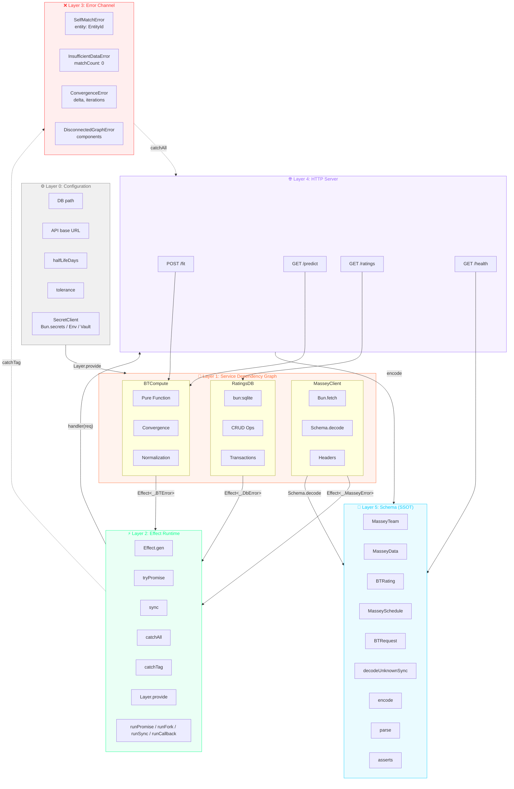

# Architecture

## Overview

`@platform/bradley-terry` is a Bun-native, Effect-powered Bradley-Terry rating
engine. It fits maximum-likelihood strength ratings from win/loss match data
using the Hunter (2004) MM algorithm, with graph-connectivity awareness, time
decay, multiple output scales, and a streaming Massey CSV loader.

```
                ┌────────────────────▼─────────────────────┐
                │           BradleyTerry Service            │
                │  (Context tag + BradleyTerryLive layer)   │
                │                                          │
                │   fit()          predictWinProbability() │
                │      │                    │              │
                │      ▼                    ▼              │
                │  ┌────────┐         ┌──────────────┐     │
                │  │   MM   │         │  P(a>b) =    │     │
                │  │  algo  │         │  sA/(sA+sB)  │     │
                │  └───┬────┘         └──────────────┘     │
                │      │                                   │
                │      ▼                                   │
                │  ┌────────────┐  ┌──────────────┐        │
                │  │ Union-Find │  │  Time decay  │        │
                │  │ (graph)    │  │ (exponential)│        │
                │  └────────────┘  └──────────────┘        │
                └────────────────────┬─────────────────────┘
                                     │
                ┌────────────────────▼─────────────────────┐
                │              Schema (SSOT)               │
                │  EntityId, Match, FitResult,            │
                │  BradleyTerryConfig, BradleyTerryError   │
                └────────────────────┬─────────────────────┘
                                     │
        ┌────────────────────────────┼────────────────────────────┐
        │                            │                            │
┌───────▼─────────┐       ┌──────────▼─────────┐         ┌────────▼─────────┐
│  Massey Loader  │       │   Match Adapter    │         │   Repository     │
│  (Effect Stream │       │  (SQLite MatchRow  │         │  (sqlite-loader  │
│   CSV → Match)  │       │   → BT Match)      │         │   placeholder)   │
└─────────────────┘       └────────────────────┘         └──────────────────┘
```

## Deep architecture: Effect layers



> **Color key:** Effect `#00FF88` · Bun `#FF6B35` · Schema `#00CCFF` · DB `#FF00FF` ·
> Compute `#FFFF00` · Fetch `#FF3366` · Server `#9966FF` · Error `#FF3333` ·
> Config `#888888` · Layer `#44FF44`

**SecretClient abstraction** (`src/secrets/index.ts`): Layer 0's `SecretClient` is a
channel-agnostic Effect service that wraps `Bun.secrets` (local), env vars (CI),
or HashiCorp Vault (production) behind a single `get(service, name)` interface.
Swap implementations by changing the provided `Layer` — the rest of the pipeline
never knows which backend resolved the secret.

## Configuration & Secrets

`src/secrets/index.ts` defines a channel-agnostic `SecretClient` Effect tag. The
same service contract (`get(service, name)`) is implemented by three different
backends, so the `RatingsConfig` Layer never needs to know where a secret came
from.

```
┌─────────────────────────────────────────────────────────────────┐
│  LAYER 0: CONFIGURATION (RatingsConfig)                          │
│  ┌─────────────────────────────────────────────────────────┐    │
│  │  SecretClient.get(service, name)                         │    │
│  │  ─────────────────────────────────────────────────────  │    │
│  │  Channel: OS IPC (Bun.secrets) / HTTPS (Vault) / env   │    │
│  │  Isolation: Data namespace (service + name)             │    │
│  │  NOT: Process sandboxing (same user = theoretical read) │    │
│  └─────────────────────────────────────────────────────────┘    │
│         ↓ SecretClient returns plaintext to Effect.gen           │
└─────────────────────────────────────────────────────────────────┘
         ↓ Layer.provide (Effect dependency injection)
┌─────────────────────────────────────────────────────────────────┐
│  LAYER 1: SERVICES                                               │
│  ┌─────────────┐    ┌─────────────┐    ┌─────────────┐        │
│  │ MasseyClient│    │  RatingsDB  │    │  BTCompute  │        │
│  │ ─────────── │    │ ─────────── │    │ ─────────── │        │
│  │ Channel:    │    │ Channel:    │    │ Channel:    │        │
│  │ HTTPS/TCP   │    │ File I/O    │    │ In-memory   │        │
│  │ (Bun.fetch) │    │ (bun:sqlite)│    │ (pure fn)   │        │
│  └─────────────┘    └─────────────┘    └─────────────┘        │
└─────────────────────────────────────────────────────────────────┘
```

**Backend mapping:**

| Environment | Backend | Channel | Isolation guarantee |
|-------------|---------|---------|-------------------|
| Local dev | `BunSecretsLive` | OS IPC (`Bun.secrets`) | Data namespace (same user) |
| CI / ephemeral | `EnvSecretsLive` | Environment variables | Process-level (short-lived) |
| Production | `VaultSecretsLive` | HTTPS to Vault/Secrets Manager | IAM + network ACLs |

`src/ratings/config.ts` consumes `SecretClient` to build `RatingsConfig`:

- `masseyUrl` — static endpoint for Massey data
- `apiKey` — from `bradley-ratings.messy-client:api-key`
- `dbPath` — from `bradley-ratings.db:sqlite-path`
- `interval` — refresh interval in milliseconds

The key property is that the channel can change without touching `RatingsConfig`.

## Layers

### 1. Schema (`src/schema.ts`)

The single source of truth for all domain types, built on Effect `Schema` and
`Brand`:

- `EntityId` — branded string (`string & Brand<"EntityId">`)
- `MatchRowSchema` — raw ingestion row (`{ home_team, away_team, winner_idx, loser_idx, date, sport?, league?, y?, match_id? }`)
- `MatchSchema` — canonical BT match (`{ winner, loser, date?, weight?, sport?, league? }`)
- `BradleyTerryConfigSchema` — fitter options with defaults
- `RatingEntrySchema`, `FitResultSchema` — output types
- Error types: `SelfMatchError`, `InsufficientDataError`,
  `ConvergenceError`, `DisconnectedGraphError`, `EntityNotFoundError` — all
  `Data.TaggedError` variants on the `BradleyTerryError` union

`src/schema.ts` adds the runtime `FitResult.prototype.toJSON` helper for
serialization (timestamp + version stamping).

### 2. BradleyTerry Service (`src/bradley-terry/index.ts`)

The core engine, exposed as an Effect `Context.Tag` service with a
`Layer.succeed` implementation (`BradleyTerryLive`).

**`fit(matches, config?)`** pipeline:

1. **Validate** — reject empty match lists (`InsufficientDataError`) and
   self-matches (`SelfMatchError`); require ≥2 distinct entities
2. **Build graph** — Union-Find over entities to detect connected components
3. **Filter to largest component** — isolated entities are excluded from the
   fit; a warning is emitted when the graph is disconnected
4. **Apply time decay** — if `timeDecayHalfLifeDays` is set, weight each match
   by `0.5^((t_ref - t_match) / halfLife)` where `t_ref` is the latest match
   timestamp
5. **Run MM algorithm** — Hunter (2004) iteration:
   - For each entity *i*: `s_i ← W_i / Σ_j (n_ij / (s_i + s_j))`
   - Stop when max delta < `tolerance` or `maxIterations` reached
6. **Scale ratings** — apply `outputScale` (`arithmetic`, `geometric`, or
   `elo400`) if `normalize` is true
7. **Compute log-likelihood** — `Σ w · log(s_w / (s_w + s_l))`
8. **Return `FitResult`** — ratings map, iteration count, convergence delta,
   warnings, `largestComponentSize`, etc.

**`predictWinProbability(ratings, a, b)`** — returns `s_a / (s_a + s_b)`.
Fails with `EntityNotFoundError` if either entity is missing.

### 3. Loaders

**`src/data/massey-loader.ts`** — Effect `Stream`-based Massey CSV ingestion.
`Stream.acquireRelease` opens the file, `Stream.fromAsyncIterable` reads lines
with backpressure, `Stream.mapEffect` parses + validates each row against
`MatchRowSchema`. Errors collapse to `MasseyLoaderError`.

**`src/match-adapter.ts`** — SQLite `MatchRow` → BT `Match` pipeline. Bridges the
persistent SQLite match store to the in-memory fitter input. Depends on the
`src/repository/sqlite-loader.ts` stub until the full SQLite repository is
wired in.

### 4. Repository (`src/repository/`)

`src/repository/sqlite-loader.ts` — placeholder SQLite loader for the
`match-adapter` pipeline. A full `RatingsRepositoryLive` for rating snapshots
and deltas will live here once the SQLite schema is finalized.

## Data flow

```
SQLite matches ──► match-adapter ──► Match[] ──► fit() ──► FitResult
                                                          │
Massey CSV ──► massey-loader ──► Match[] ─────────────────┤
                                                          ▼
                                                   predictWinProbability
```

## Testing strategy

- **Property tests** (`test/property/`) — fast-check invariants:
  - `mm-invariants.test.ts` — win-probability symmetry (P + (1-P) = 1),
    monotonicity under added wins
  - `graph-connectivity.test.ts` — `largestComponentSize` correctness,
    disconnected-graph handling
  - `error-handling.test.ts` — `SelfMatchError` / `InsufficientDataError`
    guarantees
- **Benchmarks** (`test/benchmark/`, `src/bench/`) — 50k-match perf target
  (<1.5s), 5k + 25k timed runs with embedded git commit hash

All tests use Bun's built-in test runner (`bun:test`) and run via `bun test`.

## Performance

The MM algorithm is O(iterations × matches) per fit. On an M-series Mac:

| Workload | Mean | Min | Target |
| --- | --- | --- | --- |
| 5k matches | 4.7ms | 2.8ms | — |
| 25k matches | 8.9ms | 7.5ms | — |
| 50k matches | 87ms | — | < 1500ms |

Float64 typed arrays are used for strengths and win counts to avoid GC pressure
on large match sets.

## Bun-native API inventory

This project uses Bun's built-in APIs exclusively — no Node.js polyfills or
third-party equivalents. The strategy keeps the dependency footprint small and
leverages Bun's performance-optimized primitives.

### I/O & File system
| API | Usage |
|-----|-------|
| `Bun.file(path)` | Read artifacts (JSON, Markdown, CSV, HTML) |
| `Bun.write(path, content)` | Write generated artifacts |
| `Bun.file(path).text()` | Streaming text read |
| `Bun.file(path).json()` | Parse file as JSON directly |
| `Bun.file(path).writer()` | Incremental FileSink for chunked writes |
| `Bun.readableStreamToText(stream)` | Stream → text conversion |
| `Bun.readableStreamToArrayBuffer(stream)` | Stream → ArrayBuffer conversion |
| `Bun.readableStreamToBytes(stream)` | Stream → Uint8Array conversion |
| `Bun.stdin` / `Bun.stdout` / `Bun.stderr` | Standard I/O as BunFile |

### Hashing & cryptography
| API | Usage |
|-----|-------|
| `Bun.CryptoHasher("sha256"/"sha512", key?)` | JSON drift hashing, content integrity, HMAC keyed hashing |
| `Bun.hash(content)` | Fast content-addressable hashing (wyhash, default) |
| `Bun.hash.xxHash3(content)` | Fast non-crypto 64-bit hash |
| `Bun.hash.wyhash(content)` | Wyhash 64-bit hash |
| `Bun.password.hash(password)` / `hashSync(password)` | Argon2id/bcrypt password hashing |
| `Bun.password.verify(password, hash)` / `verifySync(password, hash)` | Password verification |


### Compression
| API | Usage |
|-----|-------|
| `Bun.gzipSync(data)` | Compress for storage/transport |
| `Bun.gunzipSync(data)` | Decompress for processing |
| `Bun.deflateSync(data)` | DEFLATE compression |
| `Bun.inflateSync(data)` | DEFLATE decompression |
| `Bun.zstdCompressSync(data)` | Zstandard compression (better ratio than gzip) |
| `Bun.zstdDecompressSync(data)` | Zstandard decompression |
| `Bun.zstdCompress(data)` | Async Zstandard compression |
| `Bun.zstdDecompress(data)` | Async Zstandard decompression |

### Text & formatting
| API | Usage |
|-----|-------|
| `Bun.escapeHTML(str)` | HTML artifact generation |
| `Bun.stringWidth(str)` | CJK/emoji-aware column alignment in markdown tables |
| `Bun.stripANSI(str)` | Strip ANSI escape codes from terminal output |

### Data utilities
| API | Usage |
|-----|-------|
| `Bun.deepEquals(a, b)` | Structural equality in tests |
| `Bun.peek(promise)` | Synchronous inspection of resolved promises |
| `Bun.peek.status(promise)` | Read promise state without resolving |
| `Bun.env` | Environment variable access |
| `Bun.version` / `Bun.revision` | Runtime version introspection |
| `Bun.main` | Entrypoint path resolution |
| `Bun.which(cmd)` | Binary lookup |
| `Bun.sleep(ms)` | Async delay |
| `Bun.sleepSync(ms)` | Blocking synchronous delay |
| `Bun.nanoseconds()` | High-precision timing |
| `Bun.randomUUIDv7()` | Time-ordered UUID generation for history tables |
| `Bun.openInEditor(path, opts)` | Open files in the default editor |

### Parsing & serialization
| API | Usage |
|-----|-------|
| `Bun.TOML.parse(str)` | TOML configuration parsing (e.g., `bunfig.toml`) |
| `Bun.JSONC.parse(str)` | JSONC (JSON with comments) parsing |

### Path resolution
| API | Usage |
|-----|-------|
| `Bun.fileURLToPath(url)` | Convert file:// URLs to OS paths |
| `Bun.pathToFileURL(path)` | Cross-platform path → file:// URL conversion |
| `Bun.resolveSync(id, opts)` | Resolve module paths synchronously |

### Glob & process
| API | Usage |
|-----|-------|
| `Bun.Glob(pattern)` | File globbing for artifact discovery |
| `Bun.Glob.match(path)` | Validate a path against the glob pattern |
| `Bun.spawn(cmd, opts)` | Child process spawning |
| `Bun.spawnSync(cmd, opts)` | Synchronous child process (macros, CLI tools) |

### Transpiler & workers
| API | Usage |
|-----|-------|
| `Bun.Transpiler({ loader })` | Programmatic TS/JSX transpilation |
| `new Worker(url)` | Web Workers API with blob: URL support |
| `Bun.color(input, format)` | Convert between CSS/hex/rgb/hsl/ANSI color formats |

### SQL (bun:sql)
| API | Usage |
|-----|-------|
| `new SQL(url)` | Unified tagged-template SQL client (PostgreSQL/MySQL/SQLite) |
| `` db`SELECT ...` `` | Parameterized queries with auto-escaping |

### Network & serving
| API | Usage |
|-----|-------|
| `Bun.serve(opts)` | HTTP server |
| `server.port` | Assigned port (`0` requests an ephemeral port) |
| `server.stop()` | Gracefully stop the server |
| `server.ref()` / `server.unref()` | Control event-loop retention |
| `server.fetch(req)` | In-process request handler (testing) |
| `Bun.WebSocket` | WebSocket support |
| `Bun.dns` | DNS resolution |
| `Bun.connect(opts)` | TCP/UDP connections |
| `Bun.udpSocket(opts)` | UDP socket creation |

The `Bun.serve` API is used by the HTTP ratings service layer. A server started with `port: 0` binds to an ephemeral port; `server.port` reflects the actual port and `server.stop()` shuts it down.

### Inspection & debugging
| API | Usage |
|-----|-------|
| `Bun.inspect(obj)` | Structured object inspection |
| `Bun.inspect.table(rows)` | Tabular console output |
| `Bun.inspect.custom` | Custom inspect symbol for user classes |

### Serialization (bun:jsc)
| API | Usage |
|-----|-------|
| `serialize(value)` | Structured clone into SharedArrayBuffer |
| `deserialize(buf)` | Restore from SharedArrayBuffer |
| `estimateShallowMemoryUsageOf(obj)` | Best-effort memory estimate in bytes |

### SQLite (bun:sqlite)
| API | Usage |
|-----|-------|
| `new Database(path)` / `Database(":memory:")` | Open/create SQLite databases |
| `db.run(sql, params?)` | Execute statements |
| `db.query(sql)` | Create prepared statement with .all()/.get()/.values()/.iterate() |
| `db.serialize()` / `Database.deserialize(buf)` | Snapshot database to/from Uint8Array |
| `db.transaction(fn)` | Higher-order transaction with auto BEGIN/COMMIT/ROLLBACK |
| `using db = new Database(...)` | Auto-close via Disposable |

### Versioning & runtime info
| API | Usage |
|-----|-------|
| `Bun.version` | Runtime semver string (e.g. `1.4.0`) |
| `Bun.revision` | Runtime commit hash (e.g. `452139e36...`) |
| `Bun.semver.satisfies(version, range)` | Semver range checking (drift gate) |
| `Bun.semver.order(a, b)` | Version comparison |

### Markdown (unstable, validation only)
| API | Usage |
|-----|-------|
| `Bun.markdown.html(md, opts)` | Validate markdown structure (not used in production output) |

### Web APIs (globals)
| API | Usage |
|-----|-------|
| `performance.now()` | High-resolution monotonic timestamps |
| `CustomEvent` / `EventTarget` | Web-standard event dispatching |
| `DOMException` | Web API error type |
| `alert` / `confirm` / `prompt` | CLI interactive dialogs (blocking) |
| `ShadowRealm` | Sandboxed JS evaluation (Stage 3) |

### Bun Runtime
| API | Usage |
|-----|-------|
| `--watch` / `--hot` | Auto-restart on file change |
| `--smol` | Reduced memory heap size |
| `Bun.env` / `process.env` | Auto-loaded .env with variable expansion |
| `Bun.Archive` (≥1.4.0) | Create/extract tar.gz archives |

## One-Liner Cookbook

Curated `bun -e` one-liners that demonstrate Bun APIs. Run via `bun run cookbook`.
Each one-liner is a living specification — the test suite executes every one and
asserts the output matches expected patterns.

| # | One-liner | APIs demonstrated |
|---|-----------|-------------------|
| 1 | HTTP server on ephemeral port | `Bun.serve`, `port: 0` |
| 2 | File write and read | `Bun.write`, `Bun.file` |
| 3 | Runtime version and revision | `Bun.version`, `Bun.revision` |
| 4 | Password hashing and verification | `Bun.password.hashSync`, `verifySync` |
| 5 | SHA-256 hashing | `Bun.CryptoHasher` |
| 6 | gzip compression roundtrip | `Bun.gzipSync`, `gunzipSync` |
| 7 | TOML parsing | `Bun.TOML.parse` |
| 8 | Environment variable access | `Bun.env` |
| 9 | nanoseconds timing | `Bun.nanoseconds`, `Bun.sleepSync` |
| 10 | UUIDv7 generation | `Bun.randomUUIDv7` |
| 11 | stringWidth CJK measurement | `Bun.stringWidth` |
| 12 | sleep async delay | `Bun.sleep` |
| 13 | `--smol` memory-constrained run | `bun --smol` |
| 14 | stdin pipe via `bun run -` | `bun run -` |
| 15 | deflate compression roundtrip | `Bun.deflateSync`, `inflateSync` |
| 16 | zstd compression with level | `Bun.zstdCompressSync` |
| 17 | HTML entity escaping | `Bun.escapeHTML` |
| 18 | deepEquals structural comparison | `Bun.deepEquals` |
| 19 | peek synchronous promise inspection | `Bun.peek`, `peek.status` |
| 20 | resolveSync module resolution | `Bun.resolveSync` |
| 21 | ArrayBufferSink incremental buffer | `Bun.ArrayBufferSink` |
| 22 | semver satisfies range check | `Bun.semver.satisfies` |
| 23 | semver order comparison | `Bun.semver.order` |
| 24 | color hex and number conversion | `Bun.color` |
| 25 | Transpiler TS to JS | `Bun.Transpiler` |

Add new one-liners to `one-liners.json` and run `bun run cookbook` to verify.

## References

### HTTP Server

Source: <https://bun.com/docs/api/http>

| Example | First line |
| ------- | ---------- |
| Example 1 | `import myReactSinglePageApp from "./index.html";` |
| Example 2 | `Bun.serve({` |
| Example 3 | `const server = Bun.serve({` |
| Example 4 | `console.log(server.port); // 3000` |
| Example 5 | `Bun.serve({` |
| Example 6 | `Bun.serve({` |
| Example 7 | `Bun.serve({` |
| Example 8 | `import type { Serve } from "bun";` |
| Example 9 | `const server = Bun.serve({` |
| Example 10 | `const server = Bun.serve({` |
| Example 11 | `// Don't keep process alive if server is the only thing runn` |
| Example 12 | `const server = Bun.serve({` |
| Example 13 | `const server = Bun.serve({` |
| Example 14 | `Bun.serve({` |
| Example 15 | `Bun.serve({` |
| Example 16 | `require("http")` |
| Example 17 | `interface Server extends Disposable {` |

```typescript
import myReactSinglePageApp from "./index.html";

Bun.serve({
  routes: {
    "/": myReactSinglePageApp,
  },
});
```


### Bun File

Source: <https://bun.com/docs/api/file>

| Example | First line |
| ------- | ---------- |
| Example 1 | `const foo = Bun.file("foo.txt"); // relative to cwd` |
| Example 2 | `const foo = Bun.file("foo.txt");` |
| Example 3 | `Bun.file(1234);` |
| Example 4 | `const notreal = Bun.file("notreal.txt");` |
| Example 5 | `const notreal = Bun.file("notreal.json", { type: "applicatio` |
| Example 6 | `Bun.stdin; // readonly` |
| Example 7 | `await Bun.file("logs.json").delete();` |
| Example 8 | `const input = Bun.file("input.txt");` |
| Example 9 | `const encoder = new TextEncoder();` |
| Example 10 | `const input = Bun.file("input.txt");` |
| Example 11 | `const response = await fetch("https://bun.com");` |
| Example 12 | `const file = Bun.file("output.txt");` |
| Example 13 | `const file = Bun.file("output.txt");` |
| Example 14 | `writer.flush(); // write buffer to disk` |
| Example 15 | `const file = Bun.file("output.txt");` |
| Example 16 | `writer.end();` |
| Example 17 | `writer.unref();` |
| Example 18 | `import { readdir } from "node:fs/promises";` |
| Example 19 | `import { readdir } from "node:fs/promises";` |
| Example 20 | `import { mkdir } from "node:fs/promises";` |
| Example 21 | `// Usage` |
| Example 22 | `interface Bun {` |

```typescript
const foo = Bun.file("foo.txt"); // relative to cwd
foo.size; // number of bytes
foo.type; // MIME type
```


### Glob

Source: <https://bun.com/docs/api/glob>

| Example | First line |
| ------- | ---------- |
| Example 1 | `import { Glob } from "bun";` |
| Example 2 | `import { Glob } from "bun";` |
| Example 3 | `class Glob {` |
| Example 4 | `const glob = new Glob("???.ts");` |
| Example 5 | `const glob = new Glob("*.ts");` |
| Example 6 | `const glob = new Glob("**/*.ts");` |
| Example 7 | `const glob = new Glob("ba[rz].ts");` |
| Example 8 | `const glob = new Glob("ba[a-z][0-9][^4-9].ts");` |
| Example 9 | `const glob = new Glob("{a,b,c}.ts");` |
| Example 10 | `const glob = new Glob("!index.ts");` |
| Example 11 | `const glob = new Glob("\\!index.ts");` |
| Example 12 | `import { glob, globSync, promises } from "node:fs";` |

```typescript
import { Glob } from "bun";

const glob = new Glob("**/*.ts");

// Scans the current working directory and each of its sub-directories recursively
for await (const file of glob.scan(".")) {
  console.log(file); // => "index.ts"
}
```


### Spawn

Source: <https://bun.com/docs/api/spawn>

| Example | First line |
| ------- | ---------- |
| Example 1 | `const proc = Bun.spawn(["bun", "--version"]);` |
| Example 2 | `const proc = Bun.spawn(["bun", "--version"], {` |
| Example 3 | `const proc = Bun.spawn(["cat"], {` |
| Example 4 | `const proc = Bun.spawn(["cat"], {` |
| Example 5 | `const stream = new ReadableStream({` |
| Example 6 | `const proc = Bun.spawn(["bun", "--version"]);` |
| Example 7 | `const proc = Bun.spawn(["bun", "--version"], {` |
| Example 8 | `const proc = Bun.spawn(["bun", "--version"]);` |
| Example 9 | `const proc = Bun.spawn(["bun", "--version"]);` |
| Example 10 | `const proc = Bun.spawn(["bun", "--version"]);` |
| Example 11 | `const controller = new AbortController();` |
| Example 12 | `// Kill the process after 5 seconds` |
| Example 13 | `// Kill the process with SIGKILL after 5 seconds` |
| Example 14 | `// Kill 'yes' after it emits over 100 bytes of output` |
| Example 15 | `const child = Bun.spawn(["bun", "child.ts"], {` |
| Example 16 | `const childProc = Bun.spawn(["bun", "child.ts"], {` |
| Example 17 | `process.send("Hello from child as string");` |
| Example 18 | `// send a string` |
| Example 19 | `childProc.disconnect();` |
| Example 20 | `const proc = Bun.spawn(["bash"], {` |
| Example 21 | `// Write data to the terminal` |
| Example 22 | `await using terminal = new Bun.Terminal({` |
| Example 23 | `const proc = Bun.spawnSync(["echo", "hello"]);` |
| Example 24 | `interface Bun {` |

```typescript
const proc = Bun.spawn(["bun", "--version"]);
console.log(await proc.exited); // 0
```


### SQLite

Source: <https://bun.com/docs/api/sqlite>

| Example | First line |
| ------- | ---------- |
| Example 1 | `import { Database } from "bun:sqlite";` |
| Example 2 | `import { Database } from "bun:sqlite";` |
| Example 3 | `import { Database } from "bun:sqlite";` |
| Example 4 | `import { Database } from "bun:sqlite";` |
| Example 5 | `import { Database } from "bun:sqlite";` |
| Example 6 | `import db from "./mydb.sqlite" with { type: "sqlite" };` |
| Example 7 | `import { Database } from "bun:sqlite";` |
| Example 8 | `const db = new Database();` |
| Example 9 | `const db = new Database();` |
| Example 10 | `import { Database } from "bun:sqlite";` |
| Example 11 | `const olddb = new Database("mydb.sqlite");` |
| Example 12 | `const query = db.query("SELECT * FROM users WHERE id = ?");` |
| Example 13 | `// compile the prepared statement without caching` |
| Example 14 | `db.run("PRAGMA journal_mode = WAL;");` |
| Example 15 | `import { Database, constants } from "bun:sqlite";` |
| Example 16 | `class Movie {` |
| Example 17 | `const query = db.query("SELECT * FROM foo");` |
| Example 18 | `const query = db.query("SELECT * FROM foo");` |
| Example 19 | `const query = db.query("SELECT title, year FROM movies");` |
| Example 20 | `import { Database } from "bun:sqlite";` |
| Example 21 | `const query = db.query("SELECT * FROM foo WHERE bar = $bar")` |
| Example 22 | `const query = db.query("SELECT ?1, ?2");` |
| Example 23 | `import { Database } from "bun:sqlite";` |
| Example 24 | `const insertCat = db.prepare("INSERT INTO cats (name) VALUES` |
| Example 25 | `// setup` |
| Example 26 | `insertCats(cats); // uses "BEGIN"` |
| Example 27 | `import { Database } from "bun:sqlite";` |
| Example 28 | `import { Database } from "bun:sqlite";` |
| Example 29 | `import { Database, constants } from "bun:sqlite";` |
| Example 30 | `class Database {` |

```typescript
import { Database } from "bun:sqlite";

const db = new Database(":memory:");
const query = db.query("select 'Hello world' as message;");
query.get();
```


### Hashing

Source: <https://bun.com/docs/api/hashing>

| Example | First line |
| ------- | ---------- |
| Example 1 | `const password = "super-secure-pa$$word";` |
| Example 2 | `const password = "super-secure-pa$$word";` |
| Example 3 | `const password = "super-secure-pa$$word";` |
| Example 4 | `const password = "super-secure-pa$$word";` |
| Example 5 | `await Bun.password.hash("hello", {` |
| Example 6 | `await Bun.password.hash("hello".repeat(100), {` |
| Example 7 | `await Bun.password.hash("hello", {` |
| Example 8 | `Bun.hash("some data here");` |
| Example 9 | `const arr = new Uint8Array([1, 2, 3, 4]);` |
| Example 10 | `Bun.hash("some data here", 1234);` |
| Example 11 | `Bun.hash.wyhash("data", 1234); // equivalent to Bun.hash()` |
| Example 12 | `const hasher = new Bun.CryptoHasher("sha256");` |
| Example 13 | `const hasher = new Bun.CryptoHasher("sha256");` |
| Example 14 | `hasher.update("hello world"); // defaults to utf8` |
| Example 15 | `const hasher = new Bun.CryptoHasher("sha256");` |
| Example 16 | `hasher.digest("base64");` |
| Example 17 | `const arr = new Uint8Array(32);` |
| Example 18 | `const hasher = new Bun.CryptoHasher("sha256", "secret-key");` |
| Example 19 | `const hasher = new Bun.CryptoHasher("sha256", "secret-key");` |

```typescript
const password = "super-secure-pa$$word";

const hash = await Bun.password.hash(password);
// => $argon2id$v=19$m=65536,t=2,p=1$tFq+9AVr1bfPxQdh6E8DQRhEXg/M/SqYCNu6gVdRRNs$GzJ8PuBi+K+BVojzPfS5mjnC8OpLGtv8KJqF99eP6a4

const isMatch = await Bun.password.verify(password, hash);
// => true
```


### Transpiler

Source: <https://bun.com/docs/api/transpiler>

| Example | First line |
| ------- | ---------- |
| Example 1 | `const transpiler = new Bun.Transpiler({` |
| Example 2 | `transpiler.transformSync("<div>hi!</div>", "tsx");` |
| Example 3 | `const transpiler = new Bun.Transpiler({ loader: "jsx" });` |
| Example 4 | `await transpiler.transform("<div>hi!</div>", "tsx");` |

```typescript
const transpiler = new Bun.Transpiler({
  loader: "tsx", // "js" | "jsx" | "ts" | "tsx"
});
```


### Color

Source: <https://bun.com/docs/api/color>

| Example | First line |
| ------- | ---------- |
| Example 1 | `Bun.color("red", "css"); // "red"` |
| Example 2 | `Bun.color("red", "ansi"); // "\u001b[38;2;255;0;0m"` |
| Example 3 | `Bun.color("red", "ansi-16m"); // "\x1b[38;2;255;0;0m"` |
| Example 4 | `Bun.color("red", "ansi-256"); // "\u001b[38;5;196m"` |
| Example 5 | `Bun.color("red", "ansi-16"); // "\u001b[38;5;\tm"` |
| Example 6 | `Bun.color("red", "number"); // 16711680` |
| Example 7 | `type RGBAObject = {` |
| Example 8 | `Bun.color("hsl(0, 0%, 50%)", "{rgba}"); // { r: 128, g: 128,` |
| Example 9 | `Bun.color("hsl(0, 0%, 50%)", "{rgb}"); // { r: 128, g: 128, ` |
| Example 10 | `// All values are 0 - 255` |
| Example 11 | `Bun.color("hsl(0, 0%, 50%)", "[rgba]"); // [128, 128, 128, 2` |
| Example 12 | `Bun.color("hsl(0, 0%, 50%)", "[rgb]"); // [128, 128, 128]` |
| Example 13 | `Bun.color("hsl(0, 0%, 50%)", "hex"); // "#808080"` |
| Example 14 | `Bun.color("hsl(0, 0%, 50%)", "HEX"); // "#808080"` |
| Example 15 | `import { color } from "bun" with { type: "macro" };` |
| Example 16 | `// client-side.ts` |

```typescript
Bun.color("red", "css"); // "red"
Bun.color(0xff0000, "css"); // "#f000"
Bun.color("#f00", "css"); // "red"
Bun.color("#ff0000", "css"); // "red"
Bun.color("rgb(255, 0, 0)", "css"); // "red"
Bun.color("rgba(255, 0, 0, 1)", "css"); // "red"
Bun.color("hsl(0, 100%, 50%)", "css"); // "red"
Bun.color("hsla(0, 100%, 50%, 1)", "css"); // "red"
Bun.color({ r: 255, g: 0, b: 0 }, "css"); // "red"
Bun.color({ r: 255, g: 0, b: 0, a: 1 }, "css"); // "red"
Bun.color([255, 0, 0], "css"); // "red"
Bun.color([255, 0, 0, 255], "css"); // "red"
```


### Semver

Source: <https://bun.com/docs/api/semver>

| Example | First line |
| ------- | ---------- |
| Example 1 | `import { semver } from "bun";` |
| Example 2 | `import { semver } from "bun";` |

```typescript
import { semver } from "bun";

semver.satisfies("1.0.0", "^1.0.0"); // true
semver.satisfies("1.0.0", "^1.0.1"); // false
semver.satisfies("1.0.0", "~1.0.0"); // true
semver.satisfies("1.0.0", "~1.0.1"); // false
semver.satisfies("1.0.0", "1.0.0"); // true
semver.satisfies("1.0.0", "1.0.1"); // false
semver.satisfies("1.0.1", "1.0.0"); // false
semver.satisfies("1.0.0", "1.0.x"); // true
semver.satisfies("1.0.0", "1.x.x"); // true
semver.satisfies("1.0.0", "x.x.x"); // true
semver.satisfies("1.0.0", "1.0.0 - 2.0.0"); // true
semver.satisfies("1.0.0", "1.0.0 - 1.0.1"); // true
```


### WebSockets

Source: <https://bun.com/docs/api/websockets>

| Example | First line |
| ------- | ---------- |
| Example 1 | `Bun.serve({` |
| Example 2 | `Bun.serve({` |
| Example 3 | `Bun.serve({` |
| Example 4 | `Bun.serve({` |
| Example 5 | `type WebSocketData = {` |
| Example 6 | `const socket = new WebSocket("ws://localhost:3000/chat");` |
| Example 7 | `const server = Bun.serve({` |
| Example 8 | `Bun.serve({` |
| Example 9 | `ws.send("Hello world", true);` |
| Example 10 | `Bun.serve({` |
| Example 11 | `Bun.serve({` |
| Example 12 | `const socket = new WebSocket("ws://localhost:3000");` |
| Example 13 | `const socket = new WebSocket("ws://localhost:3000", {` |
| Example 14 | `// message is received` |

```typescript
Bun.serve({
  fetch(req, server) {
    // upgrade the request to a WebSocket
    if (server.upgrade(req)) {
      return; // do not return a Response
    }
    return new Response("Upgrade failed", { status: 500 });
  },
  websocket: {}, // handlers
});
```


### UDP

Source: <https://bun.com/docs/api/udp>

| Example | First line |
| ------- | ---------- |
| Example 1 | `const socket = await Bun.udpSocket({});` |
| Example 2 | `const socket = await Bun.udpSocket({` |
| Example 3 | `socket.send("Hello, world!", 41234, "127.0.0.1");` |
| Example 4 | `const socket = await Bun.udpSocket({});` |
| Example 5 | `const socket = await Bun.udpSocket({` |
| Example 6 | `const socket = await Bun.udpSocket({` |
| Example 7 | `const socket = await Bun.udpSocket({});` |
| Example 8 | `const socket = await Bun.udpSocket({});` |
| Example 9 | `// Set TTL for multicast packets (number of network hops)` |
| Example 10 | `socket.addSourceSpecificMembership("10.0.0.1", "232.0.0.1");` |

```typescript
const socket = await Bun.udpSocket({});
console.log(socket.port); // assigned by the operating system
```


### DNS

Source: <https://bun.com/docs/api/dns>

| Example | First line |
| ------- | ---------- |
| Example 1 | `import * as dns from "node:dns";` |
| Example 2 | `import { dns } from "bun";` |
| Example 3 | `import { dns } from "bun";` |
| Example 4 | `import { dns } from "bun";` |
| Example 5 | `{` |
| Example 6 | `import { dns } from "bun";` |

```typescript
import * as dns from "node:dns";

const addrs = await dns.promises.resolve4("bun.com", { ttl: true });
console.log(addrs);
// => [{ address: "172.67.161.226", family: 4, ttl: 0 }, ...]
```


<!-- api-docs:http-server -->

### Server

Source: <https://bun.com/docs/runtime/http/server> · bun-types `runtime/http/server.mdx`

| Example | First line |
| ------- | ---------- |
| Example 1 | `const server = Bun.serve({` |
| Example 2 | `Bun.serve({` |
| Example 3 | `console.log(server.url); // http://localhost:3000` |
| Example 4 | `import type { Serve } from "bun";` |
| Example 5 | `server.unref();` |
| Example 6 | `Bun.serve({` |
| Example 7 | `import type { Post } from "./types.ts";` |
| Example 8 | `export interface Post {` |
| Example 9 | `interface Server extends Disposable {` |

```typescript
const server = Bun.serve({
  // `routes` requires Bun v1.2.3+
  routes: {
    // Static routes
    "/api/status": new Response("OK"),

    // Dynamic routes
    "/users/:id": req => {
      return new Response(`Hello User ${req.params.id}!`);
    },

    // Per-HTTP method handlers
    "/api/posts": {
      GET: () => new Response("List posts"),
      POST: async req => {
        const body = await req.json();
        return Response.json({ created: true, ...body });
      },
    },

    // Wildcard route for all routes that start with "/api/" and aren't otherwise matched
    "/api/*": Response.json({ message: "Not found" }, { status: 404 }),

    // Redirect from /blog/hello to /blog/hello/world
    "/blog/hello": Response.redirect("/blog/hello/world"),

    // Serve a file by lazily loading it into memory
    "/favicon.ico": Bun.file("./favicon.ico"),
  },

  // (optional) fallback for unmatched routes:
  // Required if Bun's version < 1.2.3
  fetch(req) {
    return new Response("Not Found", { status: 404 });
  },
});

console.log(`Server running at ${server.url}`);
```

<!-- /api-docs:http-server -->


<!-- api-docs:bun-file -->

### File I/O

Source: <https://bun.com/docs/runtime/file-io> · bun-types `runtime/file-io.mdx`

| Example | First line |
| ------- | ---------- |
| Example 1 | `foo.size; // number of bytes` |
| Example 2 | `await foo.text(); // contents as a string` |
| Example 3 | `Bun.file(new URL(import.meta.url)); // reference to the curr` |
| Example 4 | `notreal.size; // 0` |
| Example 5 | `notreal.type; // => "application/json;charset=utf-8"` |
| Example 6 | `Bun.stdout;` |
| Example 7 | `await Bun.write("output.txt", data);` |
| Example 8 | `const output = Bun.file("output.txt"); // doesn't exist yet!` |
| Example 9 | `const data = encoder.encode("datadatadata"); // Uint8Array` |
| Example 10 | `await Bun.write(Bun.stdout, input);` |
| Example 11 | `await Bun.write("index.html", response);` |
| Example 12 | `const writer = file.writer();` |
| Example 13 | `const writer = file.writer();` |
| Example 14 | `const writer = file.writer({ highWaterMark: 1024 * 1024 }); ` |
| Example 15 | `// to "re-ref" it later` |
| Example 16 | `// read all the files in the current directory` |
| Example 17 | `// read all the files in the current directory, recursively` |
| Example 18 | `await mkdir("path/to/dir", { recursive: true });` |
| Example 19 | `// Usage` |

```typescript
foo.size; // number of bytes
foo.type; // MIME type
```

<!-- /api-docs:bun-file -->


<!-- api-docs:glob -->

### Glob

Source: <https://bun.com/docs/runtime/glob> · bun-types `runtime/glob.mdx`

| Example | First line |
| ------- | ---------- |
| Example 1 | `const glob = new Glob("**/*.ts");` |
| Example 2 | `const glob = new Glob("*.ts");` |
| Example 3 | `glob.match("foo.ts"); // => true` |
| Example 4 | `glob.match("index.ts"); // => true` |
| Example 5 | `glob.match("index.ts"); // => true` |
| Example 6 | `glob.match("bar.ts"); // => true` |
| Example 7 | `glob.match("bar01.ts"); // => true` |
| Example 8 | `glob.match("a.ts"); // => true` |
| Example 9 | `glob.match("index.ts"); // => false` |
| Example 10 | `glob.match("!index.ts"); // => true` |
| Example 11 | `// Array of patterns` |

```typescript
const glob = new Glob("**/*.ts");

// Scans the current working directory and each of its sub-directories recursively
for await (const file of glob.scan(".")) {
  console.log(file); // => "index.ts"
}
```

<!-- /api-docs:glob -->


<!-- api-docs:spawn -->

### Spawn

Source: <https://bun.com/docs/runtime/child-process> · bun-types `runtime/child-process.mdx`

| Example | First line |
| ------- | ---------- |
| Example 1 | `console.log(await proc.exited); // 0` |
| Example 2 | `const text = await proc.stdout.text();` |
| Example 3 | `const proc = Bun.spawn(["bun", "--version"], {` |
| Example 4 | `const proc = Bun.spawn(["bun", "--version"]);` |
| Example 5 | `const proc = Bun.spawn(["bun", "--version"]);` |
| Example 6 | `const proc = Bun.spawn(["bun", "--version"]);` |
| Example 7 | `const proc = Bun.spawn(["bun", "--version"]);` |
| Example 8 | `const controller = new AbortController();` |
| Example 9 | `// Kill the process after 5 seconds` |
| Example 10 | `// Kill the process with SIGKILL after 5 seconds` |
| Example 11 | `// Kill 'yes' after it emits over 100 bytes of output` |
| Example 12 | `const child = Bun.spawn(["bun", "child.ts"], {` |
| Example 13 | `const childProc = Bun.spawn(["bun", "child.ts"], {` |
| Example 14 | `process.send("Hello from child as string");` |
| Example 15 | `// send a string` |
| Example 16 | `if (typeof Bun !== "undefined") {` |
| Example 17 | `proc.terminal.write("echo hello\n");` |
| Example 18 | `console.log(proc.stdout.toString());` |
| Example 19 | `interface Bun {` |

```typescript
console.log(await proc.exited); // 0
```

<!-- /api-docs:spawn -->


<!-- api-docs:sqlite -->

### SQLite

Source: <https://bun.com/docs/runtime/sqlite> · bun-types `runtime/sqlite.mdx`

| Example | First line |
| ------- | ---------- |
| Example 1 | `import { Database } from "bun:sqlite";` |
| Example 2 | `import { Database } from "bun:sqlite";` |
| Example 3 | `import { Database } from "bun:sqlite";` |
| Example 4 | `import { Database } from "bun:sqlite";` |
| Example 5 | `import { Database } from "bun:sqlite";` |
| Example 6 | `import db from "./mydb.sqlite" with { type: "sqlite" };` |
| Example 7 | `import { Database } from "bun:sqlite";` |
| Example 8 | `const db = new Database();` |
| Example 9 | `const db = new Database();` |
| Example 10 | `import { Database } from "bun:sqlite";` |
| Example 11 | `const olddb = new Database("mydb.sqlite");` |
| Example 12 | `const query = db.query(`select "Hello world" as message`);` |
| Example 13 | `query.get(1); // ✓ Works` |
| Example 14 | `const query = db.prepare("SELECT * FROM foo WHERE bar = ?");` |
| Example 15 | `db.run("PRAGMA journal_mode = WAL;");` |
| Example 16 | `import { Database, constants } from "bun:sqlite";` |
| Example 17 | `const query = db.query(`select "Hello world" as message`);` |
| Example 18 | `const query = db.query(`select $message;`);` |
| Example 19 | `const query = db.query(`select ?1;`);` |
| Example 20 | `import { Database } from "bun:sqlite";` |
| Example 21 | `const query = db.query(`select $message;`);` |
| Example 22 | `const query = db.query(`select $message;`);` |
| Example 23 | `const query = db.query(`create table foo;`);` |
| Example 24 | `class Movie {` |
| Example 25 | `const query = db.query("SELECT * FROM foo");` |
| Example 26 | `const query = db.query("SELECT * FROM foo");` |
| Example 27 | `const query = db.query(`select $message;`);` |
| Example 28 | `const query = db.query("SELECT title, year FROM movies");` |
| Example 29 | `import { Database } from "bun:sqlite";` |
| Example 30 | `const query = db.query("SELECT * FROM foo WHERE bar = $bar")` |
| Example 31 | `const query = db.query("SELECT ?1, ?2");` |
| Example 32 | `import { Database } from "bun:sqlite";` |
| Example 33 | `import { Database } from "bun:sqlite";` |
| Example 34 | `import { Database } from "bun:sqlite";` |
| Example 35 | `const insertCat = db.prepare("INSERT INTO cats (name) VALUES` |
| Example 36 | `const insert = db.prepare("INSERT INTO cats (name) VALUES ($` |
| Example 37 | `// setup` |
| Example 38 | `insertCats.deferred(cats); // uses "BEGIN DEFERRED"` |
| Example 39 | `import { Database } from "bun:sqlite";` |
| Example 40 | `import { Database } from "bun:sqlite";` |
| Example 41 | `import { Database, constants } from "bun:sqlite";` |
| Example 42 | `class Database {` |

```typescript
import { Database } from "bun:sqlite";

const db = new Database(":memory:");
const query = db.query("select 'Hello world' as message;");
query.get();
```

<!-- /api-docs:sqlite -->


<!-- api-docs:hashing -->

### Hashing

Source: <https://bun.com/docs/runtime/hashing> · bun-types `runtime/hashing.mdx`

| Example | First line |
| ------- | ---------- |
| Example 1 | `const hash = await Bun.password.hash(password);` |
| Example 2 | `// use argon2 (default)` |
| Example 3 | `const hash = await Bun.password.hash(password, {` |
| Example 4 | `const hash = Bun.password.hashSync(password, {` |
| Example 5 | `// 11562320457524636935n` |
| Example 6 | `Bun.hash("some data here");` |
| Example 7 | `// 15724820720172937558n` |
| Example 8 | `Bun.hash.crc32("data", 1234);` |
| Example 9 | `hasher.update("hello world");` |
| Example 10 | `hasher.update("hello world");` |
| Example 11 | `hasher.update("hello world", "hex");` |
| Example 12 | `hasher.update("hello world");` |
| Example 13 | `// => "uU0nuZNNPgilLlLX2n2r+sSE7+N6U4DukIj3rOLvzek="` |
| Example 14 | `hasher.digest(arr);` |
| Example 15 | `hasher.update("hello world");` |
| Example 16 | `hasher.update("hello world");` |

```typescript
const hash = await Bun.password.hash(password);
// => $argon2id$v=19$m=65536,t=2,p=1$tFq+9AVr1bfPxQdh6E8DQRhEXg/M/SqYCNu6gVdRRNs$GzJ8PuBi+K+BVojzPfS5mjnC8OpLGtv8KJqF99eP6a4

const isMatch = await Bun.password.verify(password, hash);
// => true
```

<!-- /api-docs:hashing -->


<!-- api-docs:transpiler -->

### Transpiler

Source: <https://bun.com/docs/runtime/transpiler> · bun-types `runtime/transpiler.mdx`

| Example | First line |
| ------- | ---------- |
| Example 1 | `const transpiler = new Bun.Transpiler({` |
| Example 2 | `import { __require as require } from "bun:wrap";` |
| Example 3 | `const result = await transpiler.transform("<div>hi!</div>");` |
| Example 4 | `const transpiler = new Bun.Transpiler({` |
| Example 5 | `const transpiler = new Bun.Transpiler({` |

```typescript
const transpiler = new Bun.Transpiler({
  loader: 'tsx',
});

const code = `
import * as whatever from "./whatever.ts"
export function Home(props: {title: string}){
  return <p>{props.title}</p>;
}`;

const result = transpiler.transformSync(code);
```

<!-- /api-docs:transpiler -->


<!-- api-docs:color -->

### Color

Source: <https://bun.com/docs/runtime/color> · bun-types `runtime/color.mdx`

| Example | First line |
| ------- | ---------- |
| Example 1 | `Bun.color(0xff0000, "css"); // "#f000"` |
| Example 2 | `Bun.color(0xff0000, "ansi"); // "\u001b[38;2;255;0;0m"` |
| Example 3 | `Bun.color(0xff0000, "ansi-16m"); // "\x1b[38;2;255;0;0m"` |
| Example 4 | `Bun.color(0xff0000, "ansi-256"); // "\u001b[38;5;196m"` |
| Example 5 | `Bun.color(0xff0000, "ansi-16"); // "\u001b[38;5;\tm"` |
| Example 6 | `Bun.color(0xff0000, "number"); // 16711680` |
| Example 7 | `Bun.color("red", "{rgba}"); // { r: 255, g: 0, b: 0, a: 1 }` |
| Example 8 | `Bun.color("red", "{rgb}"); // { r: 255, g: 0, b: 0 }` |
| Example 9 | `type RGBAArray = [number, number, number, number];` |
| Example 10 | `Bun.color("red", "[rgba]"); // [255, 0, 0, 255]` |
| Example 11 | `Bun.color("red", "[rgb]"); // [255, 0, 0]` |
| Example 12 | `Bun.color("red", "hex"); // "#ff0000"` |
| Example 13 | `Bun.color("red", "HEX"); // "#FF0000"` |
| Example 14 | `import { color } from "bun" with { type: "macro" };` |
| Example 15 | `console.log("red");` |

```typescript
Bun.color(0xff0000, "css"); // "#f000"
Bun.color("#f00", "css"); // "red"
Bun.color("#ff0000", "css"); // "red"
Bun.color("rgb(255, 0, 0)", "css"); // "red"
Bun.color("rgba(255, 0, 0, 1)", "css"); // "red"
Bun.color("hsl(0, 100%, 50%)", "css"); // "red"
Bun.color("hsla(0, 100%, 50%, 1)", "css"); // "red"
Bun.color({ r: 255, g: 0, b: 0 }, "css"); // "red"
Bun.color({ r: 255, g: 0, b: 0, a: 1 }, "css"); // "red"
Bun.color([255, 0, 0], "css"); // "red"
Bun.color([255, 0, 0, 255], "css"); // "red"
```

<!-- /api-docs:color -->


<!-- api-docs:semver -->

### Semver

Source: <https://bun.com/docs/runtime/semver> · bun-types `runtime/semver.mdx`

| Example | First line |
| ------- | ---------- |
| Example 1 | `semver.satisfies("1.0.0", "^1.0.0"); // true` |
| Example 2 | `semver.order("1.0.0", "1.0.0"); // 0` |

```typescript
semver.satisfies("1.0.0", "^1.0.0"); // true
semver.satisfies("1.0.0", "^1.0.1"); // false
semver.satisfies("1.0.0", "~1.0.0"); // true
semver.satisfies("1.0.0", "~1.0.1"); // false
semver.satisfies("1.0.0", "1.0.0"); // true
semver.satisfies("1.0.0", "1.0.1"); // false
semver.satisfies("1.0.1", "1.0.0"); // false
semver.satisfies("1.0.0", "1.0.x"); // true
semver.satisfies("1.0.0", "1.x.x"); // true
semver.satisfies("1.0.0", "x.x.x"); // true
semver.satisfies("1.0.0", "1.0.0 - 2.0.0"); // true
semver.satisfies("1.0.0", "1.0.0 - 1.0.1"); // true
```

<!-- /api-docs:semver -->


<!-- api-docs:websockets -->

### WebSockets

Source: <https://bun.com/docs/runtime/http/websockets> · bun-types `runtime/http/websockets.mdx`

| Example | First line |
| ------- | ---------- |
| Example 1 | `Bun.serve({` |
| Example 2 | `Bun.serve({` |
| Example 3 | `Bun.serve({` |
| Example 4 | `Bun.serve({` |
| Example 5 | `type WebSocketData = {` |
| Example 6 | `const socket = new WebSocket("ws://localhost:3000/chat");` |
| Example 7 | `const server = Bun.serve({` |
| Example 8 | `Bun.serve({` |
| Example 9 | `// With subprotocol negotiation` |
| Example 10 | `socket.addEventListener("message", event => {});` |
| Example 11 | `namespace Bun {` |

```typescript
Bun.serve({
  fetch(req, server) {
    // upgrade the request to a WebSocket
    if (server.upgrade(req)) {
      return; // do not return a Response
    }
    return new Response("Upgrade failed", { status: 500 });
  },
  websocket: {}, // handlers
});
```

<!-- /api-docs:websockets -->


<!-- api-docs:udp -->

### UDP

Source: <https://bun.com/docs/runtime/networking/udp> · bun-types `runtime/networking/udp.mdx`

| Example | First line |
| ------- | ---------- |
| Example 1 | `console.log(socket.port); // assigned by the operating syste` |
| Example 2 | `const server = await Bun.udpSocket({` |
| Example 3 | `const server = await Bun.udpSocket({` |
| Example 4 | `const socket = await Bun.udpSocket({});` |
| Example 5 | `const socket = await Bun.udpSocket({` |
| Example 6 | `// Enable broadcasting to send packets to a broadcast addres` |
| Example 7 | `// Join a multicast group` |
| Example 8 | `socket.setMulticastTTL(2);` |
| Example 9 | `socket.dropSourceSpecificMembership("10.0.0.1", "232.0.0.1")` |

```typescript
console.log(socket.port); // assigned by the operating system
```

<!-- /api-docs:udp -->


<!-- api-docs:dns -->

### DNS

Source: <https://bun.com/docs/runtime/networking/dns> · bun-types `runtime/networking/dns.mdx`

| Example | First line |
| ------- | ---------- |
| Example 1 | `const addrs = await dns.promises.resolve4("bun.com", { ttl: ` |
| Example 2 | `dns.prefetch("bun.com", 443);` |
| Example 3 | `dns.prefetch("my.database-host.com", 5432);` |
| Example 4 | `dns.prefetch("bun.com", 443);` |
| Example 5 | `const stats = dns.getCacheStats();` |

```typescript
const addrs = await dns.promises.resolve4("bun.com", { ttl: true });
console.log(addrs);
// => [{ address: "172.67.161.226", family: 4, ttl: 0 }, ...]
```

<!-- /api-docs:dns -->
