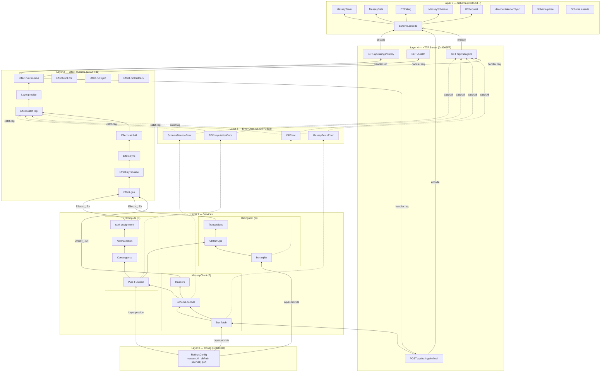

# Architecture Overview

**Bradley-Terry Ratings Service** — Effect TS + Bun runtime. Deep matrix view: 6 layers, 3 side panels, ANSI hex color matrix.

> Visual reference: `bt_effect_deep_architecture.png` (terminal aesthetic, hex badges F/D/C on services).

## Layer stack (bottom → top)

| Layer | Name | Color (hex) | Summary |
|-------|------|-------------|---------|
| **0** | Configuration | `0x888888` | `RatingsConfig` fields → services via `Layer.provide` |
| **1** | Service Dependency Graph | Multi | `MasseyClient` (F), `RatingsDB` (D), `BTCompute` (C) |
| **2** | Effect Runtime | `0x00FF88` | 6 core primitives + 4 run variants |
| **3** | Error Channel | `0xFF3333` | 4 tagged errors, `catchTag` / `catchAll` wiring |
| **4** | HTTP Server | `0x9966FF` | `Bun.serve` + 4 routes with handler chains |
| **5** | Schema | `0x00CCFF` | 5 types + 4 schema functions |

---

## Layer 0: Configuration

`RatingsConfig` fans out to all services via solid `Layer.provide` arrows.

| Field | Type | Consumer |
|-------|------|----------|
| `masseyUrl` | `string` | MasseyClient |
| `dbPath` | `string` | RatingsDB |
| `interval` | `number` | BTCompute / scheduler |
| `port` | `number` | Bun.serve |

Credentials (`api-token`, encryption passphrase) load via `Bun.secrets` at bootstrap — not stored in config. See [Secrets vs config](#secrets-vs-config).

---

## Layer 1: Service Dependency Graph

Each service has a hex badge and internal sub-boxes.

### MasseyClient (badge **F**, Fetch `0xFF3366`)

| Sub-box | Detail |
|---------|--------|
| `Bun.fetch` | HTTP GET → Response |
| `Schema.decode` | `decodeUnknownSync<MasseyData>` |
| `Headers` | `Accept: application/json` |

Flow: `Bun.fetch` → `Schema.decode` → `Headers`

### RatingsDB (badge **D**, DB `0xFF00FF`)

| Sub-box | Detail |
|---------|--------|
| `bun:sqlite` | `new Database(path)` |
| `CRUD Operations` | `storeMassey`, `storeBT`, `getBT` |
| `Transactions` | `db.transaction()` — atomic |

### BTCompute (badge **C**, Compute `0xFFFF00`)

| Sub-box | Detail |
|---------|--------|
| `Pure Function` | Iterative MLE estimation |
| `Convergence` | 100 iter \| 1e-6 tolerance |
| `Normalization` | arithmetic / geometric / elo400 |
| `Ratings → rank` | rank assignment |

**Arrow to runtime:** solid `Effect<_, E>`

---

## Layer 2: Effect Runtime

### Core primitives (bottom row)

| Primitive | Purpose |
|-----------|---------|
| `Effect.gen` | generator / yield* |
| `Effect.tryPromise` | async error capture |
| `Effect.sync` | synchronous compute |
| `Effect.catchAll` | error recovery |
| `Effect.catchTag` | tagged error routing |
| `Layer.provide` | dependency injection |

### Run variants (top row)

| Variant | Use |
|---------|-----|
| `Effect.runPromise` | HTTP handlers (Bun.serve) |
| `Effect.runFork` | background refresh jobs |
| `Effect.runSync` | pure compute paths |
| `Effect.runCallback` | legacy interop |

**Arrow to server:** thick `handler(req)`

---

## Layer 3: Error Channel

Tagged, typed, catchable. Zigzag overlays connect services → errors → `catchTag` → runtime.

| Error | Payload | Source |
|-------|---------|--------|
| `MasseyFetchError` | `{ cause: Error; url: string }` | MasseyClient |
| `DBError` | `{ cause: Error; operation: string }` | RatingsDB |
| `BTComputationError` | `{ cause: Error; teamCount: number }` | BTCompute |
| `SchemaDecodeError` | `{ cause: ParseError; input: unknown }` | Schema.decode |

### Error handling API

| Function | Behavior |
|----------|----------|
| `catchAll` | handle any error in the channel |
| `catchTag` | route specific tagged errors |
| `catchSome` | partial handling |
| `orDie` | fatal on error (defects) |
| `orElse` | fallback effect |
| `retry` | with policy |

**Arrows:** dashed `catchTag` (errors → runtime), dashed `catchAll` (errors → server 500 mapping)

---

## Layer 4: HTTP Server

`Bun.serve` + `Effect.runPromise`

| Route | Handler chain | Response |
|-------|---------------|----------|
| `GET /api/ratings/bt` | `Effect.gen` → `RatingsDB.getBT` → `Schema.encode` → Response | `BTRating[]` |
| `POST /api/ratings/refresh` | `MasseyClient.fetch` → `BTCompute.compute` → `RatingsDB.storeBT` → Response | 202 / summary |
| `GET /health` | `Bun.version`, `Date.now()` | `status \| version \| timestamp` |
| `GET /api/ratings/history` | `RatingsDB.getHistory` → `Schema.encode` | `BTRating[]` |

**Arrow to schema:** solid `encode`

---

## Layer 5: Schema

`Effect.Schema` — decode on ingress, encode on egress.

### Types

| Type | Key fields |
|------|------------|
| `MasseyTeam` | team id, name, conference |
| `MasseyData` | teams, schedule, results |
| `BTRating` | `teamID`, `teamName`, `rating`, `confidence`, `rank` |
| `MasseySchedule` | match rows, dates |
| `BTRequest` | `sport`, `season` query params |

### Functions

| Function | Role |
|----------|------|
| `Schema.decodeUnknownSync` | runtime validation (ingress) |
| `Schema.encode` | to JSON (egress) |
| `Schema.parse` | safe parse |
| `Schema.asserts` | type guard |

---

## Data flow arrows

| From | To | Style | Label |
|------|-----|-------|-------|
| Config | Services | solid | `Layer.provide` |
| Services | Runtime | solid | `Effect<_, E>` |
| Runtime | Server | thick | `handler(req)` |
| Errors | Server | dashed | `catchAll` |
| Server | Schema | solid | `encode` |
| Runtime | Errors | dashed | `catchTag` |

---

## ANSI hex color matrix

| Component | Hex | RGB | Micro-text |
|-----------|-----|-----|------------|
| Effect | `0x00FF88` | 0, 255, 136 | Generator \| Sync \| Async \| Layer |
| Bun | `0xFF6B35` | 255, 107, 53 | serve \| fetch \| sqlite \| file |
| Schema | `0x00CCFF` | 0, 204, 255 | Struct \| decode \| validation |
| DB | `0xFF00FF` | 255, 0, 255 | sqlite \| prepare \| transaction |
| Compute | `0xFFFF00` | 255, 255, 0 | Pure \| MLE \| iterative |
| Fetch | `0xFF3366` | 255, 51, 102 | HTTP \| GET \| JSON |
| Server | `0x9966FF` | 153, 102, 255 | Routes \| handlers \| port |
| Error | `0xFF3333` | 255, 51, 51 | Typed \| tagged \| catchAll |
| Config | `0x888888` | 136, 136, 136 | masseyUrl \| dbPath \| interval |
| Layer | `0x44FF44` | 68, 255, 68 | provide \| succeed \| effect |

---

## Bun native API surface

| API | Category | Features |
|-----|----------|----------|
| `Bun.serve` | Server | port, `fetch(req)`, websocket |
| `Bun.fetch` | Client | native fetch, streaming |
| `bun:sqlite` | DB | Database, query, transaction |
| `Bun.file` | I/O | read, write, stream, stat |
| `Bun.CryptoHasher` | Crypto | sha256, sha512, blake2b |
| `Bun.gzipSync` | Compression | gzip, gunzip, zstd |
| `Bun.inspect.table` | Debug | tabular output, colors |
| `Bun.deepEquals` | Compare | structural equality |
| `Bun.env` | Config | process.env replacement |
| `Bun.version` | Meta | runtime version string |
| `Bun.secrets` | Credentials | OS keychain, per-`(service,name)` namespace |

---

## Secrets vs config

| Kind | Storage | Example |
|------|---------|---------|
| **Config** | `RatingsConfig` / env | `masseyUrl`, `dbPath`, `interval`, `port` |
| **Credentials** | `SecretClient` (channel-swappable) | `com.bradley-terry.massey` / `api-token` |

`Bun.secrets` provides **data-namespace isolation** between modules (MasseyClient cannot read DB passphrase). It does **not** provide kernel/process isolation on the same OS user.

### Channel annotations

```
LAYER 0: CONFIGURATION (RatingsConfig)
┌─────────────────────────────────────────────────────────────┐
│  SecretClient.get({ service, name })                        │
│  Channel: OS IPC | env | HTTPS (Vault) — swappable          │
│  Isolation: data namespace (service + name)                 │
│  NOT: process sandboxing (same OS user = theoretical read)  │
└─────────────────────────────────────────────────────────────┘
         ↓ plaintext injected into RatingsConfig via Effect.gen
         ↓ Layer.provide
LAYER 1: SERVICES
┌──────────────┐  ┌──────────────┐  ┌──────────────┐
│ MasseyClient │  │  RatingsDB   │  │  BTCompute   │
│ HTTPS/TCP    │  │  File I/O    │  │  In-memory   │
│ (Bun.fetch)  │  │ (bun:sqlite) │  │  (pure fn)   │
│ uses api-key │  │ uses dbPath  │  │  no secrets  │
│ from config  │  │ + optional   │  │              │
│              │  │ encrypt key  │  │              │
└──────────────┘  └──────────────┘  └──────────────┘
```

### SecretClient abstraction (`src/service/secrets.ts`)

`RatingsConfig` reads credentials through `SecretClient`, not directly from `Bun.secrets`. The Effect Layer stays channel-agnostic:

| Implementation | `SECRETS_BACKEND` | Channel | Use case |
|----------------|-------------------|---------|----------|
| `SecretClientAutoLive` | `auto` (default) | env → OS IPC fallback | Local dev |
| `BunSecretsLive` | `bun` | OS IPC (Keychain / DBus / Cred Manager) | Local dev only |
| `EnvSecretsLive` | `env` | Process environment | CI/CD (GitHub Secrets) |
| `VaultSecretsLive` | `vault` | HTTPS/TCP to Vault | Production |

### Production migration path

| Environment | Secrets backend | Channel | Isolation guarantee |
|-------------|-----------------|---------|---------------------|
| Local dev | `Bun.secrets` via `SecretClient` | OS IPC | Data namespace (same user) |
| CI/CD | `EnvSecretsLive` / `MASSEY_API_TOKEN` | Environment | Process-level (ephemeral job) |
| Docker prod | AWS Secrets Manager / Vault | HTTPS/TCP | IAM policy + network ACL |
| Kubernetes | K8s Secrets + Vault sidecar | HTTPS/TCP + mTLS | Service account + pod security |

**Key insight:** The `SecretClient` API pattern (`service` + `name`) stays stable; only the channel changes from OS IPC to HTTPS. `RatingsConfigLive` does not change when swapping backends.

### Namespace map

| `service` | `name` | Consumer | Notes |
|-----------|--------|----------|-------|
| `com.bradley-terry.massey` | `api-token` | MasseyClient | Credential |
| `com.bradley-terry.db` | `encryption-passphrase` | RatingsDB | Optional; `dbPath` stays in config |

---

## Mermaid source (deep)



---

## Library modules (package consumers)

For embedded use without the HTTP server:

```
BT Core → Loader (SQLite + Massey) → Repository → Cascade Integration
```

| Module | Role |
|--------|------|
| `schema.ts` | Branded `EntityId`, `Match`, `FitResult` |
| `massey-loader.ts` | Streaming Massey CSV ingestion |
| `match-adapter.ts` | SQLite `MatchRow` → validated `Match` |
| `src/bradley-terry/` | `fit()` core algorithm |
| `src/repository/` | Snapshot persistence |
| `src/integrations/cascade-mover.ts` | Win prob + delta consumer |
