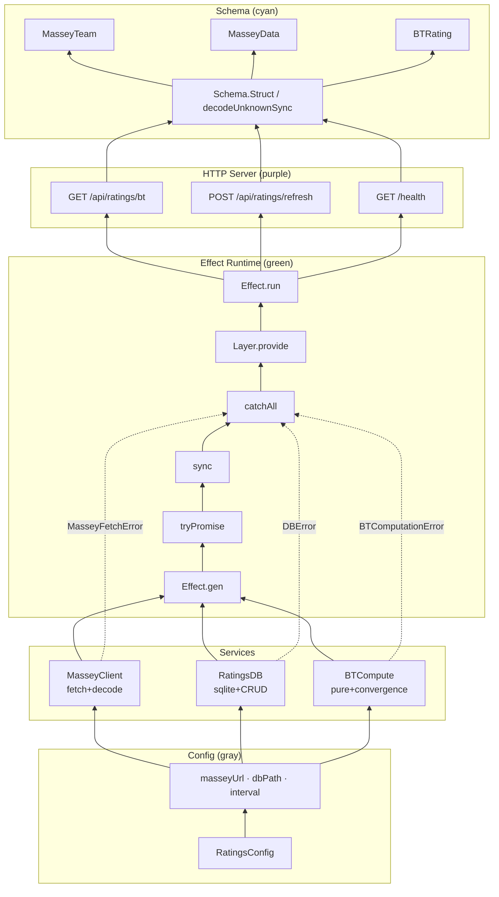

# Architecture Overview

Effect HTTP service for Bradley-Terry ratings — ANSI-colored layer stack, matrix layout, dark terminal aesthetic.

## Layer stack (bottom → top)

| Layer | Color | Nodes |
|-------|-------|-------|
| **Config** | Gray | `RatingsConfig` → masseyUrl, dbPath, interval |
| **Services** | Multi | `MasseyClient` (fetch+decode), `RatingsDB` (sqlite+CRUD), `BTCompute` (pure+convergence) |
| **Effect Runtime** | Green | `Effect.gen`, `tryPromise`, `sync`, `catchAll`, `Layer.provide`, `Effect.run` |
| **HTTP Server** | Purple | `GET /api/ratings/bt`, `POST /api/ratings/refresh`, `GET /health` |
| **Schema** | Cyan | `MasseyTeam`, `MasseyData`, `BTRating`, `Schema.Struct`, `decodeUnknownSync` |

## Error channel

Tagged errors surface as red **E** badges on service nodes:

- **MasseyFetchError** — tagged, typed, catchable
- **DBError** — sqlite operation failures
- **BTComputationError** — convergence failures, team count context

## Data flow

1. **Config** fans out to all three services (`MasseyClient`, `RatingsDB`, `BTCompute`)
2. **Services** emit `Effect<_, E>` into the runtime layer
3. **Runtime** composes handlers for `Bun.serve`
4. **Server** responses encode through the Schema layer

## Mermaid source



## Library modules (package consumers)

For embedded use without the HTTP server:

```
BT Core → Loader (SQLite + Massey) → Repository → Cascade Integration
```

| Module | Role |
|--------|------|
| `schema.ts` | Branded `EntityId`, `Match`, `FitResult` |
| `massey-loader.ts` | Streaming Massey CSV ingestion |
| `match-adapter.ts` | SQLite `MatchRow` → validated `Match` |
| `src/bradley-terry/` | `fit()` core algorithm |
| `src/repository/` | Snapshot persistence |
| `src/integrations/cascade-mover.ts` | Win prob + delta consumer |
