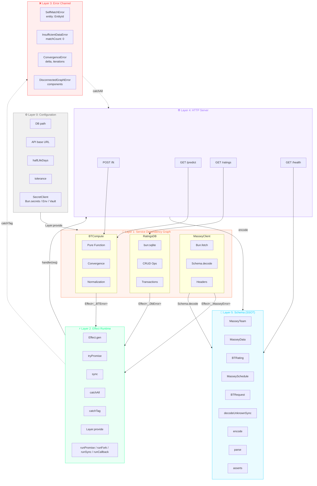

# Architecture

## Overview

`@platform/bradley-terry` is a Bun-native, Effect-powered Bradley-Terry rating
engine. It fits maximum-likelihood strength ratings from win/loss match data
using the Hunter (2004) MM algorithm, with graph-connectivity awareness, time
decay, multiple output scales, and a streaming Massey CSV loader.

```
                ┌────────────────────▼─────────────────────┐
                │           BradleyTerry Service            │
                │  (Context tag + BradleyTerryLive layer)   │
                │                                          │
                │   fit()          predictWinProbability() │
                │      │                    │              │
                │      ▼                    ▼              │
                │  ┌────────┐         ┌──────────────┐     │
                │  │   MM   │         │  P(a>b) =    │     │
                │  │  algo  │         │  sA/(sA+sB)  │     │
                │  └───┬────┘         └──────────────┘     │
                │      │                                   │
                │      ▼                                   │
                │  ┌────────────┐  ┌──────────────┐        │
                │  │ Union-Find │  │  Time decay  │        │
                │  │ (graph)    │  │ (exponential)│        │
                │  └────────────┘  └──────────────┘        │
                └────────────────────┬─────────────────────┘
                                     │
                ┌────────────────────▼─────────────────────┐
                │              Schema (SSOT)               │
                │  EntityId, Match, FitResult,            │
                │  BradleyTerryConfig, BradleyTerryError   │
                └────────────────────┬─────────────────────┘
                                     │
        ┌────────────────────────────┼────────────────────────────┐
        │                            │                            │
┌───────▼─────────┐       ┌──────────▼─────────┐         ┌────────▼─────────┐
│  Massey Loader  │       │   Match Adapter    │         │   Repository     │
│  (Effect Stream │       │  (SQLite MatchRow  │         │  (sqlite-loader  │
│   CSV → Match)  │       │   → BT Match)      │         │   placeholder)   │
└─────────────────┘       └────────────────────┘         └──────────────────┘
```

## Deep architecture: Effect layers



> **Color key:** Effect `#00FF88` · Bun `#FF6B35` · Schema `#00CCFF` · DB `#FF00FF` ·
> Compute `#FFFF00` · Fetch `#FF3366` · Server `#9966FF` · Error `#FF3333` ·
> Config `#888888` · Layer `#44FF44`

**SecretClient abstraction** (`src/secrets/index.ts`): Layer 0's `SecretClient` is a
channel-agnostic Effect service that wraps `Bun.secrets` (local), env vars (CI),
or HashiCorp Vault (production) behind a single `get(service, name)` interface.
Swap implementations by changing the provided `Layer` — the rest of the pipeline
never knows which backend resolved the secret.

## Configuration & Secrets

`src/secrets/index.ts` defines a channel-agnostic `SecretClient` Effect tag. The
same service contract (`get(service, name)`) is implemented by three different
backends, so the `RatingsConfig` Layer never needs to know where a secret came
from.

```
┌─────────────────────────────────────────────────────────────────┐
│  LAYER 0: CONFIGURATION (RatingsConfig)                          │
│  ┌─────────────────────────────────────────────────────────┐    │
│  │  SecretClient.get(service, name)                         │    │
│  │  ─────────────────────────────────────────────────────  │    │
│  │  Channel: OS IPC (Bun.secrets) / HTTPS (Vault) / env   │    │
│  │  Isolation: Data namespace (service + name)             │    │
│  │  NOT: Process sandboxing (same user = theoretical read) │    │
│  └─────────────────────────────────────────────────────────┘    │
│         ↓ SecretClient returns plaintext to Effect.gen           │
└─────────────────────────────────────────────────────────────────┘
         ↓ Layer.provide (Effect dependency injection)
┌─────────────────────────────────────────────────────────────────┐
│  LAYER 1: SERVICES                                               │
│  ┌─────────────┐    ┌─────────────┐    ┌─────────────┐        │
│  │ MasseyClient│    │  RatingsDB  │    │  BTCompute  │        │
│  │ ─────────── │    │ ─────────── │    │ ─────────── │        │
│  │ Channel:    │    │ Channel:    │    │ Channel:    │        │
│  │ HTTPS/TCP   │    │ File I/O    │    │ In-memory   │        │
│  │ (Bun.fetch) │    │ (bun:sqlite)│    │ (pure fn)   │        │
│  └─────────────┘    └─────────────┘    └─────────────┘        │
└─────────────────────────────────────────────────────────────────┘
```

**Backend mapping:**

| Environment | Backend | Channel | Isolation guarantee |
|-------------|---------|---------|-------------------|
| Local dev | `BunSecretsLive` | OS IPC (`Bun.secrets`) | Data namespace (same user) |
| CI / ephemeral | `EnvSecretsLive` | Environment variables | Process-level (short-lived) |
| Production | `VaultSecretsLive` | HTTPS to Vault/Secrets Manager | IAM + network ACLs |

`src/ratings/config.ts` consumes `SecretClient` to build `RatingsConfig`:

- `masseyUrl` — static endpoint for Massey data
- `apiKey` — from `bradley-ratings.messy-client:api-key`
- `dbPath` — from `bradley-ratings.db:sqlite-path`
- `interval` — refresh interval in milliseconds

The key property is that the channel can change without touching `RatingsConfig`.

## Layers

### 1. Schema (`src/schema.ts`)

The single source of truth for all domain types, built on Effect `Schema` and
`Brand`:

- `EntityId` — branded string (`string & Brand<"EntityId">`)
- `MatchRowSchema` — raw ingestion row (`{ home_team, away_team, winner_idx, loser_idx, date, sport?, league?, y?, match_id? }`)
- `MatchSchema` — canonical BT match (`{ winner, loser, date?, weight?, sport?, league? }`)
- `BradleyTerryConfigSchema` — fitter options with defaults
- `RatingEntrySchema`, `FitResultSchema` — output types
- Error types: `SelfMatchError`, `InsufficientDataError`,
  `ConvergenceError`, `DisconnectedGraphError`, `EntityNotFoundError` — all
  `Data.TaggedError` variants on the `BradleyTerryError` union

`src/schema.ts` adds the runtime `FitResult.prototype.toJSON` helper for
serialization (timestamp + version stamping).

### 2. BradleyTerry Service (`src/bradley-terry/index.ts`)

The core engine, exposed as an Effect `Context.Tag` service with a
`Layer.succeed` implementation (`BradleyTerryLive`).

**`fit(matches, config?)`** pipeline:

1. **Validate** — reject empty match lists (`InsufficientDataError`) and
   self-matches (`SelfMatchError`); require ≥2 distinct entities
2. **Build graph** — Union-Find over entities to detect connected components
3. **Filter to largest component** — isolated entities are excluded from the
   fit; a warning is emitted when the graph is disconnected
4. **Apply time decay** — if `timeDecayHalfLifeDays` is set, weight each match
   by `0.5^((t_ref - t_match) / halfLife)` where `t_ref` is the latest match
   timestamp
5. **Run MM algorithm** — Hunter (2004) iteration:
   - For each entity *i*: `s_i ← W_i / Σ_j (n_ij / (s_i + s_j))`
   - Stop when max delta < `tolerance` or `maxIterations` reached
6. **Scale ratings** — apply `outputScale` (`arithmetic`, `geometric`, or
   `elo400`) if `normalize` is true
7. **Compute log-likelihood** — `Σ w · log(s_w / (s_w + s_l))`
8. **Return `FitResult`** — ratings map, iteration count, convergence delta,
   warnings, `largestComponentSize`, etc.

**`predictWinProbability(ratings, a, b)`** — returns `s_a / (s_a + s_b)`.
Fails with `EntityNotFoundError` if either entity is missing.

### 3. Loaders

**`src/data/massey-loader.ts`** — Effect `Stream`-based Massey CSV ingestion.
`Stream.acquireRelease` opens the file, `Stream.fromAsyncIterable` reads lines
with backpressure, `Stream.mapEffect` parses + validates each row against
`MatchRowSchema`. Errors collapse to `MasseyLoaderError`.

**`src/match-adapter.ts`** — SQLite `MatchRow` → BT `Match` pipeline. Bridges the
persistent SQLite match store to the in-memory fitter input. Depends on the
`src/repository/sqlite-loader.ts` stub until the full SQLite repository is
wired in.

### 4. Repository (`src/repository/`)

`src/repository/sqlite-loader.ts` — placeholder SQLite loader for the
`match-adapter` pipeline. A full `RatingsRepositoryLive` for rating snapshots
and deltas will live here once the SQLite schema is finalized.

## Data flow

```
SQLite matches ──► match-adapter ──► Match[] ──► fit() ──► FitResult
                                                          │
Massey CSV ──► massey-loader ──► Match[] ─────────────────┤
                                                          ▼
                                                   predictWinProbability
```

## Testing strategy

- **Property tests** (`test/property/`) — fast-check invariants:
  - `mm-invariants.test.ts` — win-probability symmetry (P + (1-P) = 1),
    monotonicity under added wins
  - `graph-connectivity.test.ts` — `largestComponentSize` correctness,
    disconnected-graph handling
  - `error-handling.test.ts` — `SelfMatchError` / `InsufficientDataError`
    guarantees
- **Benchmarks** (`test/benchmark/`, `src/bench/`) — 50k-match perf target
  (<1.5s), 5k + 25k timed runs with embedded git commit hash

All tests use Bun's built-in test runner (`bun:test`) and run via `bun test`.

## Performance

The MM algorithm is O(iterations × matches) per fit. On an M-series Mac:

| Workload | Mean | Min | Target |
| --- | --- | --- | --- |
| 5k matches | 4.7ms | 2.8ms | — |
| 25k matches | 8.9ms | 7.5ms | — |
| 50k matches | 87ms | — | < 1500ms |

Float64 typed arrays are used for strengths and win counts to avoid GC pressure
on large match sets.

## Bun-native API inventory

This project uses Bun's built-in APIs exclusively — no Node.js polyfills or
third-party equivalents. The strategy keeps the dependency footprint small and
leverages Bun's performance-optimized primitives.

### I/O & File system
| API | Usage |
|-----|-------|
| `Bun.file(path)` | Read artifacts (JSON, Markdown, CSV, HTML) |
| `Bun.write(path, content)` | Write generated artifacts |
| `Bun.file(path).text()` | Streaming text read |
| `Bun.readableStreamToText(stream)` | Stream → text conversion |
| `Bun.readableStreamToArrayBuffer(stream)` | Stream → ArrayBuffer conversion |
| `Bun.readableStreamToBytes(stream)` | Stream → Uint8Array conversion |

### Hashing & cryptography
| API | Usage |
|-----|-------|
| `Bun.CryptoHasher("sha256"/"sha512", key?)` | JSON drift hashing, content integrity, HMAC keyed hashing |
| `Bun.hash(content)` | Fast content-addressable hashing (wyhash, default) |
| `Bun.hash.xxHash3(content)` | Fast non-crypto 64-bit hash |
| `Bun.hash.wyhash(content)` | Wyhash 64-bit hash |
| `Bun.password.hash(password)` / `hashSync(password)` | Argon2id/bcrypt password hashing |
| `Bun.password.verify(password, hash)` / `verifySync(password, hash)` | Password verification |


### Compression
| API | Usage |
|-----|-------|
| `Bun.gzipSync(data)` | Compress for storage/transport |
| `Bun.gunzipSync(data)` | Decompress for processing |
| `Bun.deflateSync(data)` | DEFLATE compression |
| `Bun.inflateSync(data)` | DEFLATE decompression |
| `Bun.zstdCompressSync(data)` | Zstandard compression (better ratio than gzip) |
| `Bun.zstdDecompressSync(data)` | Zstandard decompression |
| `Bun.zstdCompress(data)` | Async Zstandard compression |
| `Bun.zstdDecompress(data)` | Async Zstandard decompression |

### Text & formatting
| API | Usage |
|-----|-------|
| `Bun.escapeHTML(str)` | HTML artifact generation |
| `Bun.stringWidth(str)` | CJK/emoji-aware column alignment in markdown tables |
| `Bun.stripANSI(str)` | Strip ANSI escape codes from terminal output |

### Data utilities
| API | Usage |
|-----|-------|
| `Bun.deepEquals(a, b)` | Structural equality in tests |
| `Bun.peek(promise)` | Synchronous inspection of resolved promises |
| `Bun.peek.status(promise)` | Read promise state without resolving |
| `Bun.env` | Environment variable access |
| `Bun.version` / `Bun.revision` | Runtime version introspection |
| `Bun.main` | Entrypoint path resolution |
| `Bun.which(cmd)` | Binary lookup |
| `Bun.sleep(ms)` | Async delay |
| `Bun.sleepSync(ms)` | Blocking synchronous delay |
| `Bun.nanoseconds()` | High-precision timing |
| `Bun.randomUUIDv7()` | Time-ordered UUID generation for history tables |
| `Bun.openInEditor(path, opts)` | Open files in the default editor |

### Parsing & serialization
| API | Usage |
|-----|-------|
| `Bun.TOML.parse(str)` | TOML configuration parsing (e.g., `bunfig.toml`) |
| `Bun.JSONC.parse(str)` | JSONC (JSON with comments) parsing |

### Path resolution
| API | Usage |
|-----|-------|
| `Bun.fileURLToPath(url)` | Convert file:// URLs to OS paths |
| `Bun.pathToFileURL(path)` | Cross-platform path → file:// URL conversion |
| `Bun.resolveSync(id, opts)` | Resolve module paths synchronously |

### Glob & process
| API | Usage |
|-----|-------|
| `Bun.Glob(pattern)` | File globbing for artifact discovery |
| `Bun.spawn(cmd, opts)` | Child process spawning |

### Network & serving
| API | Usage |
|-----|-------|
| `Bun.serve(opts)` | HTTP server |
| `Bun.WebSocket` | WebSocket support |
| `Bun.dns` | DNS resolution |
| `Bun.connect(opts)` | TCP/UDP connections |
| `Bun.udpSocket(opts)` | UDP socket creation |

### Inspection & debugging
| API | Usage |
|-----|-------|
| `Bun.inspect(obj)` | Structured object inspection |
| `Bun.inspect.table(rows)` | Tabular console output |
| `Bun.inspect.custom` | Custom inspect symbol for user classes |

### Serialization (bun:jsc)
| API | Usage |
|-----|-------|
| `serialize(value)` | Structured clone into SharedArrayBuffer |
| `deserialize(buf)` | Restore from SharedArrayBuffer |
| `estimateShallowMemoryUsageOf(obj)` | Best-effort memory estimate in bytes |

### SQLite (bun:sqlite)
| API | Usage |
|-----|-------|
| `new Database(path)` / `Database(":memory:")` | Open/create SQLite databases |
| `db.run(sql, params?)` | Execute statements |
| `db.query(sql)` | Create prepared statement with .all()/.get()/.values()/.iterate() |
| `db.serialize()` / `Database.deserialize(buf)` | Snapshot database to/from Uint8Array |
| `db.transaction(fn)` | Higher-order transaction with auto BEGIN/COMMIT/ROLLBACK |
| `using db = new Database(...)` | Auto-close via Disposable |

### Versioning
| API | Usage |
|-----|-------|
| `Bun.semver.satisfies(version, range)` | Semver range checking (drift gate) |
| `Bun.semver.order(a, b)` | Version comparison |

### Markdown (unstable, validation only)
| API | Usage |
|-----|-------|
| `Bun.markdown.html(md, opts)` | Validate markdown structure (not used in production output) |

## References

- Hunter, D. R. (2004). *MM algorithms for generalized Bradley-Terry models.*
  The Annals of Statistics, 32(1), 384–406.
- Bradley, R. A., & Terry, M. E. (1952). *Rank analysis of incomplete block
  designs I. The method of paired comparisons.* Biometrika, 39, 324–345.
