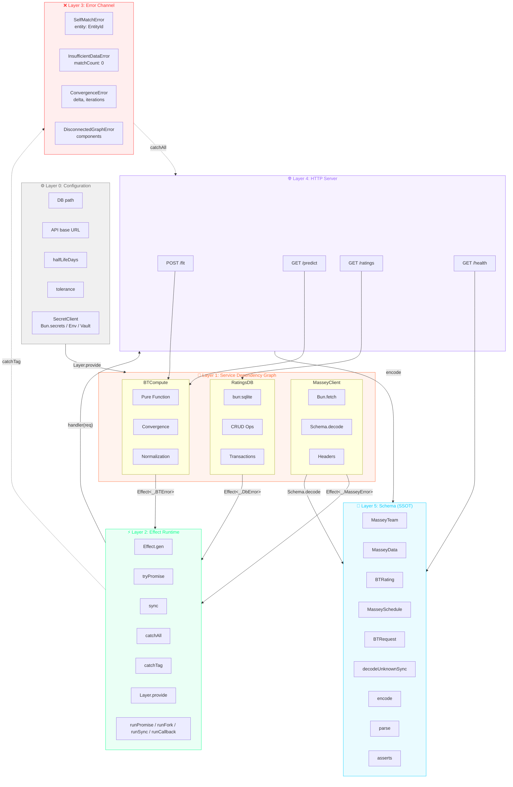

# Architecture

## Overview

`@platform/bradley-terry` is a Bun-native, Effect-powered Bradley-Terry rating
engine. It fits maximum-likelihood strength ratings from win/loss match data
using the Hunter (2004) MM algorithm, with graph-connectivity awareness, time
decay, multiple output scales, and a streaming Massey CSV loader.

```
                ┌────────────────────▼─────────────────────┐
                │           BradleyTerry Service            │
                │  (Context tag + BradleyTerryLive layer)   │
                │                                          │
                │   fit()          predictWinProbability() │
                │      │                    │              │
                │      ▼                    ▼              │
                │  ┌────────┐         ┌──────────────┐     │
                │  │   MM   │         │  P(a>b) =    │     │
                │  │  algo  │         │  sA/(sA+sB)  │     │
                │  └───┬────┘         └──────────────┘     │
                │      │                                   │
                │      ▼                                   │
                │  ┌────────────┐  ┌──────────────┐        │
                │  │ Union-Find │  │  Time decay  │        │
                │  │ (graph)    │  │ (exponential)│        │
                │  └────────────┘  └──────────────┘        │
                └────────────────────┬─────────────────────┘
                                     │
                ┌────────────────────▼─────────────────────┐
                │              Schema (SSOT)               │
                │  EntityId, Match, FitResult,            │
                │  BradleyTerryConfig, BradleyTerryError   │
                └────────────────────┬─────────────────────┘
                                     │
        ┌────────────────────────────┼────────────────────────────┐
        │                            │                            │
┌───────▼─────────┐       ┌──────────▼─────────┐         ┌────────▼─────────┐
│  Massey Loader  │       │   Match Adapter    │         │   Repository     │
│  (Effect Stream │       │  (SQLite MatchRow  │         │  (sqlite-loader  │
│   CSV → Match)  │       │   → BT Match)      │         │   placeholder)   │
└─────────────────┘       └────────────────────┘         └──────────────────┘
```

## Deep architecture: Effect layers



> **Color key:** Effect `#00FF88` · Bun `#FF6B35` · Schema `#00CCFF` · DB `#FF00FF` ·
> Compute `#FFFF00` · Fetch `#FF3366` · Server `#9966FF` · Error `#FF3333` ·
> Config `#888888` · Layer `#44FF44`

**SecretClient abstraction** (`src/secrets/index.ts`): Layer 0's `SecretClient` is a
channel-agnostic Effect service that wraps `Bun.secrets` (local), env vars (CI),
or HashiCorp Vault (production) behind a single `get(service, name)` interface.
Swap implementations by changing the provided `Layer` — the rest of the pipeline
never knows which backend resolved the secret.

## Configuration & Secrets

`src/secrets/index.ts` defines a channel-agnostic `SecretClient` Effect tag. The
same service contract (`get(service, name)`) is implemented by three different
backends, so the `RatingsConfig` Layer never needs to know where a secret came
from.

```
┌─────────────────────────────────────────────────────────────────┐
│  LAYER 0: CONFIGURATION (RatingsConfig)                          │
│  ┌─────────────────────────────────────────────────────────┐    │
│  │  SecretClient.get(service, name)                         │    │
│  │  ─────────────────────────────────────────────────────  │    │
│  │  Channel: OS IPC (Bun.secrets) / HTTPS (Vault) / env   │    │
│  │  Isolation: Data namespace (service + name)             │    │
│  │  NOT: Process sandboxing (same user = theoretical read) │    │
│  └─────────────────────────────────────────────────────────┘    │
│         ↓ SecretClient returns plaintext to Effect.gen           │
└─────────────────────────────────────────────────────────────────┘
         ↓ Layer.provide (Effect dependency injection)
┌─────────────────────────────────────────────────────────────────┐
│  LAYER 1: SERVICES                                               │
│  ┌─────────────┐    ┌─────────────┐    ┌─────────────┐        │
│  │ MasseyClient│    │  RatingsDB  │    │  BTCompute  │        │
│  │ ─────────── │    │ ─────────── │    │ ─────────── │        │
│  │ Channel:    │    │ Channel:    │    │ Channel:    │        │
│  │ HTTPS/TCP   │    │ File I/O    │    │ In-memory   │        │
│  │ (Bun.fetch) │    │ (bun:sqlite)│    │ (pure fn)   │        │
│  └─────────────┘    └─────────────┘    └─────────────┘        │
└─────────────────────────────────────────────────────────────────┘
```

**Backend mapping:**

| Environment | Backend | Channel | Isolation guarantee |
|-------------|---------|---------|-------------------|
| Local dev | `BunSecretsLive` | OS IPC (`Bun.secrets`) | Data namespace (same user) |
| CI / ephemeral | `EnvSecretsLive` | Environment variables | Process-level (short-lived) |
| Production | `VaultSecretsLive` | HTTPS to Vault/Secrets Manager | IAM + network ACLs |

`src/ratings/config.ts` consumes `SecretClient` to build `RatingsConfig`:

- `masseyUrl` — static endpoint for Massey data
- `apiKey` — from `bradley-ratings.messy-client:api-key`
- `dbPath` — from `bradley-ratings.db:sqlite-path`
- `interval` — refresh interval in milliseconds

The key property is that the channel can change without touching `RatingsConfig`.

## Layers

### 1. Schema (`src/schema.ts`)

The single source of truth for all domain types, built on Effect `Schema` and
`Brand`:

- `EntityId` — branded string (`string & Brand<"EntityId">`)
- `MatchRowSchema` — raw ingestion row (`{ home_team, away_team, winner_idx, loser_idx, date, sport?, league?, y?, match_id? }`)
- `MatchSchema` — canonical BT match (`{ winner, loser, date?, weight?, sport?, league? }`)
- `BradleyTerryConfigSchema` — fitter options with defaults
- `RatingEntrySchema`, `FitResultSchema` — output types
- Error types: `SelfMatchError`, `InsufficientDataError`,
  `ConvergenceError`, `DisconnectedGraphError`, `EntityNotFoundError` — all
  `Data.TaggedError` variants on the `BradleyTerryError` union

`src/schema.ts` adds the runtime `FitResult.prototype.toJSON` helper for
serialization (timestamp + version stamping).

### 2. BradleyTerry Service (`src/bradley-terry/index.ts`)

The core engine, exposed as an Effect `Context.Tag` service with a
`Layer.succeed` implementation (`BradleyTerryLive`).

**`fit(matches, config?)`** pipeline:

1. **Validate** — reject empty match lists (`InsufficientDataError`) and
   self-matches (`SelfMatchError`); require ≥2 distinct entities
2. **Build graph** — Union-Find over entities to detect connected components
3. **Filter to largest component** — isolated entities are excluded from the
   fit; a warning is emitted when the graph is disconnected
4. **Apply time decay** — if `timeDecayHalfLifeDays` is set, weight each match
   by `0.5^((t_ref - t_match) / halfLife)` where `t_ref` is the latest match
   timestamp
5. **Run MM algorithm** — Hunter (2004) iteration:
   - For each entity *i*: `s_i ← W_i / Σ_j (n_ij / (s_i + s_j))`
   - Stop when max delta < `tolerance` or `maxIterations` reached
6. **Scale ratings** — apply `outputScale` (`arithmetic`, `geometric`, or
   `elo400`) if `normalize` is true
7. **Compute log-likelihood** — `Σ w · log(s_w / (s_w + s_l))`
8. **Return `FitResult`** — ratings map, iteration count, convergence delta,
   warnings, `largestComponentSize`, etc.

**`predictWinProbability(ratings, a, b)`** — returns `s_a / (s_a + s_b)`.
Fails with `EntityNotFoundError` if either entity is missing.

### 3. Loaders

**`src/data/massey-loader.ts`** — Effect `Stream`-based Massey CSV ingestion.
`Stream.acquireRelease` opens the file, `Stream.fromAsyncIterable` reads lines
with backpressure, `Stream.mapEffect` parses + validates each row against
`MatchRowSchema`. Errors collapse to `MasseyLoaderError`.

**`src/match-adapter.ts`** — SQLite `MatchRow` → BT `Match` pipeline. Bridges the
persistent SQLite match store to the in-memory fitter input. Depends on the
`src/repository/sqlite-loader.ts` stub until the full SQLite repository is
wired in.

### 4. Repository (`src/repository/`)

`src/repository/sqlite-loader.ts` — placeholder SQLite loader for the
`match-adapter` pipeline. A full `RatingsRepositoryLive` for rating snapshots
and deltas will live here once the SQLite schema is finalized.

## Data flow

```
SQLite matches ──► match-adapter ──► Match[] ──► fit() ──► FitResult
                                                          │
Massey CSV ──► massey-loader ──► Match[] ─────────────────┤
                                                          ▼
                                                   predictWinProbability
```

## Testing strategy

- **Property tests** (`test/property/`) — fast-check invariants:
  - `mm-invariants.test.ts` — win-probability symmetry (P + (1-P) = 1),
    monotonicity under added wins
  - `graph-connectivity.test.ts` — `largestComponentSize` correctness,
    disconnected-graph handling
  - `error-handling.test.ts` — `SelfMatchError` / `InsufficientDataError`
    guarantees
- **Benchmarks** (`test/benchmark/`, `src/bench/`) — 50k-match perf target
  (<1.5s), 5k + 25k timed runs with embedded git commit hash

All tests use Bun's built-in test runner (`bun:test`) and run via `bun test`.

## Performance

The MM algorithm is O(iterations × matches) per fit. On an M-series Mac:

| Workload | Mean | Min | Target |
| --- | --- | --- | --- |
| 5k matches | 4.7ms | 2.8ms | — |
| 25k matches | 8.9ms | 7.5ms | — |
| 50k matches | 87ms | — | < 1500ms |

Float64 typed arrays are used for strengths and win counts to avoid GC pressure
on large match sets.

## Bun-native API inventory

This project uses Bun's built-in APIs exclusively — no Node.js polyfills or
third-party equivalents. The strategy keeps the dependency footprint small and
leverages Bun's performance-optimized primitives.

### I/O & File system
| API | Usage |
|-----|-------|
| `Bun.file(path)` | Read artifacts (JSON, Markdown, CSV, HTML) |
| `Bun.write(path, content)` | Write generated artifacts |
| `Bun.file(path).text()` | Streaming text read |
| `Bun.file(path).json()` | Parse file as JSON directly |
| `Bun.file(path).writer()` | Incremental FileSink for chunked writes |
| `Bun.readableStreamToText(stream)` | Stream → text conversion |
| `Bun.readableStreamToArrayBuffer(stream)` | Stream → ArrayBuffer conversion |
| `Bun.readableStreamToBytes(stream)` | Stream → Uint8Array conversion |
| `Bun.stdin` / `Bun.stdout` / `Bun.stderr` | Standard I/O as BunFile |

### Hashing & cryptography
| API | Usage |
|-----|-------|
| `Bun.CryptoHasher("sha256"/"sha512", key?)` | JSON drift hashing, content integrity, HMAC keyed hashing |
| `Bun.hash(content)` | Fast content-addressable hashing (wyhash, default) |
| `Bun.hash.xxHash3(content)` | Fast non-crypto 64-bit hash |
| `Bun.hash.wyhash(content)` | Wyhash 64-bit hash |
| `Bun.password.hash(password)` / `hashSync(password)` | Argon2id/bcrypt password hashing |
| `Bun.password.verify(password, hash)` / `verifySync(password, hash)` | Password verification |


### Compression
| API | Usage |
|-----|-------|
| `Bun.gzipSync(data)` | Compress for storage/transport |
| `Bun.gunzipSync(data)` | Decompress for processing |
| `Bun.deflateSync(data)` | DEFLATE compression |
| `Bun.inflateSync(data)` | DEFLATE decompression |
| `Bun.zstdCompressSync(data)` | Zstandard compression (better ratio than gzip) |
| `Bun.zstdDecompressSync(data)` | Zstandard decompression |
| `Bun.zstdCompress(data)` | Async Zstandard compression |
| `Bun.zstdDecompress(data)` | Async Zstandard decompression |

### Text & formatting
| API | Usage |
|-----|-------|
| `Bun.escapeHTML(str)` | HTML artifact generation |
| `Bun.stringWidth(str)` | CJK/emoji-aware column alignment in markdown tables |
| `Bun.stripANSI(str)` | Strip ANSI escape codes from terminal output |

### Data utilities
| API | Usage |
|-----|-------|
| `Bun.deepEquals(a, b)` | Structural equality in tests |
| `Bun.peek(promise)` | Synchronous inspection of resolved promises |
| `Bun.peek.status(promise)` | Read promise state without resolving |
| `Bun.env` | Environment variable access |
| `Bun.version` / `Bun.revision` | Runtime version introspection |
| `Bun.main` | Entrypoint path resolution |
| `Bun.which(cmd)` | Binary lookup |
| `Bun.sleep(ms)` | Async delay |
| `Bun.sleepSync(ms)` | Blocking synchronous delay |
| `Bun.nanoseconds()` | High-precision timing |
| `Bun.randomUUIDv7()` | Time-ordered UUID generation for history tables |
| `Bun.openInEditor(path, opts)` | Open files in the default editor |

### Parsing & serialization
| API | Usage |
|-----|-------|
| `Bun.TOML.parse(str)` | TOML configuration parsing (e.g., `bunfig.toml`) |
| `Bun.JSONC.parse(str)` | JSONC (JSON with comments) parsing |

### Path resolution
| API | Usage |
|-----|-------|
| `Bun.fileURLToPath(url)` | Convert file:// URLs to OS paths |
| `Bun.pathToFileURL(path)` | Cross-platform path → file:// URL conversion |
| `Bun.resolveSync(id, opts)` | Resolve module paths synchronously |

### Glob & process
| API | Usage |
|-----|-------|
| `Bun.Glob(pattern)` | File globbing for artifact discovery |
| `Bun.Glob.match(path)` | Validate a path against the glob pattern |
| `Bun.spawn(cmd, opts)` | Child process spawning |
| `Bun.spawnSync(cmd, opts)` | Synchronous child process (macros, CLI tools) |

### Transpiler & workers
| API | Usage |
|-----|-------|
| `Bun.Transpiler({ loader })` | Programmatic TS/JSX transpilation |
| `new Worker(url)` | Web Workers API with blob: URL support |
| `Bun.color(input, format)` | Convert between CSS/hex/rgb/hsl/ANSI color formats |

### SQL (bun:sql)
| API | Usage |
|-----|-------|
| `new SQL(url)` | Unified tagged-template SQL client (PostgreSQL/MySQL/SQLite) |
| `` db`SELECT ...` `` | Parameterized queries with auto-escaping |

### Network & serving
| API | Usage |
|-----|-------|
| `Bun.serve(opts)` | HTTP server |
| `server.port` | Assigned port (`0` requests an ephemeral port) |
| `server.stop()` | Gracefully stop the server |
| `server.ref()` / `server.unref()` | Control event-loop retention |
| `server.fetch(req)` | In-process request handler (testing) |
| `Bun.WebSocket` | WebSocket support |
| `Bun.dns` | DNS resolution |
| `Bun.connect(opts)` | TCP/UDP connections |
| `Bun.udpSocket(opts)` | UDP socket creation |

The `Bun.serve` API is used by the HTTP ratings service layer. A server started with `port: 0` binds to an ephemeral port; `server.port` reflects the actual port and `server.stop()` shuts it down.

### Inspection & debugging
| API | Usage |
|-----|-------|
| `Bun.inspect(obj)` | Structured object inspection |
| `Bun.inspect.table(rows)` | Tabular console output |
| `Bun.inspect.custom` | Custom inspect symbol for user classes |

### Serialization (bun:jsc)
| API | Usage |
|-----|-------|
| `serialize(value)` | Structured clone into SharedArrayBuffer |
| `deserialize(buf)` | Restore from SharedArrayBuffer |
| `estimateShallowMemoryUsageOf(obj)` | Best-effort memory estimate in bytes |

### SQLite (bun:sqlite)
| API | Usage |
|-----|-------|
| `new Database(path)` / `Database(":memory:")` | Open/create SQLite databases |
| `db.run(sql, params?)` | Execute statements |
| `db.query(sql)` | Create prepared statement with .all()/.get()/.values()/.iterate() |
| `db.serialize()` / `Database.deserialize(buf)` | Snapshot database to/from Uint8Array |
| `db.transaction(fn)` | Higher-order transaction with auto BEGIN/COMMIT/ROLLBACK |
| `using db = new Database(...)` | Auto-close via Disposable |

### Versioning & runtime info
| API | Usage |
|-----|-------|
| `Bun.version` | Runtime semver string (e.g. `1.4.0`) |
| `Bun.revision` | Runtime commit hash (e.g. `452139e36...`) |
| `Bun.semver.satisfies(version, range)` | Semver range checking (drift gate) |
| `Bun.semver.order(a, b)` | Version comparison |

### Markdown (unstable, validation only)
| API | Usage |
|-----|-------|
| `Bun.markdown.html(md, opts)` | Validate markdown structure (not used in production output) |

### Web APIs (globals)
| API | Usage |
|-----|-------|
| `performance.now()` | High-resolution monotonic timestamps |
| `CustomEvent` / `EventTarget` | Web-standard event dispatching |
| `DOMException` | Web API error type |
| `alert` / `confirm` / `prompt` | CLI interactive dialogs (blocking) |
| `ShadowRealm` | Sandboxed JS evaluation (Stage 3) |

### Bun Runtime
| API | Usage |
|-----|-------|
| `--watch` / `--hot` | Auto-restart on file change |
| `--smol` | Reduced memory heap size |
| `Bun.env` / `process.env` | Auto-loaded .env with variable expansion |
| `Bun.Archive` (≥1.4.0) | Create/extract tar.gz archives |

## One-Liner Cookbook

Curated `bun -e` one-liners that demonstrate Bun APIs. Run via `bun run cookbook`.
Each one-liner is a living specification — the test suite executes every one and
asserts the output matches expected patterns.

| # | One-liner | APIs demonstrated |
|---|-----------|-------------------|
| 1 | HTTP server on ephemeral port | `Bun.serve`, `port: 0` |
| 2 | File write and read | `Bun.write`, `Bun.file` |
| 3 | Runtime version and revision | `Bun.version`, `Bun.revision` |
| 4 | Password hashing and verification | `Bun.password.hashSync`, `verifySync` |
| 5 | SHA-256 hashing | `Bun.CryptoHasher` |
| 6 | gzip compression roundtrip | `Bun.gzipSync`, `gunzipSync` |
| 7 | TOML parsing | `Bun.TOML.parse` |
| 8 | Environment variable access | `Bun.env` |
| 9 | nanoseconds timing | `Bun.nanoseconds`, `Bun.sleepSync` |
| 10 | UUIDv7 generation | `Bun.randomUUIDv7` |
| 11 | stringWidth CJK measurement | `Bun.stringWidth` |
| 12 | sleep async delay | `Bun.sleep` |
| 13 | `--smol` memory-constrained run | `bun --smol` |
| 14 | stdin pipe via `bun run -` | `bun run -` |
| 15 | deflate compression roundtrip | `Bun.deflateSync`, `inflateSync` |
| 16 | zstd compression with level | `Bun.zstdCompressSync` |
| 17 | HTML entity escaping | `Bun.escapeHTML` |
| 18 | deepEquals structural comparison | `Bun.deepEquals` |
| 19 | peek synchronous promise inspection | `Bun.peek`, `peek.status` |
| 20 | resolveSync module resolution | `Bun.resolveSync` |
| 21 | ArrayBufferSink incremental buffer | `Bun.ArrayBufferSink` |
| 22 | semver satisfies range check | `Bun.semver.satisfies` |
| 23 | semver order comparison | `Bun.semver.order` |
| 24 | color hex and number conversion | `Bun.color` |
| 25 | Transpiler TS to JS | `Bun.Transpiler` |

Add new one-liners to `one-liners.json` and run `bun run cookbook` to verify.

## References

### HTTP Server

Source: <https://bun.com/docs/api/http>

| Example | First line |
| ------- | ---------- |
| Example 1 | `import myReactSinglePageApp from "./index.html";` |
| Example 2 | `Bun.serve({` |
| Example 3 | `const server = Bun.serve({` |
| Example 4 | `console.log(server.port); // 3000` |
| Example 5 | `Bun.serve({` |
| Example 6 | `Bun.serve({` |
| Example 7 | `Bun.serve({` |
| Example 8 | `import type { Serve } from "bun";` |
| Example 9 | `const server = Bun.serve({` |
| Example 10 | `const server = Bun.serve({` |
| Example 11 | `// Don't keep process alive if server is the only thing runn` |
| Example 12 | `const server = Bun.serve({` |
| Example 13 | `const server = Bun.serve({` |
| Example 14 | `Bun.serve({` |
| Example 15 | `Bun.serve({` |
| Example 16 | `require("http")` |
| Example 17 | `interface Server extends Disposable {` |

```typescript
import myReactSinglePageApp from "./index.html";

Bun.serve({
  routes: {
    "/": myReactSinglePageApp,
  },
});
```


### Bun File

Source: <https://bun.com/docs/api/file>

| Example | First line |
| ------- | ---------- |
| Example 1 | `const foo = Bun.file("foo.txt"); // relative to cwd` |
| Example 2 | `const foo = Bun.file("foo.txt");` |
| Example 3 | `Bun.file(1234);` |
| Example 4 | `const notreal = Bun.file("notreal.txt");` |
| Example 5 | `const notreal = Bun.file("notreal.json", { type: "applicatio` |
| Example 6 | `Bun.stdin; // readonly` |
| Example 7 | `await Bun.file("logs.json").delete();` |
| Example 8 | `const input = Bun.file("input.txt");` |
| Example 9 | `const encoder = new TextEncoder();` |
| Example 10 | `const input = Bun.file("input.txt");` |
| Example 11 | `const response = await fetch("https://bun.com");` |
| Example 12 | `const file = Bun.file("output.txt");` |
| Example 13 | `const file = Bun.file("output.txt");` |
| Example 14 | `writer.flush(); // write buffer to disk` |
| Example 15 | `const file = Bun.file("output.txt");` |
| Example 16 | `writer.end();` |
| Example 17 | `writer.unref();` |
| Example 18 | `import { readdir } from "node:fs/promises";` |
| Example 19 | `import { readdir } from "node:fs/promises";` |
| Example 20 | `import { mkdir } from "node:fs/promises";` |
| Example 21 | `// Usage` |
| Example 22 | `interface Bun {` |

```typescript
const foo = Bun.file("foo.txt"); // relative to cwd
foo.size; // number of bytes
foo.type; // MIME type
```


### Glob

Source: <https://bun.com/docs/api/glob>

| Example | First line |
| ------- | ---------- |
| Example 1 | `import { Glob } from "bun";` |
| Example 2 | `import { Glob } from "bun";` |
| Example 3 | `class Glob {` |
| Example 4 | `const glob = new Glob("???.ts");` |
| Example 5 | `const glob = new Glob("*.ts");` |
| Example 6 | `const glob = new Glob("**/*.ts");` |
| Example 7 | `const glob = new Glob("ba[rz].ts");` |
| Example 8 | `const glob = new Glob("ba[a-z][0-9][^4-9].ts");` |
| Example 9 | `const glob = new Glob("{a,b,c}.ts");` |
| Example 10 | `const glob = new Glob("!index.ts");` |
| Example 11 | `const glob = new Glob("\\!index.ts");` |
| Example 12 | `import { glob, globSync, promises } from "node:fs";` |

```typescript
import { Glob } from "bun";

const glob = new Glob("**/*.ts");

// Scans the current working directory and each of its sub-directories recursively
for await (const file of glob.scan(".")) {
  console.log(file); // => "index.ts"
}
```


### Spawn

Source: <https://bun.com/docs/api/spawn>

| Example | First line |
| ------- | ---------- |
| Example 1 | `const proc = Bun.spawn(["bun", "--version"]);` |
| Example 2 | `const proc = Bun.spawn(["bun", "--version"], {` |
| Example 3 | `const proc = Bun.spawn(["cat"], {` |
| Example 4 | `const proc = Bun.spawn(["cat"], {` |
| Example 5 | `const stream = new ReadableStream({` |
| Example 6 | `const proc = Bun.spawn(["bun", "--version"]);` |
| Example 7 | `const proc = Bun.spawn(["bun", "--version"], {` |
| Example 8 | `const proc = Bun.spawn(["bun", "--version"]);` |
| Example 9 | `const proc = Bun.spawn(["bun", "--version"]);` |
| Example 10 | `const proc = Bun.spawn(["bun", "--version"]);` |
| Example 11 | `const controller = new AbortController();` |
| Example 12 | `// Kill the process after 5 seconds` |
| Example 13 | `// Kill the process with SIGKILL after 5 seconds` |
| Example 14 | `// Kill 'yes' after it emits over 100 bytes of output` |
| Example 15 | `const child = Bun.spawn(["bun", "child.ts"], {` |
| Example 16 | `const childProc = Bun.spawn(["bun", "child.ts"], {` |
| Example 17 | `process.send("Hello from child as string");` |
| Example 18 | `// send a string` |
| Example 19 | `childProc.disconnect();` |
| Example 20 | `const proc = Bun.spawn(["bash"], {` |
| Example 21 | `// Write data to the terminal` |
| Example 22 | `await using terminal = new Bun.Terminal({` |
| Example 23 | `const proc = Bun.spawnSync(["echo", "hello"]);` |
| Example 24 | `interface Bun {` |

```typescript
const proc = Bun.spawn(["bun", "--version"]);
console.log(await proc.exited); // 0
```


### SQLite

Source: <https://bun.com/docs/api/sqlite>

| Example | First line |
| ------- | ---------- |
| Example 1 | `import { Database } from "bun:sqlite";` |
| Example 2 | `import { Database } from "bun:sqlite";` |
| Example 3 | `import { Database } from "bun:sqlite";` |
| Example 4 | `import { Database } from "bun:sqlite";` |
| Example 5 | `import { Database } from "bun:sqlite";` |
| Example 6 | `import db from "./mydb.sqlite" with { type: "sqlite" };` |
| Example 7 | `import { Database } from "bun:sqlite";` |
| Example 8 | `const db = new Database();` |
| Example 9 | `const db = new Database();` |
| Example 10 | `import { Database } from "bun:sqlite";` |
| Example 11 | `const olddb = new Database("mydb.sqlite");` |
| Example 12 | `const query = db.query("SELECT * FROM users WHERE id = ?");` |
| Example 13 | `// compile the prepared statement without caching` |
| Example 14 | `db.run("PRAGMA journal_mode = WAL;");` |
| Example 15 | `import { Database, constants } from "bun:sqlite";` |
| Example 16 | `class Movie {` |
| Example 17 | `const query = db.query("SELECT * FROM foo");` |
| Example 18 | `const query = db.query("SELECT * FROM foo");` |
| Example 19 | `const query = db.query("SELECT title, year FROM movies");` |
| Example 20 | `import { Database } from "bun:sqlite";` |
| Example 21 | `const query = db.query("SELECT * FROM foo WHERE bar = $bar")` |
| Example 22 | `const query = db.query("SELECT ?1, ?2");` |
| Example 23 | `import { Database } from "bun:sqlite";` |
| Example 24 | `const insertCat = db.prepare("INSERT INTO cats (name) VALUES` |
| Example 25 | `// setup` |
| Example 26 | `insertCats(cats); // uses "BEGIN"` |
| Example 27 | `import { Database } from "bun:sqlite";` |
| Example 28 | `import { Database } from "bun:sqlite";` |
| Example 29 | `import { Database, constants } from "bun:sqlite";` |
| Example 30 | `class Database {` |

```typescript
import { Database } from "bun:sqlite";

const db = new Database(":memory:");
const query = db.query("select 'Hello world' as message;");
query.get();
```


### Hashing

Source: <https://bun.com/docs/api/hashing>

| Example | First line |
| ------- | ---------- |
| Example 1 | `const password = "super-secure-pa$$word";` |
| Example 2 | `const password = "super-secure-pa$$word";` |
| Example 3 | `const password = "super-secure-pa$$word";` |
| Example 4 | `const password = "super-secure-pa$$word";` |
| Example 5 | `await Bun.password.hash("hello", {` |
| Example 6 | `await Bun.password.hash("hello".repeat(100), {` |
| Example 7 | `await Bun.password.hash("hello", {` |
| Example 8 | `Bun.hash("some data here");` |
| Example 9 | `const arr = new Uint8Array([1, 2, 3, 4]);` |
| Example 10 | `Bun.hash("some data here", 1234);` |
| Example 11 | `Bun.hash.wyhash("data", 1234); // equivalent to Bun.hash()` |
| Example 12 | `const hasher = new Bun.CryptoHasher("sha256");` |
| Example 13 | `const hasher = new Bun.CryptoHasher("sha256");` |
| Example 14 | `hasher.update("hello world"); // defaults to utf8` |
| Example 15 | `const hasher = new Bun.CryptoHasher("sha256");` |
| Example 16 | `hasher.digest("base64");` |
| Example 17 | `const arr = new Uint8Array(32);` |
| Example 18 | `const hasher = new Bun.CryptoHasher("sha256", "secret-key");` |
| Example 19 | `const hasher = new Bun.CryptoHasher("sha256", "secret-key");` |

```typescript
const password = "super-secure-pa$$word";

const hash = await Bun.password.hash(password);
// => $argon2id$v=19$m=65536,t=2,p=1$tFq+9AVr1bfPxQdh6E8DQRhEXg/M/SqYCNu6gVdRRNs$GzJ8PuBi+K+BVojzPfS5mjnC8OpLGtv8KJqF99eP6a4

const isMatch = await Bun.password.verify(password, hash);
// => true
```


### Transpiler

Source: <https://bun.com/docs/api/transpiler>

| Example | First line |
| ------- | ---------- |
| Example 1 | `const transpiler = new Bun.Transpiler({` |
| Example 2 | `transpiler.transformSync("<div>hi!</div>", "tsx");` |
| Example 3 | `const transpiler = new Bun.Transpiler({ loader: "jsx" });` |
| Example 4 | `await transpiler.transform("<div>hi!</div>", "tsx");` |

```typescript
const transpiler = new Bun.Transpiler({
  loader: "tsx", // "js" | "jsx" | "ts" | "tsx"
});
```


### Color

Source: <https://bun.com/docs/api/color>

| Example | First line |
| ------- | ---------- |
| Example 1 | `Bun.color("red", "css"); // "red"` |
| Example 2 | `Bun.color("red", "ansi"); // "\u001b[38;2;255;0;0m"` |
| Example 3 | `Bun.color("red", "ansi-16m"); // "\x1b[38;2;255;0;0m"` |
| Example 4 | `Bun.color("red", "ansi-256"); // "\u001b[38;5;196m"` |
| Example 5 | `Bun.color("red", "ansi-16"); // "\u001b[38;5;\tm"` |
| Example 6 | `Bun.color("red", "number"); // 16711680` |
| Example 7 | `type RGBAObject = {` |
| Example 8 | `Bun.color("hsl(0, 0%, 50%)", "{rgba}"); // { r: 128, g: 128,` |
| Example 9 | `Bun.color("hsl(0, 0%, 50%)", "{rgb}"); // { r: 128, g: 128, ` |
| Example 10 | `// All values are 0 - 255` |
| Example 11 | `Bun.color("hsl(0, 0%, 50%)", "[rgba]"); // [128, 128, 128, 2` |
| Example 12 | `Bun.color("hsl(0, 0%, 50%)", "[rgb]"); // [128, 128, 128]` |
| Example 13 | `Bun.color("hsl(0, 0%, 50%)", "hex"); // "#808080"` |
| Example 14 | `Bun.color("hsl(0, 0%, 50%)", "HEX"); // "#808080"` |
| Example 15 | `import { color } from "bun" with { type: "macro" };` |
| Example 16 | `// client-side.ts` |

```typescript
Bun.color("red", "css"); // "red"
Bun.color(0xff0000, "css"); // "#f000"
Bun.color("#f00", "css"); // "red"
Bun.color("#ff0000", "css"); // "red"
Bun.color("rgb(255, 0, 0)", "css"); // "red"
Bun.color("rgba(255, 0, 0, 1)", "css"); // "red"
Bun.color("hsl(0, 100%, 50%)", "css"); // "red"
Bun.color("hsla(0, 100%, 50%, 1)", "css"); // "red"
Bun.color({ r: 255, g: 0, b: 0 }, "css"); // "red"
Bun.color({ r: 255, g: 0, b: 0, a: 1 }, "css"); // "red"
Bun.color([255, 0, 0], "css"); // "red"
Bun.color([255, 0, 0, 255], "css"); // "red"
```


### Semver

Source: <https://bun.com/docs/api/semver>

| Example | First line |
| ------- | ---------- |
| Example 1 | `import { semver } from "bun";` |
| Example 2 | `import { semver } from "bun";` |

```typescript
import { semver } from "bun";

semver.satisfies("1.0.0", "^1.0.0"); // true
semver.satisfies("1.0.0", "^1.0.1"); // false
semver.satisfies("1.0.0", "~1.0.0"); // true
semver.satisfies("1.0.0", "~1.0.1"); // false
semver.satisfies("1.0.0", "1.0.0"); // true
semver.satisfies("1.0.0", "1.0.1"); // false
semver.satisfies("1.0.1", "1.0.0"); // false
semver.satisfies("1.0.0", "1.0.x"); // true
semver.satisfies("1.0.0", "1.x.x"); // true
semver.satisfies("1.0.0", "x.x.x"); // true
semver.satisfies("1.0.0", "1.0.0 - 2.0.0"); // true
semver.satisfies("1.0.0", "1.0.0 - 1.0.1"); // true
```


### WebSockets

Source: <https://bun.com/docs/api/websockets>

| Example | First line |
| ------- | ---------- |
| Example 1 | `Bun.serve({` |
| Example 2 | `Bun.serve({` |
| Example 3 | `Bun.serve({` |
| Example 4 | `Bun.serve({` |
| Example 5 | `type WebSocketData = {` |
| Example 6 | `const socket = new WebSocket("ws://localhost:3000/chat");` |
| Example 7 | `const server = Bun.serve({` |
| Example 8 | `Bun.serve({` |
| Example 9 | `ws.send("Hello world", true);` |
| Example 10 | `Bun.serve({` |
| Example 11 | `Bun.serve({` |
| Example 12 | `const socket = new WebSocket("ws://localhost:3000");` |
| Example 13 | `const socket = new WebSocket("ws://localhost:3000", {` |
| Example 14 | `// message is received` |

```typescript
Bun.serve({
  fetch(req, server) {
    // upgrade the request to a WebSocket
    if (server.upgrade(req)) {
      return; // do not return a Response
    }
    return new Response("Upgrade failed", { status: 500 });
  },
  websocket: {}, // handlers
});
```


### UDP

Source: <https://bun.com/docs/api/udp>

| Example | First line |
| ------- | ---------- |
| Example 1 | `const socket = await Bun.udpSocket({});` |
| Example 2 | `const socket = await Bun.udpSocket({` |
| Example 3 | `socket.send("Hello, world!", 41234, "127.0.0.1");` |
| Example 4 | `const socket = await Bun.udpSocket({});` |
| Example 5 | `const socket = await Bun.udpSocket({` |
| Example 6 | `const socket = await Bun.udpSocket({` |
| Example 7 | `const socket = await Bun.udpSocket({});` |
| Example 8 | `const socket = await Bun.udpSocket({});` |
| Example 9 | `// Set TTL for multicast packets (number of network hops)` |
| Example 10 | `socket.addSourceSpecificMembership("10.0.0.1", "232.0.0.1");` |

```typescript
const socket = await Bun.udpSocket({});
console.log(socket.port); // assigned by the operating system
```


### DNS

Source: <https://bun.com/docs/api/dns>

| Example | First line |
| ------- | ---------- |
| Example 1 | `import * as dns from "node:dns";` |
| Example 2 | `import { dns } from "bun";` |
| Example 3 | `import { dns } from "bun";` |
| Example 4 | `import { dns } from "bun";` |
| Example 5 | `{` |
| Example 6 | `import { dns } from "bun";` |

```typescript
import * as dns from "node:dns";

const addrs = await dns.promises.resolve4("bun.com", { ttl: true });
console.log(addrs);
// => [{ address: "172.67.161.226", family: 4, ttl: 0 }, ...]
```


<!-- api-docs:http-server -->

### Server

Source: <https://bun.com/docs/runtime/http/server> · bun-types `runtime/http/server.mdx`

| Example | First line |
| ------- | ---------- |
| Example 1 | `const server = Bun.serve({` |
| Example 2 | `Bun.serve({` |
| Example 3 | `console.log(server.url); // http://localhost:3000` |
| Example 4 | `import type { Serve } from "bun";` |
| Example 5 | `server.unref();` |
| Example 6 | `Bun.serve({` |
| Example 7 | `import type { Post } from "./types.ts";` |
| Example 8 | `export interface Post {` |
| Example 9 | `interface Server extends Disposable {` |

```typescript
const server = Bun.serve({
  // `routes` requires Bun v1.2.3+
  routes: {
    // Static routes
    "/api/status": new Response("OK"),

    // Dynamic routes
    "/users/:id": req => {
      return new Response(`Hello User ${req.params.id}!`);
    },

    // Per-HTTP method handlers
    "/api/posts": {
      GET: () => new Response("List posts"),
      POST: async req => {
        const body = await req.json();
        return Response.json({ created: true, ...body });
      },
    },

    // Wildcard route for all routes that start with "/api/" and aren't otherwise matched
    "/api/*": Response.json({ message: "Not found" }, { status: 404 }),

    // Redirect from /blog/hello to /blog/hello/world
    "/blog/hello": Response.redirect("/blog/hello/world"),

    // Serve a file by lazily loading it into memory
    "/favicon.ico": Bun.file("./favicon.ico"),
  },

  // (optional) fallback for unmatched routes:
  // Required if Bun's version < 1.2.3
  fetch(req) {
    return new Response("Not Found", { status: 404 });
  },
});

console.log(`Server running at ${server.url}`);
```

#### Type signatures from bun-types

```typescript
// serve.d.ts

/**
   * A status that represents the outcome of a sent message.
   *
   * - if **0**, the message was **dropped**.
   * - if **-1**, there is **backpressure** of messages.
   * - if **>0**, it represents the **number of bytes sent**.
   *
   * @example
   * ```js
   * const status = ws.send("Hello!");
   * if (status === 0) {
   *   console.log("Message was dropped");
   * } else if (status === -1) {
   *   console.log("Backpressure was applied");
   * } else {
   *   console.log(`Success! Sent ${status} bytes`);
   * }
   * ```
   */
  type ServerWebSocketSendStatus = number;

/**
   * A state that represents if a WebSocket is connected.
   *
   * - `WebSocket.CONNECTING` is `0`, the connection is pending.
   * - `WebSocket.OPEN` is `1`, the connection is established and `send()` is possible.
   * - `WebSocket.CLOSING` is `2`, the connection is closing.
   * - `WebSocket.CLOSED` is `3`, the connection is closed or couldn't be opened.
   *
   * @link https://developer.mozilla.org/en-US/docs/Web/API/WebSocket/readyState
   */
  type WebSocketReadyState = 0 | 1 | 2 | 3;

/**
   * A fast WebSocket designed for servers.
   *
   * Features:
   * - **Message compression** - Messages can be compressed
   * - **Backpressure** - If the client is not ready to receive data, the server will tell you.
   * - **Dropped messages** - If the client cannot receive data, the server will tell you.
   * - **Topics** - Messages can be {@link ServerWebSocket.publish}ed to a specific topic and the client can {@link ServerWebSocket.subscribe} to topics
   *
   * This is slightly different than the browser {@link WebSocket} which Bun supports for clients.
   *
   * Powered by [uWebSockets](https://github.com/uNetworking/uWebSockets).
   *
   * @example
   * ```ts
   * Bun.serve({
   *   websocket: {
   *     open(ws) {
   *       console.log("Connected", ws.remoteAddress);
   *     },
   *     message(ws, data) {
   *       console.log("Received", data);
   *       ws.send(data);
   *     },
   *     close(ws, code, reason) {
   *       console.log("Disconnected", code, reason);
   *     },
   *   }
   * });
   * ```
   */
  interface ServerWebSocket<T = undefined> {
    /**
     * Sends a message to the client.
     *
     * @param data The data to send.
     * @param compress Should the data be compressed? If the client does not support compression, this is ignored.
     * @example
     * ws.send("Hello!");
     * ws.send("Compress this.", true);
     * ws.send(new Uint8Array([1, 2, 3, 4]));
     */
    send(data: string | BufferSource, compress?: boolean): ServerWebSocketSendStatus;

    /**
     * Sends a text message to the client.
     *
     * @param data The data to send.
     * @param compress Should the data be compressed? If the client does not support compression, this is ignored.
     * @example
     * ws.send("Hello!");
     * ws.send("Compress this.", true);
     */
    sendText(data: string, compress?: boolean): ServerWebSocketSendStatus;

    /**
     * Sends a binary message to the client.
     *
     * @param data The data to send.
     * @param compress Should the data be compressed? If the client does not support compression, this is ignored.
     * @example
     * ws.send(new TextEncoder().encode("Hello!"));
     * ws.send(new Uint8Array([1, 2, 3, 4]), true);
     */
    sendBinary(data: BufferSource, compress?: boolean): ServerWebSocketSendStatus;

    /**
     * Closes the connection.
     *
     * Here is a list of close codes:
     * - `1000` means "normal closure" **(default)**
     * - `1009` means a message was too big and was rejected
     * - `1011` means the server encountered an error
     * - `1012` means the server is restarting
     * - `1013` means the server is too busy or the client is rate-limited
     * - `4000` through `4999` are reserved for applications (you can use it!)
     *
     * To close the connection abruptly, use `terminate()`.
     *
     * @param code The close code to send
     * @param reason The close reason to send
     */
    close(code?: number, reason?: string): void;

    /**
     * Abruptly close the connection.
     *
     * To gracefully close the connection, use `close()`.
     */
    terminate(): void;

    /**
     * Sends a ping.
     *
     * @param data The data to send
     */
    ping(data?: string | BufferSource): ServerWebSocketSendStatus;

    /**
     * Sends a pong.
     *
     * @param data The data to send
     */
    pong(data?: string | BufferSource): ServerWebSocketSendStatus;

    /**
     * Sends a message to subscribers of the topic.
     *
     * @param topic The topic name.
     * @param data The data to send.
     * @param compress Should the data be compressed? If the client does not support compression, this is ignored.
     * @example
     * ws.publish("chat", "Hello!");
     * ws.publish("chat", "Compress this.", true);
     * ws.publish("chat", new Uint8Array([1, 2, 3, 4]));
     */
    publish(topic: string, data: string | BufferSource, compress?: boolean): ServerWebSocketSendStatus;

    /**
     * Sends a text message to subscribers of the topic.
     *
     * @param topic The topic name.
     * @param data The data to send.
     * @param compress Should the data be compressed? If the client does not support compression, this is ignored.
     * @example
     * ws.publish("chat", "Hello!");
     * ws.publish("chat", "Compress this.", true);
     */
    publishText(topic: string, data: string, compress?: boolean): ServerWebSocketSendStatus;

    /**
     * Sends a binary message to subscribers of the topic.
     *
     * @param topic The topic name.
     * @param data The data to send.
     * @param compress Should the data be compressed? If the client does not support compression, this is ignored.
     * @example
     * ws.publish("chat", new TextEncoder().encode("Hello!"));
     * ws.publish("chat", new Uint8Array([1, 2, 3, 4]), true);
     */
    publishBinary(topic: string, data: BufferSource, compress?: boolean): ServerWebSocketSendStatus;

    /**
     * Subscribes a client to the topic.
     *
     * @param topic The topic name.
     * @example
     * ws.subscribe("chat");
     */
    subscribe(topic: string): void;

    /**
     * Unsubscribes a client to the topic.
     *
     * @param topic The topic name.
     * @example
     * ws.unsubscribe("chat");
     */
    unsubscribe(topic: string): void;

    /**
     * Is the client subscribed to a topic?
     *
     * @param topic The topic name.
     * @example
     * ws.subscribe("chat");
     * console.log(ws.isSubscribed("chat")); // true
     */
    isSubscribed(topic: string): boolean;

    /**
     * Returns an array of all topics the client is currently subscribed to.
     *
     * @example
     * ws.subscribe("chat");
     * ws.subscribe("notifications");
     * console.log(ws.subscriptions); // ["chat", "notifications"]
     */
    readonly subscriptions: string[];

    /**
     * Batches `send()` and `publish()` operations, which makes it faster to send data.
     *
     * The `message`, `open`, and `drain` callbacks are automatically corked, so
     * you only need to call this if you are sending messages outside of those
     * callbacks or in async functions.
     *
     * @param callback The callback to run.
     * @example
     * ws.cork((ctx) => {
     *   ctx.send("These messages");
     *   ctx.sendText("are sent");
     *   ctx.sendBinary(new TextEncoder().encode("together!"));
     * });
     */
    cork<T = unknown>(callback: (ws: ServerWebSocket<T>) => T): T;

    /**
     * The IP address of the client.
     *
     * @example
     * console.log(socket.remoteAddress); // "127.0.0.1"
     */
    readonly remoteAddress: string;

    /**
     * The ready state of the client.
     *
     * - if `0`, the client is connecting.
     * - if `1`, the client is connected.
     * - if `2`, the client is closing.
     * - if `3`, the client is closed.
     *
     * @example
     * console.log(socket.readyState); // 1
     */
    readonly readyState: WebSocketReadyState;

    /**
     * Sets how binary data is returned in events.
     *
     * - if `nodebuffer`, binary data is returned as `Buffer` objects. **(default)**
     * - if `arraybuffer`, binary data is returned as `ArrayBuffer` objects.
     * - if `uint8array`, binary data is returned as `Uint8Array` objects.
     *
     * @example
     * let ws: WebSocket;
     * ws.binaryType = "uint8array";
     * ws.addEventListener("message", ({ data }) => {
     *   console.log(data instanceof Uint8Array); // true
     * });
     */
    binaryType?: "nodebuffer" | "arraybuffer" | "uint8array";

    /**
     * Custom data that you can assign to a client, can be read and written at any time.
     *
     * @example
     * import { serve } from "bun";
     *
     * serve({
     *   fetch(request, server) {
     *     const data = {
     *       accessToken: request.headers.get("Authorization"),
     *     };
     *     if (server.upgrade(request, { data })) {
     *       return;
     *     }
     *     return new Response();
     *   },
     *   websocket: {
     *     data: {} as {accessToken: string | null},
     *     message(ws) {
     *       console.log(ws.data.accessToken);
     *     }
     *   }
     * });
     */
    data: T;

    getBufferedAmount(): number;
  }

/**
   * Compression options for WebSocket messages.
   */
  type WebSocketCompressor =
    | "disable"
    | "shared"
    | "dedicated"
    | "3KB"
    | "4KB"
    | "8KB"
    | "16KB"
    | "32KB"
    | "64KB"
    | "128KB"
    | "256KB";
```

<!-- /api-docs:http-server -->


<!-- api-docs:bun-file -->

### File I/O

Source: <https://bun.com/docs/runtime/file-io> · bun-types `runtime/file-io.mdx`

| Example | First line |
| ------- | ---------- |
| Example 1 | `foo.size; // number of bytes` |
| Example 2 | `await foo.text(); // contents as a string` |
| Example 3 | `Bun.file(new URL(import.meta.url)); // reference to the curr` |
| Example 4 | `notreal.size; // 0` |
| Example 5 | `notreal.type; // => "application/json;charset=utf-8"` |
| Example 6 | `Bun.stdout;` |
| Example 7 | `await Bun.write("output.txt", data);` |
| Example 8 | `const output = Bun.file("output.txt"); // doesn't exist yet!` |
| Example 9 | `const data = encoder.encode("datadatadata"); // Uint8Array` |
| Example 10 | `await Bun.write(Bun.stdout, input);` |
| Example 11 | `await Bun.write("index.html", response);` |
| Example 12 | `const writer = file.writer();` |
| Example 13 | `const writer = file.writer();` |
| Example 14 | `const writer = file.writer({ highWaterMark: 1024 * 1024 }); ` |
| Example 15 | `// to "re-ref" it later` |
| Example 16 | `// read all the files in the current directory` |
| Example 17 | `// read all the files in the current directory, recursively` |
| Example 18 | `await mkdir("path/to/dir", { recursive: true });` |
| Example 19 | `// Usage` |

```typescript
foo.size; // number of bytes
foo.type; // MIME type
```

#### Type signatures from bun-types

```typescript
// bun.d.ts

/**
   * Convert a filesystem path to a file:// URL.
   *
   * @param path The path to convert.
   * @returns A {@link URL} with the file:// scheme.
   *
   * @category File System
   *
   * @example
   * ```js
   * const url = Bun.pathToFileURL("/foo/bar.txt");
   * console.log(url.href); // "file:///foo/bar.txt"
   * ```
   *
   * Internally, this function uses WebKit's URL API to
   * convert the path to a file:// URL.
   */
  function pathToFileURL(path: string): URL;

/**
   * Convert a {@link URL} to a filesystem path.
   *
   * @param url The URL to convert.
   * @returns A filesystem path.
   * @throws If the URL is not a URL.
   *
   * @category File System
   *
   * @example
   * ```js
   * const path = Bun.fileURLToPath(new URL("file:///foo/bar.txt"));
   * console.log(path); // "/foo/bar.txt"
   * ```
   */
  function fileURLToPath(url: URL | string): string;

interface FileBlob extends BunFile {}

/**
   * [`Blob`](https://developer.mozilla.org/en-US/docs/Web/API/Blob) powered by the fastest system calls available for operating on files.
   *
   * This Blob is lazy. That means it won't do any work until you read from it.
   *
   * - `size` will not be valid until the contents of the file are read at least once.
   * - `type` is auto-set based on the file extension when possible
   *
   * @category File System
   *
   * @example
   * ```js
   * const file = Bun.file("./hello.json");
   * console.log(file.type); // "application/json"
   * console.log(await file.text()); // '{"hello":"world"}'
   * ```
   *
   * @example
   * ```js
   * await Bun.write(
   *   Bun.file("./hello.txt"),
   *   "Hello, world!"
   * );
   * ```
   */
  interface BunFile extends Blob {
    /**
     * Offset any operation on the file starting at `begin` and ending at `end`. `end` is relative to 0
     *
     * Similar to [`TypedArray.subarray`](https://developer.mozilla.org/en-US/docs/Web/JavaScript/Reference/Global_Objects/TypedArray/subarray). Does not copy the file, open the file, or modify the file.
     *
     * If `begin` > 0, {@link Bun.write()} will be slower on macOS
     *
     * @param begin - start offset in bytes
     * @param end - absolute offset in bytes (relative to 0)
     * @param contentType - MIME type for the new BunFile
     */
    slice(begin?: number, end?: number, contentType?: string): BunFile;

    /**
     * Offset any operation on the file starting at `begin`
     *
     * Similar to [`TypedArray.subarray`](https://developer.mozilla.org/en-US/docs/Web/JavaScript/Reference/Global_Objects/TypedArray/subarray). Does not copy the file, open the file, or modify the file.
     *
     * If `begin` > 0, {@link Bun.write}() will be slower on macOS
     *
     * @param begin - start offset in bytes
     * @param contentType - MIME type for the new BunFile
     */
    slice(begin?: number, contentType?: string): BunFile;

    /**
     * Slice the file from the beginning to the end, optionally with a new MIME type.
     *
     * @param contentType - MIME type for the new BunFile
     */
    slice(contentType?: string): BunFile;

    /**
     * Incremental writer for files and pipes.
     */
    writer(options?: { highWaterMark?: number }): FileSink;

    // TODO
    // readonly readable: ReadableStream<Uint8Array>;
    // readonly writable: WritableStream<Uint8Array>;

    /**
     * A UNIX timestamp indicating when the file was last modified.
     */
    lastModified: number;
    /**
     * The name or path of the file, as specified in the constructor.
     */
    readonly name?: string;

    /**
     * Does the file exist?
     *
     * This returns true for regular files and FIFOs. It returns false for
     * directories. Note that a race condition can occur where the file is
     * deleted or renamed after this is called but before you open it.
     *
     * This does a system call to check if the file exists, which can be
     * slow.
     *
     * If using this in an HTTP server, it's faster to instead use `return new
     * Response(Bun.file(path))` and then an `error` handler to handle
     * exceptions.
     *
     * Instead of checking for a file's existence and then performing the
     * operation, it is faster to just perform the operation and handle the
     * error.
     *
     * For empty Blob, this always returns true.
     */
    exists(): Promise<boolean>;

    /**
     * Write data to the file. This is equivalent to using {@link Bun.write} with a {@link BunFile}.
     * @param data - The data to write.
     * @param options - The options to use for the write.
     */
    write(
      data: string | ArrayBufferView | ArrayBuffer | SharedArrayBuffer | Request | Response | BunFile,
      options?: { highWaterMark?: number },
    ): Promise<number>;

    /**
     * Deletes the file.
     */
    unlink(): Promise<void>;

    /**
     * Deletes the file (same as unlink)
     */
    delete(): Promise<void>;

    /**
     *  Provides useful information about the file.
     */
    stat(): Promise<import("node:fs").Stats>;
  }

/**
   * Metafile structure containing build metadata for analysis.
   *
   * @category Bundler
   */
  interface BuildMetafile {
    /** Information about all input source files */
    inputs: {
      [path: string]: {
        /** Size of the input file in bytes */
        bytes: number;
        /** List of imports from this file */
        imports: Array<{
          /** Resolved path of the imported file */
          path: string;
          /** Type of import statement */
          kind: ImportKind;
          /** Original import specifier before resolution (if different from path) */
          original?: string;
          /** Whether this import is external to the bundle */
          external?: boolean;
          /** Import attributes (e.g., `{ type: "json" }`) */
          with?: Record<string, string>;
        }>;
        /** Module format of the input file */
        format?: "esm" | "cjs" | "json" | "css";
      };
    };
    /** Information about all output files */
    outputs: {
      [path: string]: {
        /** Size of the output file in bytes */
        bytes: number;
        /** Map of input files to their contribution in this output */
        inputs: {
          [path: string]: {
            /** Number of bytes this input contributed to the output */
            bytesInOutput: number;
          };
        };
        /** List of imports to other chunks */
        imports: Array<{
          /** Path to the imported chunk */
          path: string;
          /** Type of import */
          kind: ImportKind;
        }>;
        /** List of exported names from this output */
        exports: string[];
        /** Entry point path if this output is an entry point */
        entryPoint?: string;
        /** Path to the associated CSS bundle (for JS entry points with CSS) */
        cssBundle?: string;
      };
    };
  }

/**
   * [`Blob`](https://developer.mozilla.org/en-US/docs/Web/API/Blob) powered by the fastest system calls available for operating on files.
   *
   * This Blob is lazy. That means it won't do any work until you read from it.
   *
   * - `size` will not be valid until the contents of the file are read at least once.
   * - `type` is auto-set based on the file extension when possible
   *
   * @example
   * ```js
   * const file = Bun.file("./hello.json");
   * console.log(file.type); // "application/json"
   * console.log(await file.json()); // { hello: "world" }
   * ```
   *
   * @example
   * ```js
   * await Bun.write(
   *   Bun.file("./hello.txt"),
   *   "Hello, world!"
   * );
   * ```
   * @param path The path to the file (lazily loaded) if the path starts with `s3://` it will behave like {@link S3File}
   */
  function file(path: string | URL, options?: BlobPropertyBag): BunFile;

/**
   * A list of files embedded into the standalone executable. Lexigraphically sorted by name.
   *
   * If the process is not a standalone executable, this returns an empty array.
   */
  const embeddedFiles: ReadonlyArray<Blob>;

/**
   * `Blob` that leverages the fastest system calls available to operate on files.
   *
   * This Blob is lazy. It won't do any work until you read from it. Errors propagate as promise rejections.
   *
   * `Blob.size` will not be valid until the contents of the file are read at least once.
   * `Blob.type` will have a default set based on the file extension
   *
   * @example
   * ```js
   * const file = Bun.file(new TextEncoder.encode("./hello.json"));
   * console.log(file.type); // "application/json"
   * ```
   *
   * @param path The path to the file as a byte buffer (the buffer is copied) if the path starts with `s3://` it will behave like {@link S3File}
   */
  function file(path: ArrayBufferLike | Uint8Array<ArrayBuffer>, options?: BlobPropertyBag): BunFile;

/**
   * [`Blob`](https://developer.mozilla.org/en-US/docs/Web/API/Blob) powered by the fastest system calls available for operating on files.
   *
   * This Blob is lazy. That means it won't do any work until you read from it.
   *
   * - `size` will not be valid until the contents of the file are read at least once.
   *
   * @example
   * ```js
   * const file = Bun.file(fd);
   * ```
   *
   * @param fileDescriptor The file descriptor of the file
   */
  function file(fileDescriptor: number, options?: BlobPropertyBag): BunFile;

// Blocked on https://github.com/oven-sh/bun/issues/8329
  // /**
  //  *
  //  * Count the visible width of a string, as it would be displayed in a terminal.
  //  *
  //  * By default, strips ANSI escape codes before measuring the string. This is
  //  * because ANSI escape codes are not visible characters. If passed a non-string,
  //  * it will return 0.
  //  *
  //  * @param str The string to measure
  //  * @param options
  //  */
  // function stringWidth(
  //   str: string,
  //   options?: {
  //     /**
  //      * Whether to include ANSI escape codes in the width calculation
  //      *
  //      * Slightly faster if set to `false`, but less accurate if the string contains ANSI escape codes.
  //      * @default false
  //      */
  //     countAnsiEscapeCodes?: boolean;
  //   },
  // ): number;

  class FileSystemRouter {
    /**
     * Create a new {@link FileSystemRouter}.
     *
     * @example
     * ```ts
     * const router = new FileSystemRouter({
     *   dir: process.cwd() + "/pages",
     *   style: "nextjs",
     * });
     *
     * const {params} = router.match("/blog/2020/01/01/hello-world");
     * console.log(params); // {year: "2020", month: "01", day: "01", slug: "hello-world"}
     * ```
     * @param options The options to use when creating the router
     * @param options.dir The root directory containing the files to route
     * @param options.style The style of router to use (only "nextjs" supported
     * for now)
     */
    constructor(options: {
      /**
       * The root directory containing the files to route
       *
       * There is no default value for this option.
       *
       * @example
       *   ```ts
       *   const router = new FileSystemRouter({
       *   dir:
       */
      dir: string;
      style: "nextjs";

      /** The base path to use when routing */
      assetPrefix?: string;
      origin?: string;
      /** Limit the pages to those with particular file extensions. */
      fileExtensions?: string[];
    });

    // todo: URL
    match(input: string | Request | Response): MatchedRoute | null;

    readonly assetPrefix: string;
    readonly origin: string;
    readonly style: string;
    readonly routes: Record<string, string>;

    reload(): void;
  }

type BunLockFileBasePackageInfo = {
    dependencies?: Record<string, string>;
    devDependencies?: Record<string, string>;
    optionalDependencies?: Record<string, string>;
    peerDependencies?: Record<string, string>;
    optionalPeers?: string[];
    bin?: string | Record<string, string>;
    binDir?: string;
  };
```

<!-- /api-docs:bun-file -->


<!-- api-docs:glob -->

### Glob

Source: <https://bun.com/docs/runtime/glob> · bun-types `runtime/glob.mdx`

| Example | First line |
| ------- | ---------- |
| Example 1 | `const glob = new Glob("**/*.ts");` |
| Example 2 | `const glob = new Glob("*.ts");` |
| Example 3 | `glob.match("foo.ts"); // => true` |
| Example 4 | `glob.match("index.ts"); // => true` |
| Example 5 | `glob.match("index.ts"); // => true` |
| Example 6 | `glob.match("bar.ts"); // => true` |
| Example 7 | `glob.match("bar01.ts"); // => true` |
| Example 8 | `glob.match("a.ts"); // => true` |
| Example 9 | `glob.match("index.ts"); // => false` |
| Example 10 | `glob.match("!index.ts"); // => true` |
| Example 11 | `// Array of patterns` |

```typescript
const glob = new Glob("**/*.ts");

// Scans the current working directory and each of its sub-directories recursively
for await (const file of glob.scan(".")) {
  console.log(file); // => "index.ts"
}
```

#### Type signatures from bun-types

```typescript
// bun.d.ts

interface GlobScanOptions {
    /**
     * The root directory to start matching from. Defaults to `process.cwd()`
     */
    cwd?: string;

    /**
     * Allow patterns to match entries that begin with a period (`.`).
     *
     * @default false
     */
    dot?: boolean;

    /**
     * Return the absolute path for entries.
     *
     * @default false
     */
    absolute?: boolean;

    /**
     * Indicates whether to traverse descendants of symbolic link directories.
     *
     * @default false
     */
    followSymlinks?: boolean;

    /**
     * Throw an error when symbolic link is broken
     *
     * @default false
     */
    throwErrorOnBrokenSymlink?: boolean;

    /**
     * Return only files.
     *
     * @default true
     */
    onlyFiles?: boolean;
  }

/**
   * Match files using [glob patterns](https://en.wikipedia.org/wiki/Glob_(programming)).
   *
   * The supported pattern syntax for is:
   *
   * - `?`
   *     Matches any single character.
   * - `*`
   *     Matches zero or more characters, except for path separators ('/' or '\').
   * - `**`
   *     Matches zero or more characters, including path separators.
   *     Must match a complete path segment, i.e. followed by a path separator or
   *     at the end of the pattern.
   * - `[ab]`
   *     Matches one of the characters contained in the brackets.
   *     Character ranges (e.g. "[a-z]") are also supported.
   *     Use "[!ab]" or "[^ab]" to match any character *except* those contained
   *     in the brackets.
   * - `{a,b}`
   *     Match one of the patterns contained in the braces.
   *     Any of the wildcards listed above can be used in the sub patterns.
   *     Braces may be nested up to 10 levels deep.
   * - `!`
   *     Negates the result when at the start of the pattern.
   *     Multiple "!" characters negate the pattern multiple times.
   * - `\`
   *     Used to escape any of the special characters above.
   *
   * @example
   * ```js
   * const glob = new Glob("*.{ts,tsx}");
   * const scannedFiles = await Array.fromAsync(glob.scan({ cwd: './src' }))
   * ```
   */
  export class Glob {
    constructor(pattern: string);

    /**
     * Scan a root directory recursively for files that match this glob pattern. Returns an async iterator.
     *
     * @throws {ENOTDIR} Given root cwd path must be a directory
     *
     * @example
     * ```js
     * const glob = new Glob("*.{ts,tsx}");
     * const scannedFiles = await Array.fromAsync(glob.scan({ cwd: './src' }))
     * ```
     *
     * @example
     * ```js
     * const glob = new Glob("*.{ts,tsx}");
     * for await (const path of glob.scan()) {
     *   // do something
     * }
     * ```
     */
    scan(optionsOrCwd?: string | GlobScanOptions): AsyncIterableIterator<string>;

    /**
     * Synchronously scan a root directory recursively for files that match this glob pattern. Returns an iterator.
     *
     * @throws {ENOTDIR} Given root cwd path must be a directory
     *
     * @example
     * ```js
     * const glob = new Glob("*.{ts,tsx}");
     * const scannedFiles = Array.from(glob.scan({ cwd: './src' }))
     * ```
     *
     * @example
     * ```js
     * const glob = new Glob("*.{ts,tsx}");
     * for (const path of glob.scan()) {
     *   // do something
     * }
     * ```
     */
    scanSync(optionsOrCwd?: string | GlobScanOptions): IterableIterator<string>;

    /**
     * Match the glob against a string
     *
     * @example
     * ```js
     * const glob = new Glob("*.{ts,tsx}");
     * expect(glob.match('foo.ts')).toBeTrue();
     * ```
     */
    match(str: string): boolean;
  }
```

<!-- /api-docs:glob -->


<!-- api-docs:spawn -->

### Spawn

Source: <https://bun.com/docs/runtime/child-process> · bun-types `runtime/child-process.mdx`

| Example | First line |
| ------- | ---------- |
| Example 1 | `console.log(await proc.exited); // 0` |
| Example 2 | `const text = await proc.stdout.text();` |
| Example 3 | `const proc = Bun.spawn(["bun", "--version"], {` |
| Example 4 | `const proc = Bun.spawn(["bun", "--version"]);` |
| Example 5 | `const proc = Bun.spawn(["bun", "--version"]);` |
| Example 6 | `const proc = Bun.spawn(["bun", "--version"]);` |
| Example 7 | `const proc = Bun.spawn(["bun", "--version"]);` |
| Example 8 | `const controller = new AbortController();` |
| Example 9 | `// Kill the process after 5 seconds` |
| Example 10 | `// Kill the process with SIGKILL after 5 seconds` |
| Example 11 | `// Kill 'yes' after it emits over 100 bytes of output` |
| Example 12 | `const child = Bun.spawn(["bun", "child.ts"], {` |
| Example 13 | `const childProc = Bun.spawn(["bun", "child.ts"], {` |
| Example 14 | `process.send("Hello from child as string");` |
| Example 15 | `// send a string` |
| Example 16 | `if (typeof Bun !== "undefined") {` |
| Example 17 | `proc.terminal.write("echo hello\n");` |
| Example 18 | `console.log(proc.stdout.toString());` |
| Example 19 | `interface Bun {` |

```typescript
console.log(await proc.exited); // 0
```

#### Type signatures from bun-types

```typescript
// bun.d.ts

namespace Spawn {
    /**
     * Option for stdout/stderr
     */
    type Readable =
      | "pipe"
      | "inherit"
      | "ignore"
      | null // equivalent to "ignore"
      | undefined // to use default
      | BunFile
      | ArrayBufferView
      | number;

    /**
     * Option for stdin
     */
    type Writable =
      | "pipe"
      | "inherit"
      | "ignore"
      | null // equivalent to "ignore"
      | undefined // to use default
      | BunFile
      | ArrayBufferView
      | number
      | ReadableStream
      | Blob
      | Response
      | Request;

    /**
     * @deprecated use BaseOptions or the specific options for the specific {@link spawn} or {@link spawnSync} usage
     */
    type OptionsObject<In extends Writable, Out extends Readable, Err extends Readable> = BaseOptions<In, Out, Err>;

    interface BaseOptions<In extends Writable, Out extends Readable, Err extends Readable> {
      /**
       * The current working directory of the process
       *
       * Defaults to `process.cwd()`
       */
      cwd?: string;

      /**
       * Run the child in a separate process group, detached from the parent.
       *
       * - POSIX: calls `setsid()` so the child starts a new session and becomes
       *   the process group leader. It can outlive the parent and receive
       *   signals independently of the parent’s terminal/process group.
       * - Windows: sets `UV_PROCESS_DETACHED`, allowing the child to outlive
       *   the parent and receive signals independently.
       *
       * Note: stdio may keep the parent process alive. Pass `stdio: ["ignore",
       * "ignore", "ignore"]` to the spawn constructor to prevent this.
       *
       * @default false
       */
      detached?: boolean;

      /**
       * The environment variables of the process
       *
       * Defaults to `process.env` as it was when the current Bun process launched.
       *
       * Changes to `process.env` at runtime won't automatically be reflected in the default value. For that, you can pass `process.env` explicitly.
       */
      env?: Record<string, string | undefined>;

      /**
       * The standard file descriptors of the process, in the form [stdin, stdout, stderr].
       * This overrides the `stdin`, `stdout`, and `stderr` properties.
       *
       * For stdin you may pass:
       *
       * - `"ignore"`, `null`, `undefined`: The process will have no standard input (default)
       * - `"pipe"`: The process will have a new {@link FileSink} for standard input
       * - `"inherit"`: The process will inherit the standard input of the current process
       * - `ArrayBufferView`, `Blob`, `Bun.file()`, `Response`, `Request`: The process will read from buffer/stream.
       * - `number`: The process will read from the file descriptor
       *
       * For stdout and stdin you may pass:
       *
       * - `"pipe"`, `undefined`: The process will have a {@link ReadableStream} for standard output/error
       * - `"ignore"`, `null`: The process will have no standard output/error
       * - `"inherit"`: The process will inherit the standard output/error of the current process
       * - `ArrayBufferView`: The process write to the preallocated buffer. Not implemented.
       * - `number`: The process will write to the file descriptor
       *
       * @default ["ignore", "pipe", "inherit"] for `spawn`
       * ["ignore", "pipe", "pipe"] for `spawnSync`
       */
      stdio?: [In, Out, Err, ...Readable[]];

      /**
       * The file descriptor for the standard input. It may be:
       *
       * - `"ignore"`, `null`, `undefined`: The process will have no standard input
       * - `"pipe"`: The process will have a new {@link FileSink} for standard input
       * - `"inherit"`: The process will inherit the standard input of the current process
       * - `ArrayBufferView`, `Blob`: The process will read from the buffer
       * - `number`: The process will read from the file descriptor
       *
       * @default "ignore"
       */
      stdin?: In;
      /**
       * The file descriptor for the standard output. It may be:
       *
       * - `"pipe"`, `undefined`: The process will have a {@link ReadableStream} for standard output/error
       * - `"ignore"`, `null`: The process will have no standard output/error
       * - `"inherit"`: The process will inherit the standard output/error of the current process
       * - `ArrayBufferView`: The process write to the preallocated buffer. Not implemented.
       * - `number`: The process will write to the file descriptor
       *
       * @default "pipe"
       */
      stdout?: Out;
      /**
       * The file descriptor for the standard error. It may be:
       *
       * - `"pipe"`, `undefined`: The process will have a {@link ReadableStream} for standard output/error
       * - `"ignore"`, `null`: The process will have no standard output/error
       * - `"inherit"`: The process will inherit the standard output/error of the current process
       * - `ArrayBufferView`: The process write to the preallocated buffer. Not implemented.
       * - `number`: The process will write to the file descriptor
       *
       * @default "inherit" for `spawn`
       * "pipe" for `spawnSync`
       */
      stderr?: Err;

      /**
       * Callback that runs when the {@link Subprocess} exits
       *
       * This is called even if the process exits with a non-zero exit code.
       *
       * Warning: this may run before the `Bun.spawn` function returns.
       *
       * A simple alternative is `await subprocess.exited`.
       *
       * @example
       *
       * ```ts
       * const subprocess = spawn({
       *  cmd: ["echo", "hello"],
       *  onExit: (subprocess, code) => {
       *    console.log(`Process exited with code ${code}`);
       *   },
       * });
       * ```
       */
      onExit?(
        subprocess: Subprocess<In, Out, Err>,
        exitCode: number | null,
        signalCode: number | null,
        /**
         * If an error occurred in the call to waitpid2, this will be the error.
         */
        error?: ErrorLike,
      ): void | Promise<void>;

      /**
       * Called exactly once when the IPC channel between the parent and this
       * subprocess is closed. After this runs, no further IPC messages will be
       * delivered.
       *
       * When it fires:
       * - The child called `process.disconnect()` or the parent called
       *   `subprocess.disconnect()`.
       * - The child exited for any reason (normal exit or due to a signal like
       *   `SIGILL`, `SIGKILL`, etc.).
       * - The child replaced itself with a program that does not support Bun
       *   IPC.
       *
       * Notes:
       * - This callback indicates that the pipe is closed; it is not an error
       *   by itself. Use {@link onExit} or {@link Subprocess.exited} to
       *   determine why the process ended.
       * - It may occur before or after {@link onExit} depending on timing; do
       *   not rely on ordering. Typically, if you or the child call
       *   `disconnect()` first, this fires before {@link onExit}; if the
       *   process exits without an explicit disconnect, either may happen
       *   first.
       * - Only runs when {@link ipc} is enabled and runs at most once per
       *   subprocess.
       * - If the child becomes a zombie (exited but not yet reaped), the IPC is
       *   already closed, and this callback will fire (or may already have
       *   fired).
       *
       * @example
       *
       * ```ts
       * const subprocess = spawn({
       *  cmd: ["echo", "hello"],
       *  ipc: (message) => console.log(message),
       *  onDisconnect: () => {
       *    console.log("IPC channel disconnected");
       *  },
       * });
       * ```
       */
      onDisconnect?(): void | Promise<void>;

      /**
       * When specified, Bun will open an IPC channel to the subprocess. The passed callback is called for
       * incoming messages, and `subprocess.send` can send messages to the subprocess. Messages are serialized
       * using the JSC serialize API, which allows for the same types that `postMessage`/`structuredClone` supports.
       *
       * The subprocess can send and receive messages by using `process.send` and `process.on("message")`,
       * respectively. This is the same API as what Node.js exposes when `child_process.fork()` is used.
       *
       * Currently, this is only compatible with processes that are other `bun` instances.
       */
      ipc?(
        message: any,
        /**
         * The {@link Subprocess} that received the message
         */
        subprocess: Subprocess<In, Out, Err>,
        handle?: unknown,
      ): void;

      /**
       * The serialization format to use for IPC messages. Defaults to `"advanced"`.
       *
       * To communicate with Node.js processes, use `"json"`.
       *
       * When `ipc` is not specified, this is ignored.
       */
      serialization?: "json" | "advanced";

      /**
       * If true, the subprocess will have a hidden window.
       */
      windowsHide?: boolean;

      /**
       * If true, no quoting or escaping of arguments is done on Windows.
       */
      windowsVerbatimArguments?: boolean;

      /**
       * Path to the executable to run in the subprocess. This defaults to `cmds[0]`.
       *
       * One use-case for this is for applications which wrap other applications or to simulate a symlink.
       *
       * @default cmds[0]
       */
      argv0?: string;

      /**
       * An {@link AbortSignal} that can be used to abort the subprocess.
       *
       * This is useful for aborting a subprocess when some other part of the
       * program is aborted, such as a `fetch` response.
       *
       * If the signal is aborted, the process will be killed with the signal
       * specified by `killSignal` (defaults to SIGTERM).
       *
       * @example
       * ```ts
       * const controller = new AbortController();
       * const { signal } = controller;
       * const start = performance.now();
       * const subprocess = Bun.spawn({
       *  cmd: ["sleep", "100"],
       *  signal,
       * });
       * await Bun.sleep(1);
       * controller.abort();
       * await subprocess.exited;
       * const end = performance.now();
       * console.log(end - start); // 1ms instead of 101ms
       * ```
       */
      signal?: AbortSignal;

      /**
       * The maximum amount of time the process is allowed to run in milliseconds.
       *
       * If the timeout is reached, the process will be killed with the signal
       * specified by `killSignal` (defaults to SIGTERM).
       *
       * @example
       * ```ts
       * // Kill the process after 5 seconds
       * const subprocess = Bun.spawn({
       *   cmd: ["sleep", "10"],
       *   timeout: 5000,
       * });
       * await subprocess.exited; // Will resolve after 5 seconds
       * ```
       */
      timeout?: number;

      /**
       * The signal to use when killing the process after a timeout, when the AbortSignal is aborted,
       * or when the process goes over the `maxBuffer` limit.
       *
       * @default "SIGTERM" (signal 15)
       *
       * @example
       * ```ts
       * // Kill the process with SIGKILL after 5 seconds
       * const subprocess = Bun.spawn({
       *   cmd: ["sleep", "10"],
       *   timeout: 5000,
       *   killSignal: "SIGKILL",
       * });
       * ```
       */
      killSignal?: string | number;

      /**
       * The maximum number of bytes the process may output. If the process goes over this limit,
       * it is killed with signal `killSignal` (defaults to SIGTERM).
       *
       * @default undefined (no limit)
       */
      maxBuffer?: number;
    }

    interface SpawnSyncOptions<In extends Writable, Out extends Readable, Err extends Readable>
      extends BaseOptions<In, Out, Err> {}

    interface SpawnOptions<In extends Writable, Out extends Readable, Err 

/**
   * A process created by {@link Bun.spawn}.
   *
   * This type accepts 3 optional type parameters which correspond to the `stdio` array from the options object. Instead of specifying these, you should use one of the following utility types instead:
   * - {@link ReadableSubprocess} (any, pipe, pipe)
   * - {@link WritableSubprocess} (pipe, any, any)
   * - {@link PipedSubprocess} (pipe, pipe, pipe)
   * - {@link NullSubprocess} (ignore, ignore, ignore)
   */
  interface Subprocess<
    In extends SpawnOptions.Writable = SpawnOptions.Writable,
    Out extends SpawnOptions.Readable = SpawnOptions.Readable,
    Err extends SpawnOptions.Readable = SpawnOptions.Readable,
  > extends AsyncDisposable {
    readonly stdin: SpawnOptions.WritableToIO<In>;
    readonly stdout: SpawnOptions.ReadableToIO<Out>;
    readonly stderr: SpawnOptions.ReadableToIO<Err>;

    /**
     * The terminal attached to this subprocess, if spawned with the `terminal` option.
     * Returns `undefined` if no terminal was attached.
     *
     * When a terminal is attached, `stdin`, `stdout`, and `stderr` return `null`.
     * Use `terminal.write()` and the `data` callback instead.
     *
     * @example
     * ```ts
     * const proc = Bun.spawn(["bash"], {
     *   terminal: { data: (term, data) => console.log(data.toString()) },
     * });
     *
     * proc.terminal?.write("echo hello\n");
     * ```
     */
    readonly terminal: Terminal | undefined;

    /**
     * Access extra file descriptors passed to the `stdio` option in the options object.
     *
     * Entries beyond index 2 are `number` for `"pipe"` slots and, on POSIX, for slots
     * where a raw file descriptor was supplied (the same fd is returned; it remains
     * owned by the caller and is never closed by the subprocess). Other slots —
     * including raw fds on Windows — are `null`.
     */
    readonly stdio: [null, null, null, ...(number | null)[]];

    /**
     * This returns the same value as {@link Subprocess.stdout}
     *
     * It exists for compatibility with {@link ReadableStream.pipeThrough}
     */
    readonly readable: SpawnOptions.ReadableToIO<Out>;

    /**
     * The process ID of the child process
     * @example
     * ```ts
     * const { pid } = Bun.spawn({ cmd: ["echo", "hello"] });
     * console.log(pid); // 1234
     * ```
     */
    readonly pid: number;

    /**
     * The exit code of the process
     *
     * The promise will resolve when the process exits
     */
    readonly exited: Promise<number>;

    /**
     * Synchronously get the exit code of the process
     *
     * If the process hasn't exited yet, this will return `null`
     */
    readonly exitCode: number | null;

    /**
     * Synchronously get the signal code of the process
     *
     * If the process never sent a signal code, this will return `null`
     *
     * To receive signal code changes, use the `onExit` callback.
     *
     * If the signal code is unknown, it will return the original signal code
     * number, but that case should essentially never happen.
     */
    readonly signalCode: NodeJS.Signals | null;

    /**
     * Has the process exited?
     */
    readonly killed: boolean;

    /**
     * Kill the process
     * @param exitCode The exitCode to send to the process
     */
    kill(exitCode?: number | NodeJS.Signals): void;

    /**
     * This method will tell Bun to wait for this process to exit after you already
     * called `unref()`.
     *
     * Before shutting down, Bun will wait for all subprocesses to exit by default
     */
    ref(): void;

    /**
     * Before shutting down, Bun will wait for all subprocesses to exit by default
     *
     * This method will tell Bun to not wait for this process to exit before shutting down.
     */
    unref(): void;

    /**
     * Send a message to the subprocess. This is only supported if the subprocess
     * was created with the `ipc` option, and is another instance of `bun`.
     *
     * Messages are serialized using the JSC serialize API, which allows for the same types that `postMessage`/`structuredClone` supports.
     */
    send(message: any): void;

    /**
     * Disconnect the IPC channel to the subprocess. This is only supported if the subprocess
     * was created with the `ipc` option.
     */
    disconnect(): void;

    /**
     * Get the resource usage information of the process (max RSS, CPU time, etc)
     *
     * Only available after the process has exited
     *
     * If the process hasn't exited yet, this will return `undefined`
     */
    resourceUsage(): ResourceUsage | undefined;
  }

/**
   * A process created by {@link Bun.spawnSync}.
   *
   * This type accepts 2 optional type parameters which correspond to the `stdout` and `stderr` options. Instead of specifying these, you should use one of the following utility types instead:
   * - {@link ReadableSyncSubprocess} (pipe, pipe)
   * - {@link NullSyncSubprocess} (ignore, ignore)
   */
  interface SyncSubprocess<
    Out extends SpawnOptions.Readable = SpawnOptions.Readable,
    Err extends SpawnOptions.Readable = SpawnOptions.Readable,
  > {
    stdout: SpawnOptions.ReadableToSyncIO<Out>;
    stderr: SpawnOptions.ReadableToSyncIO<Err>;
    exitCode: number;
    success: boolean;
    /**
     * Get the resource usage information of the process (max RSS, CPU time, etc)
     */
    resourceUsage: ResourceUsage;

    signalCode?: string;
    exitedDueToTimeout?: boolean;
    exitedDueToMaxBuffer?: boolean;
    pid: number;
  }

/**
   * Spawn a new process
   *
   * @category Process Management
   *
   * ```js
   * const proc = Bun.spawn({
   *  cmd: ["echo", "hello"],
   *  stdout: "pipe",
   * });
   * const text = await proc.stdout.text();
   * console.log(text); // "hello\n"
   * ```
   *
   * Internally, this uses [posix_spawn(2)](https://developer.apple.com/library/archive/documentation/System/Conceptual/ManPages_iPhoneOS/man2/posix_spawn.2.html)
   */
  function spawn<
    const In extends SpawnOptions.Writable = "ignore",
    const Out extends SpawnOptions.Readable = "pipe",
    const Err extends SpawnOptions.Readable = "inherit",
  >(
    options: SpawnOptions.SpawnOptions<In, Out, Err> & {
      /**
       * The command to run
       *
       * The first argument will be resolved to an absolute executable path. It must be a file, not a directory.
       *
       * If you explicitly set `PATH` in `env`, that `PATH` will be used to resolve the executable instead of the default `PATH`.
       *
       * To check if the command exists before running it, use `Bun.which(bin)`.
       *
       * @example
       * ```ts
       * const subprocess = Bun.spawn(["echo", "hello"]);
       * ```
       */
      cmd: string[]; // to support dynamically constructed commands
    },
  ): Subprocess<In, Out, Err>;

/**
   * Spawn a new process
   *
   * ```js
   * const proc = Bun.spawn(["echo", "hello"]);
   * const text = await proc.stdout.text();
   * console.log(text); // "hello\n"
   * ```
   *
   * Internally, this uses [posix_spawn(2)](https://developer.apple.com/library/archive/documentation/System/Conceptual/ManPages_iPhoneOS/man2/posix_spawn.2.html)
   */
  function spawn<
    const In extends SpawnOptions.Writable = "ignore",
    const Out extends SpawnOptions.Readable = "pipe",
    const Err extends SpawnOptions.Readable = "inherit",
  >(
    /**
     * The command to run
     *
     * The first argument will be resolved to an absolute executable path. It must be a file, not a directory.
     *
     * If you explicitly set `PATH` in `env`, that `PATH` will be used to resolve the executable instead of the default `PATH`.
     *
     * To check if the command exists before running it, use `Bun.which(bin)`.
     *
     * @example
     * ```ts
     * const subprocess = Bun.spawn(["echo", "hello"]);
     * ```
     */
    cmds: string[],
    options?: SpawnOptions.SpawnOptions<In, Out, Err>,
  ): Subprocess<In, Out, Err>;

/**
   * Spawn a new process
   *
   * @category Process Management
   *
   * ```js
   * const {stdout} = Bun.spawnSync({
   *  cmd: ["echo", "hello"],
   * });
   * console.log(stdout.toString()); // "hello\n"
   * ```
   *
   * Internally, this uses [posix_spawn(2)](https://developer.apple.com/library/archive/documentation/System/Conceptual/ManPages_iPhoneOS/man2/posix_spawn.2.html)
   */
  function spawnSync<
    const In extends SpawnOptions.Writable = "ignore",
    const Out extends SpawnOptions.Readable = "pipe",
    const Err extends SpawnOptions.Readable = "pipe",
  >(
    options: SpawnOptions.SpawnSyncOptions<In, Out, Err> & {
      /**
       * The command to run
       *
       * The first argument will be resolved to an absolute executable path. It must be a file, not a directory.
       *
       * If you explicitly set `PATH` in `env`, that `PATH` will be used to resolve the executable instead of the default `PATH`.
       *
       * To check if the command exists before running it, use `Bun.which(bin)`.
       *
       * @example
       * ```ts
       * const subprocess = Bun.spawnSync({ cmd: ["echo", "hello"] });
       * ```
       */
      cmd: string[];

      onExit?: never;
    },
  ): SyncSubprocess<Out, Err>;

/**
   * Synchronously spawn a new process
   *
   * ```js
   * const {stdout} = Bun.spawnSync(["echo", "hello"]);
   * console.log(stdout.toString()); // "hello\n"
   * ```
   *
   * Internally, this uses [posix_spawn(2)](https://developer.apple.com/library/archive/documentation/System/Conceptual/ManPages_iPhoneOS/man2/posix_spawn.2.html)
   */
  function spawnSync<
    const In extends SpawnOptions.Writable = "ignore",
    const Out extends SpawnOptions.Readable = "pipe",
    const Err extends SpawnOptions.Readable = "pipe",
  >(
    /**
     * The command to run
     *
     * The first argument will be resolved to an absolute executable path. It must be a file, not a directory.
     *
     * If you explicitly set `PATH` in `env`, that `PATH` will be used to resolve the executable instead of the default `PATH`.
     *
     * To check if the command exists before running it, use `Bun.which(bin)`.
     *
     * @example
     * ```ts
     * const subprocess = Bun.spawnSync(["echo", "hello"]);
     * ```
     */
    cmds: string[],
    options?: SpawnOptions.SpawnSyncOptions<In, Out, Err>,
  ): SyncSubprocess<Out, Err>;

/** Utility type for any process from {@link Bun.spawn()} with both stdout and stderr set to `"pipe"` */
  type ReadableSubprocess = Subprocess<any, "pipe", "pipe">;

/** Utility type for any process from {@link Bun.spawn()} with stdin set to `"pipe"` */
  type WritableSubprocess = Subprocess<"pipe", any, any>;

/** Utility type for any process from {@link Bun.spawn()} with stdin, stdout, stderr all set to `"pipe"`. A combination of {@link ReadableSubprocess} and {@link WritableSubprocess} */
  type PipedSubprocess = Subprocess<"pipe", "pipe", "pipe">;

/** Utility type for any process from {@link Bun.spawn()} with stdin, stdout, stderr all set to `null` or similar. */
  type NullSubprocess = Subprocess<
    "ignore" | "inherit" | null | undefined,
    "ignore" | "inherit" | null | undefined,
    "ignore" | "inherit" | null | undefined
  >;

/** Utility type for any process from {@link Bun.spawnSync()} with both stdout and stderr set to `"pipe"` */
  type ReadableSyncSubprocess = SyncSubprocess<"pipe", "pipe">;

/** Utility type for any process from {@link Bun.spawnSync()} with both stdout and stderr set to `null` or similar */
  type NullSyncSubprocess = SyncSubprocess<
    "ignore" | "inherit" | null | undefined,
    "ignore" | "inherit" | null | undefined
  >;
```

<!-- /api-docs:spawn -->


<!-- api-docs:sqlite -->

### SQLite

Source: <https://bun.com/docs/runtime/sqlite> · bun-types `runtime/sqlite.mdx`

| Example | First line |
| ------- | ---------- |
| Example 1 | `import { Database } from "bun:sqlite";` |
| Example 2 | `import { Database } from "bun:sqlite";` |
| Example 3 | `import { Database } from "bun:sqlite";` |
| Example 4 | `import { Database } from "bun:sqlite";` |
| Example 5 | `import { Database } from "bun:sqlite";` |
| Example 6 | `import db from "./mydb.sqlite" with { type: "sqlite" };` |
| Example 7 | `import { Database } from "bun:sqlite";` |
| Example 8 | `const db = new Database();` |
| Example 9 | `const db = new Database();` |
| Example 10 | `import { Database } from "bun:sqlite";` |
| Example 11 | `const olddb = new Database("mydb.sqlite");` |
| Example 12 | `const query = db.query(`select "Hello world" as message`);` |
| Example 13 | `query.get(1); // ✓ Works` |
| Example 14 | `const query = db.prepare("SELECT * FROM foo WHERE bar = ?");` |
| Example 15 | `db.run("PRAGMA journal_mode = WAL;");` |
| Example 16 | `import { Database, constants } from "bun:sqlite";` |
| Example 17 | `const query = db.query(`select "Hello world" as message`);` |
| Example 18 | `const query = db.query(`select $message;`);` |
| Example 19 | `const query = db.query(`select ?1;`);` |
| Example 20 | `import { Database } from "bun:sqlite";` |
| Example 21 | `const query = db.query(`select $message;`);` |
| Example 22 | `const query = db.query(`select $message;`);` |
| Example 23 | `const query = db.query(`create table foo;`);` |
| Example 24 | `class Movie {` |
| Example 25 | `const query = db.query("SELECT * FROM foo");` |
| Example 26 | `const query = db.query("SELECT * FROM foo");` |
| Example 27 | `const query = db.query(`select $message;`);` |
| Example 28 | `const query = db.query("SELECT title, year FROM movies");` |
| Example 29 | `import { Database } from "bun:sqlite";` |
| Example 30 | `const query = db.query("SELECT * FROM foo WHERE bar = $bar")` |
| Example 31 | `const query = db.query("SELECT ?1, ?2");` |
| Example 32 | `import { Database } from "bun:sqlite";` |
| Example 33 | `import { Database } from "bun:sqlite";` |
| Example 34 | `import { Database } from "bun:sqlite";` |
| Example 35 | `const insertCat = db.prepare("INSERT INTO cats (name) VALUES` |
| Example 36 | `const insert = db.prepare("INSERT INTO cats (name) VALUES ($` |
| Example 37 | `// setup` |
| Example 38 | `insertCats.deferred(cats); // uses "BEGIN DEFERRED"` |
| Example 39 | `import { Database } from "bun:sqlite";` |
| Example 40 | `import { Database } from "bun:sqlite";` |
| Example 41 | `import { Database, constants } from "bun:sqlite";` |
| Example 42 | `class Database {` |

```typescript
import { Database } from "bun:sqlite";

const db = new Database(":memory:");
const query = db.query("select 'Hello world' as message;");
query.get();
```

#### Type signatures from bun-types

```typescript
// sqlite.d.ts

/**
 * Fast SQLite3 driver for Bun.js
 * @since v0.0.83
 *
 * @example
 * ```ts
 * import { Database } from 'bun:sqlite';
 *
 * const db = new Database('app.db');
 * db.query('SELECT * FROM users WHERE name = ?').all('John');
 * // => [{ id: 1, name: 'John' }]
 * ```
 *
 * The following types can be used when binding parameters:
 *
 * | JavaScript type | SQLite type            |
 * | --------------- | ---------------------- |
 * | `string`        | `TEXT`                 |
 * | `number`        | `INTEGER` or `DECIMAL` |
 * | `boolean`       | `INTEGER` (1 or 0)     |
 * | `Uint8Array`    | `BLOB`                 |
 * | `Buffer`        | `BLOB`                 |
 * | `bigint`        | `INTEGER`              |
 * | `null`          | `NULL`                 |
 */
declare module "bun:sqlite" {
  /**
   * Options for {@link Database}
   */
  export interface DatabaseOptions {
    /**
     * Open the database as read-only (no write operations, no create).
     *
     * Equivalent to {@link constants.SQLITE_OPEN_READONLY}
     */
    readonly?: boolean;

    /**
     * Allow creating a new database
     *
     * Equivalent to {@link constants.SQLITE_OPEN_CREATE}
     */
    create?: boolean;

    /**
     * Open the database as read-write
     *
     * Equivalent to {@link constants.SQLITE_OPEN_READWRITE}
     */
    readwrite?: boolean;

    /**
     * When set to `true`, integers are returned as `bigint` types.
     *
     * When set to `false`, integers are returned as `number` types and truncated to 52 bits.
     *
     * @default false
     * @since v1.1.14
     */
    safeIntegers?: boolean;

    /**
     * When set to `false` or `undefined`:
     * - Queries missing bound parameters will NOT throw an error
     * - Bound named parameters in JavaScript need to exactly match the SQL query.
     *
     * @example
     * ```ts
     * const db = new Database(":memory:", { strict: false });
     * db.run("INSERT INTO foo (name) VALUES ($name)", { $name: "foo" });
     * ```
     *
     * When set to `true`:
     * - Queries missing bound parameters will throw an error
     * - Bound named parameters in JavaScript no longer need to be `$`, `:`, or `@`. The SQL query will remain prefixed.
     *
     * @example
     * ```ts
     * const db = new Database(":memory:", { strict: true });
     * db.run("INSERT INTO foo (name) VALUES ($name)", { name: "foo" });
     * ```
     * @since v1.1.14
     */
    strict?: boolean;
  }

  /**
   * A SQLite3 database
   *
   * @example
   * ```ts
   * const db = new Database("mydb.sqlite");
   * db.run("CREATE TABLE foo (bar TEXT)");
   * db.run("INSERT INTO foo VALUES (?)", ["baz"]);
   * console.log(db.query("SELECT * FROM foo").all());
   * ```
   *
   * @example
   *
   * Open an in-memory database
   *
   * ```ts
   * const db = new Database(":memory:");
   * db.run("CREATE TABLE foo (bar TEXT)");
   * db.run("INSERT INTO foo VALUES (?)", ["hiiiiii"]);
   * console.log(db.query("SELECT * FROM foo").all());
   * ```
   *
   * @example
   *
   * Open read-only
   *
   * ```ts
   * const db = new Database("mydb.sqlite", {readonly: true});
   * ```
   */
  export class Database implements Disposable {
    /**
     * Open or create a SQLite3 database
     *
     * @param filename The filename of the database to open. Pass an empty string (`""`) or `":memory:"` or undefined for an in-memory database.
     * @param options defaults to `{readwrite: true, create: true}`. If a number, then it's treated as `SQLITE_OPEN_*` constant flags.
     */
    constructor(filename?: string, options?: number | DatabaseOptions);

    /**
     * Open or create a SQLite3 databases
     *
     * @param filename The filename of the database to open. Pass an empty string (`""`) or `":memory:"` or undefined for an in-memory database.
     * @param options defaults to `{readwrite: true, create: true}`. If a number, then it's treated as `SQLITE_OPEN_*` constant flags.
     *
     * This is an alias of `new Database()`
     *
     * See {@link Database}
     */
    static open(filename: string, options?: number | DatabaseOptions): Database;

    /**
     * Execute a SQL query **without returning any results**.
     *
     * This does not cache the query, so if you want to run a query multiple times, you should use {@link prepare} instead.
     *
     * Under the hood, this calls `sqlite3_prepare_v3` followed by `sqlite3_step` and `sqlite3_finalize`.
     *
     * The following types can be used when binding parameters:
     *
     * | JavaScript type | SQLite type            |
     * | --------------- | ---------------------- |
     * | `string`        | `TEXT`                 |
     * | `number`        | `INTEGER` or `DECIMAL` |
     * | `boolean`       | `INTEGER` (1 or 0)     |
     * | `Uint8Array`    | `BLOB`                 |
     * | `Buffer`        | `BLOB`                 |
     * | `bigint`        | `INTEGER`              |
     * | `null`          | `NULL`                 |
     *
     * Useful for queries like:
     * - `CREATE TABLE`
     * - `INSERT INTO`
     * - `UPDATE`
     * - `DELETE FROM`
     * - `DROP TABLE`
     * - `PRAGMA`
     * - `ATTACH DATABASE`
     * - `DETACH DATABASE`
     * - `REINDEX`
     * - `VACUUM`
     * - `EXPLAIN ANALYZE`
     * - `CREATE INDEX`
     * - `CREATE TRIGGER`
     * - `CREATE VIEW`
     * - `CREATE VIRTUAL TABLE`
     * - `CREATE TEMPORARY TABLE`
     *
     * @param sql The SQL query to run
     * @param bindings Optional bindings for the query
     * @returns A `Changes` object with `changes` and `lastInsertRowid` properties
     *
     * @example
     * ```ts
     * db.run("CREATE TABLE foo (bar TEXT)");
     * db.run("INSERT INTO foo VALUES (?)", ["baz"]);
     * // => { changes: 1, lastInsertRowid: 1 }
     * ```
     */
    run<ParamsType extends SQLQueryBindings[]>(sql: string, ...bindings: ParamsType[]): Changes;

    /**
     * This is an alias of {@link Database.run}
     *
     * @deprecated Prefer {@link Database.run}
     */
    exec<ParamsType extends SQLQueryBindings[]>(sql: string, ...bindings: ParamsType[]): Changes;

    /**
     * Compile a SQL query and return a {@link Statement} object. This is the
     * same as {@link prepare} except that it caches the compiled query.
     *
     * This **does not execute** the query, but instead prepares it for later
     * execution and caches the compiled query if possible.
     *
     * Under the hood, this calls `sqlite3_prepare_v3`.
     *
     * @example
     * ```ts
     * // compile the query
     * const stmt = db.query("SELECT * FROM foo WHERE bar = ?");
     * // run the query
     * stmt.all("baz");
     *
     * // run the query again
     * stmt.all();
     * ```
     *
     * @param sql The SQL query to compile
     * @returns `Statment` instance
     */
    query<ReturnType, ParamsType extends SQLQueryBindings | SQLQueryBindings[]>(
      sql: string,
    ): Statement<ReturnType, ParamsType extends any[] ? ParamsType : [ParamsType]>;

    /**
     * Compile a SQL query and return a {@link Statement} object.
     *
     * This does not cache the compiled query and does not execute the query.
     *
     * Under the hood, this calls `sqlite3_prepare_v3`.
     *
     * @example
     * ```ts
     * // compile the query
     * const stmt = db.query("SELECT * FROM foo WHERE bar = ?");
     * // run the query
     * stmt.all("baz");
     * ```
     *
     * @param sql The SQL query to compile
     * @param params Optional bindings for the query
     *
     * @returns A {@link Statement} instance
     */
    prepare<ReturnType, ParamsType extends SQLQueryBindings | SQLQueryBindings[]>(
      sql: string,
      params?: ParamsType,
    ): Statement<ReturnType, ParamsType extends any[] ? ParamsType : [ParamsType]>;

    /**
     * Is the database in a transaction?
     *
     * @returns `true` if the database is in a transaction, `false` otherwise
     *
     * @example
     * ```ts
     * db.run("CREATE TABLE foo (bar TEXT)");
     * db.run("INSERT INTO foo VALUES (?)", ["baz"]);
     * db.run("BEGIN");
     * db.run("INSERT INTO foo VALUES (?)", ["qux"]);
     * console.log(db.inTransaction());
     * ```
     */
    get inTransaction(): boolean;

    /**
     * Close the database connection.
     *
     * It is safe to call this method multiple times. If the database is already
     * closed, this is a no-op. Running queries after the database has been
     * closed will throw an error.
     *
     * @example
     * ```ts
     * db.close();
     * ```
     * This is called automatically when the database instance is garbage collected.
     *
     * Internally, this calls `sqlite3_close_v2`.
     */
    close(
      /**
       * If `true`, then the database will throw an error if it is in use
       * @default false
       *
       * When true, this calls `sqlite3_close` instead of `sqlite3_close_v2`.
       *
       * Learn more about this in the [sqlite3 documentation](https://www.sqlite.org/c3ref/close.html).
       *
       * Bun will automatically call close by default when the database instance is garbage collected.
       * In The future, Bun may default `throwOnError` to be true but for backwards compatibility, it is false by default.
       */
      throwOnError?: boolean,
    ): void;

    /**
     * The filename passed when `new Database()` was called
     * @example
     * ```ts
     * const db = new Database("mydb.sqlite");
     * console.log(db.filename);
     * // => "mydb.sqlite"
     * ```
     */
    readonly filename: string;

    /**
     * The underlying `sqlite3` database handle
     *
     * In native code, this is not a file descriptor, but an index into an array of database handles
     */
    readonly handle: number;

    /**
     * Load a SQLite3 extension
     *
     * macOS requires a custom SQLite3 library to be linked because the Apple build of SQLite for macOS disables loading extensions. See {@link Database.setCustomSQLite}
     *
     * Bun chooses the Apple build of SQLite on macOS because it brings a ~50% performance improvement.
     *
     * @param extension name/path of the extension to load
     * @param entryPoint optional entry point of the extension
     */
    loadExtension(extension: string, entryPoint?: string): void;

    /**
     * Change the dynamic library path to SQLite
     *
     * @note macOS-only
     *
     * This only works before SQLite is loaded, so
     * that's before you call `new Database()`.
     *
     * It can only be run once because this will load
     * the SQLite library into the process.
     *
     * @param path The path to the SQLite library
     */
    static setCustomSQLite(path: string): boolean;

    /**
     * Closes the database when using the async resource proposal
     *
     * @example
     * ```
     * using db = new Database("myapp.db");
     * doSomethingWithDatabase(db);
     * // Automatically closed when `db` goes out of scope
     * ```
     */
    [Symbol.dispose](): void;

    /**
     * Creates a function that always runs inside a transaction. When the
     * function is invoked, it will begin a new transaction. When the function
     * returns, the transaction will be committed. If an exception is thrown,
     * the transaction will be rolled back (and the exception will propagate as
     * usual).
     *
     * @param insideTransaction The callback which runs inside a transaction
     *
     * @example
     * ```ts
     * // setup
     * import { Database } from "bun:sqlite";
     * const db = Database.open(":memory:");
     * db.exec(
     *   "CREATE TABLE cats (id INTEGER PRIMARY KEY AUTOINCREMENT, name TEXT UNIQUE, age INTEGER)"
     * );
     *
     * const insert = db.prepare("INSERT INTO cats (name, age) VALUES ($name, $age)");
     * const insertMany = db.transaction((cats) => {
     *   for (const cat of cats) insert.run(cat);
     * });
     *
     * insertMany([
     *   { $name: "Joey", $age: 2 },
     *   { $name: "Sally", $age: 4 },
     *   { $
```

<!-- /api-docs:sqlite -->


<!-- api-docs:hashing -->

### Hashing

Source: <https://bun.com/docs/runtime/hashing> · bun-types `runtime/hashing.mdx`

| Example | First line |
| ------- | ---------- |
| Example 1 | `const hash = await Bun.password.hash(password);` |
| Example 2 | `// use argon2 (default)` |
| Example 3 | `const hash = await Bun.password.hash(password, {` |
| Example 4 | `const hash = Bun.password.hashSync(password, {` |
| Example 5 | `// 11562320457524636935n` |
| Example 6 | `Bun.hash("some data here");` |
| Example 7 | `// 15724820720172937558n` |
| Example 8 | `Bun.hash.crc32("data", 1234);` |
| Example 9 | `hasher.update("hello world");` |
| Example 10 | `hasher.update("hello world");` |
| Example 11 | `hasher.update("hello world", "hex");` |
| Example 12 | `hasher.update("hello world");` |
| Example 13 | `// => "uU0nuZNNPgilLlLX2n2r+sSE7+N6U4DukIj3rOLvzek="` |
| Example 14 | `hasher.digest(arr);` |
| Example 15 | `hasher.update("hello world");` |
| Example 16 | `hasher.update("hello world");` |

```typescript
const hash = await Bun.password.hash(password);
// => $argon2id$v=19$m=65536,t=2,p=1$tFq+9AVr1bfPxQdh6E8DQRhEXg/M/SqYCNu6gVdRRNs$GzJ8PuBi+K+BVojzPfS5mjnC8OpLGtv8KJqF99eP6a4

const isMatch = await Bun.password.verify(password, hash);
// => true
```

#### Type signatures from bun-types

```typescript
// bun.d.ts

/**
   * Hash a string or array buffer using Wyhash
   *
   * This is not a cryptographic hash function.
   * @param data The data to hash.
   * @param seed The seed to use.
   */
  const hash: ((
    data: string | ArrayBufferView | ArrayBuffer | SharedArrayBuffer,
    seed?: number | bigint,
  ) => number | bigint) &
    Hash;

interface Hash {
    wyhash: (data: string | ArrayBufferView | ArrayBuffer | SharedArrayBuffer, seed?: bigint) => bigint;
    adler32: (data: string | ArrayBufferView | ArrayBuffer | SharedArrayBuffer) => number;
    crc32: (data: string | ArrayBufferView | ArrayBuffer | SharedArrayBuffer, seed?: number) => number;
    cityHash32: (data: string | ArrayBufferView | ArrayBuffer | SharedArrayBuffer) => number;
    cityHash64: (data: string | ArrayBufferView | ArrayBuffer | SharedArrayBuffer, seed?: bigint) => bigint;
    xxHash32: (data: string | ArrayBufferView | ArrayBuffer | SharedArrayBuffer, seed?: number) => number;
    xxHash64: (data: string | ArrayBufferView | ArrayBuffer | SharedArrayBuffer, seed?: bigint) => bigint;
    xxHash3: (data: string | ArrayBufferView | ArrayBuffer | SharedArrayBuffer, seed?: bigint) => bigint;
    murmur32v3: (data: string | ArrayBufferView | ArrayBuffer | SharedArrayBuffer, seed?: number) => number;
    murmur32v2: (data: string | ArrayBufferView | ArrayBuffer | SharedArrayBuffer, seed?: number) => number;
    murmur64v2: (data: string | ArrayBufferView | ArrayBuffer | SharedArrayBuffer, seed?: bigint) => bigint;
    rapidhash: (data: string | ArrayBufferView | ArrayBuffer | SharedArrayBuffer, seed?: bigint) => bigint;
  }

/**
   * Hash and verify passwords using argon2 or bcrypt
   *
   * These are fast APIs that can run in a worker thread if used asynchronously.
   *
   * @see [Bun.password API docs](https://bun.com/guides/util/hash-a-password)
   *
   * @category Security
   */
  namespace Password {
    interface Argon2Algorithm {
      algorithm: "argon2id" | "argon2d" | "argon2i";

      /**
       * Memory cost, which defines the memory usage, given in kibibytes.
       */
      memoryCost?: number;
      /**
       * Defines the amount of computation realized and therefore the execution
       * time, given in number of iterations.
       */
      timeCost?: number;
    }

    interface BCryptAlgorithm {
      algorithm: "bcrypt";

      /**
       * A number between 4 and 31. The default is 10.
       */
      cost?: number;
    }

    type AlgorithmLabel = (BCryptAlgorithm | Argon2Algorithm)["algorithm"];
  }

interface Argon2Algorithm {
      algorithm: "argon2id" | "argon2d" | "argon2i";

      /**
       * Memory cost, which defines the memory usage, given in kibibytes.
       */
      memoryCost?: number;
      /**
       * Defines the amount of computation realized and therefore the execution
       * time, given in number of iterations.
       */
      timeCost?: number;
    }

interface BCryptAlgorithm {
      algorithm: "bcrypt";

      /**
       * A number between 4 and 31. The default is 10.
       */
      cost?: number;
    }

/**
   * Hash and verify passwords using argon2 or bcrypt. The default is argon2.
   * Password hashing functions are necessarily slow, and this object will
   * automatically run in a worker thread.
   *
   * @see [Bun.password API docs](https://bun.com/guides/util/hash-a-password)
   *
   * The underlying implementation of these functions are provided by the Zig
   * Standard Library. Thanks to \@jedisct1 and other Zig contributors for their
   * work on this.
   *
   * @example
   * **Example with argon2**
   * ```ts
   * import {password} from "bun";
   *
   * const hash = await password.hash("hello world");
   * const verify = await password.verify("hello world", hash);
   * console.log(verify); // true
   * ```
   *
   * **Example with bcrypt**
   * ```ts
   * import {password} from "bun";
   *
   * const hash = await password.hash("hello world", "bcrypt");
   * // algorithm is optional, will be inferred from the hash if not specified
   * const verify = await password.verify("hello world", hash, "bcrypt");
   *
   * console.log(verify); // true
   * ```
   *
   * @category Security
   */
  const password: {
    /**
     * Verify a password against a previously hashed password.
     *
     * @returns true if the password matches, false otherwise
     *
     * @example
     * ```ts
     * import {password} from "bun";
     * await password.verify("hey", "$argon2id$v=19$m=65536,t=2,p=1$ddbcyBcbAcagei7wSkZFiouX6TqnUQHmTyS5mxGCzeM$+3OIaFatZ3n6LtMhUlfWbgJyNp7h8/oIsLK+LzZO+WI");
     * // true
     * ```
     *
     * @throws If the algorithm is specified and does not match the hash
     * @throws If the algorithm is invalid
     * @throws if the hash is invalid
     */
    verify(
      /**
       * The password to verify.
       *
       * If empty, always returns false
       */
      password: Bun.StringOrBuffer,
      /**
       * Previously hashed password.
       * If empty, always returns false
       */
      hash: Bun.StringOrBuffer,
      /**
       * If not specified, the algorithm will be inferred from the hash.
       *
       * If specified and the algorithm does not match the hash, this function
       * throws an error.
       */
      algorithm?: Password.AlgorithmLabel,
    ): Promise<boolean>;
    /**
     * Asynchronously hash a password using argon2 or bcrypt. The default is argon2.
     *
     * @returns A promise that resolves to the hashed password
     *
     * @example
     * **Example with argon2**
     * ```ts
     * import {password} from "bun";
     * const hash = await password.hash("hello world");
     * console.log(hash); // $argon2id$v=1...
     * const verify = await password.verify("hello world", hash);
     * ```
     *
     * **Example with bcrypt**
     * ```ts
     * import {password} from "bun";
     * const hash = await password.hash("hello world", "bcrypt");
     * console.log(hash); // $2b$10$...
     * const verify = await password.verify("hello world", hash);
     * ```
     */
    hash(
      /**
       * The password to hash
       *
       * If empty, this function throws an error. It is usually a programming
       * mistake to hash an empty password.
       */
      password: Bun.StringOrBuffer,
      /**
       * When using bcrypt, passwords exceeding 72 characters will be SHA512'd before
       *
       * @default "argon2id"
       */
      algorithm?: Password.AlgorithmLabel | Password.Argon2Algorithm | Password.BCryptAlgorithm,
    ): Promise<string>;

    /**
     * Synchronously hash and verify passwords using argon2 or bcrypt. The default is argon2.
     * Warning: password hashing is slow, consider using {@link Bun.password.verify}
     * instead which runs in a worker thread.
     *
     * The underlying implementation of these functions are provided by the Zig
     * Standard Library. Thanks to \@jedisct1 and other Zig contributors for their
     * work on this.
     *
     * @example
     * **Example with argon2**
     * ```ts
     * import {password} from "bun";
     *
     * const hash = await password.hashSync("hello world");
     * const verify = await password.verifySync("hello world", hash);
     * console.log(verify); // true
     * ```
     *
     * **Example with bcrypt**
     * ```ts
     * import {password} from "bun";
     *
     * const hash = await password.hashSync("hello world", "bcrypt");
     * // algorithm is optional, will be inferred from the hash if not specified
     * const verify = await password.verifySync("hello world", hash, "bcrypt");
     *
     * console.log(verify); // true
     * ```
     */
    verifySync(
      /**
       * The password to verify.
       */
      password: Bun.StringOrBuffer,
      /**
       * The hash to verify against.
       */
      hash: Bun.StringOrBuffer,
      /**
       * If not specified, the algorithm will be inferred from the hash.
       */
      algorithm?: Password.AlgorithmLabel,
    ): boolean;

    /**
     * Synchronously hash and verify passwords using argon2 or bcrypt. The default is argon2.
     * Warning: password hashing is slow, consider using {@link Bun.password.hash}
     * instead which runs in a worker thread.
     *
     * The underlying implementation of these functions are provided by the Zig
     * Standard Library. Thanks to \@jedisct1 and other Zig contributors for their
     * work on this.
     *
     * @example
     * **Example with argon2**
     * ```ts
     * import {password} from "bun";
     *
     * const hash = await password.hashSync("hello world");
     * const verify = await password.verifySync("hello world", hash);
     * console.log(verify); // true
     * ```
     *
     * **Example with bcrypt**
     * ```ts
     * import {password} from "bun";
     *
     * const hash = await password.hashSync("hello world", "bcrypt");
     * // algorithm is optional, will be inferred from the hash if not specified
     * const verify = await password.verifySync("hello world", hash, "bcrypt");
     *
     * console.log(verify); // true
     * ```
     */
    hashSync(
      /**
       * The password to hash
       *
       * If empty, this function throws an error. It is usually a programming
       * mistake to hash an empty password.
       */
      password: Bun.StringOrBuffer,

      /**
       * When using bcrypt, passwords exceeding 72 characters will be SHA256'd before
       *
       * @default "argon2id"
       */
      algorithm?: Password.AlgorithmLabel | Password.Argon2Algorithm | Password.BCryptAlgorithm,
    ): string;
  };

/**
   * This class only exists in types
   */
  abstract class CryptoHashInterface<T> {
    /**
     * Update the hash with data
     *
     * @param data
     */
    update(data: Bun.BlobOrStringOrBuffer): T;

    /**
     * Finalize the hash
     *
     * @param encoding `DigestEncoding` to return the hash in. If none is provided, it will return a `Uint8Array`.
     */
    digest(encoding: DigestEncoding): string;

    /**
     * Finalize the hash
     *
     * @param hashInto `TypedArray` to write the hash into. Faster than creating a new one each time
     */
    digest(hashInto?: NodeJS.TypedArray): NodeJS.TypedArray;

    /**
     * Run the hash over the given data
     *
     * @param input `string`, `Uint8Array`, or `ArrayBuffer` to hash. `Uint8Array` or `ArrayBuffer` is faster.
     *
     * @param hashInto `TypedArray` to write the hash into. Faster than creating a new one each time
     */
    static hash(input: Bun.BlobOrStringOrBuffer, hashInto?: NodeJS.TypedArray): NodeJS.TypedArray;

    /**
     * Run the hash over the given data
     *
     * @param input `string`, `Uint8Array`, or `ArrayBuffer` to hash. `Uint8Array` or `ArrayBuffer` is faster.
     *
     * @param encoding `DigestEncoding` to return the hash in
     */
    static hash(input: Bun.BlobOrStringOrBuffer, encoding: DigestEncoding): string;
  }
```

<!-- /api-docs:hashing -->


<!-- api-docs:transpiler -->

### Transpiler

Source: <https://bun.com/docs/runtime/transpiler> · bun-types `runtime/transpiler.mdx`

| Example | First line |
| ------- | ---------- |
| Example 1 | `const transpiler = new Bun.Transpiler({` |
| Example 2 | `import { __require as require } from "bun:wrap";` |
| Example 3 | `const result = await transpiler.transform("<div>hi!</div>");` |
| Example 4 | `const transpiler = new Bun.Transpiler({` |
| Example 5 | `const transpiler = new Bun.Transpiler({` |

```typescript
const transpiler = new Bun.Transpiler({
  loader: 'tsx',
});

const code = `
import * as whatever from "./whatever.ts"
export function Home(props: {title: string}){
  return <p>{props.title}</p>;
}`;

const result = transpiler.transformSync(code);
```

#### Type signatures from bun-types

```typescript
// bun.d.ts

interface TranspilerOptions {
    /**
     * Replace key with value. Value must be a JSON string.
     * @example
     *  ```
     *  { "process.env.NODE_ENV": "\"production\"" }
     * ```
     */
    define?: Record<string, string>;

    /** What is the default loader used for this transpiler?  */
    loader?: JavaScriptLoader;

    /**  What platform are we targeting? This may affect how import and/or require is used */
    /**  @example "browser" */
    target?: Target;

    /**
     *  TSConfig.json file as stringified JSON or an object
     *  Use this to set a custom JSX factory, fragment, or import source
     *  For example, if you want to use Preact instead of React. Or if you want to use Emotion.
     */
    tsconfig?: string | TSConfig;

    /**
     *    Replace an import statement with a macro.
     *
     *    This will remove the import statement from the final output
     *    and replace any function calls or template strings with the result returned by the macro
     *
     *    @example
     *    ```json
     *    {
     *        "react-relay": {
     *            "graphql": "bun-macro-relay"
     *        }
     *    }
     *    ```
     *
     *    Code that calls `graphql` will be replaced with the result of the macro.
     *
     *    ```js
     *    import {graphql} from "react-relay";
     *
     *    // Input:
     *    const query = graphql`
     *        query {
     *            ... on User {
     *                id
     *            }
     *        }
     *    }`;
     *    ```
     *
     *    Will be replaced with:
     *
     *    ```js
     *    import UserQuery from "./UserQuery.graphql";
     *    const query = UserQuery;
     *    ```
     */
    macro?: MacroMap;

    autoImportJSX?: boolean;
    allowBunRuntime?: boolean;
    exports?: {
      eliminate?: string[];
      replace?: Record<string, string>;
    };
    treeShaking?: boolean;
    trimUnusedImports?: boolean;
    jsxOptimizationInline?: boolean;

    /**
     * **Experimental**
     *
     * Minify whitespace and comments from the output.
     */
    minifyWhitespace?: boolean;
    /**
     * **Experimental**
     *
     * Enabled by default, use this to disable dead code elimination.
     *
     * Some other transpiler options may still do some specific dead code elimination.
     */
    deadCodeElimination?: boolean;

    /**
     * This does two things (and possibly more in the future):
     * 1. `const` declarations to primitive types (excluding Object/Array) at the top of a scope before any `let` or `var` declarations will be inlined into their usages.
     * 2. `let` and `const` declarations only used once are inlined into their usages.
     *
     * JavaScript engines typically do these optimizations internally, however
     * it might only happen much later in the compilation pipeline, after code
     * has been executed many many times.
     *
     * This will typically shrink the output size of code, but it might increase
     * it in some cases. Do your own benchmarks!
     */
    inline?: boolean;

    /**
     * @default "warn"
     */
    logLevel?: "verbose" | "debug" | "info" | "warn" | "error";

    /**
     * Enable REPL mode transforms:
     * - Wraps top-level inputs that appear to be object literals (inputs starting with '{' without trailing ';') in parentheses
     * - Hoists all declarations as var for REPL persistence across vm.runInContext calls
     * - Wraps last expression in { __proto__: null, value: expr } for result capture
     * - Wraps code in sync/async IIFE to avoid parentheses around object literals
     *
     * @default false
     */
    replMode?: boolean;
  }

/**
   * Quickly transpile TypeScript, JSX, or JS to modern JavaScript.
   *
   * @example
   * ```js
   * const transpiler = new Bun.Transpiler();
   * transpiler.transformSync(`
   *   const App = () => <div>Hello World</div>;
   * export default App;
   * `);
   * // This outputs:
   * const output = `
   * const App = () => jsx("div", {
   *   children: "Hello World"
   * }, undefined, false, undefined, this);
   * export default App;
   * `
   * ```
   */

  class Transpiler {
    constructor(options?: TranspilerOptions);

    /**
     * Transpile code from TypeScript or JSX into valid JavaScript.
     * This function does not resolve imports.
     * @param code The code to transpile
     */
    transform(code: Bun.StringOrBuffer, loader?: JavaScriptLoader): Promise<string>;
    /**
     * Transpile code from TypeScript or JSX into valid JavaScript.
     * This function does not resolve imports.
     * @param code The code to transpile
     */
    transformSync(code: Bun.StringOrBuffer, loader: JavaScriptLoader, ctx: object): string;
    /**
     * Transpile code from TypeScript or JSX into valid JavaScript.
     * This function does not resolve imports.
     * @param code The code to transpile
     * @param ctx An object to pass to macros
     */
    transformSync(code: Bun.StringOrBuffer, ctx: object): string;

    /**
     * Transpile code from TypeScript or JSX into valid JavaScript.
     * This function does not resolve imports.
     * @param code The code to transpile
     */
    transformSync(code: Bun.StringOrBuffer, loader?: JavaScriptLoader): string;

    /**
     * Get a list of import paths and paths from a TypeScript, JSX, TSX, or JavaScript file.
     * @param code The code to scan
     * @example
     * ```js
     * const {imports, exports} = transpiler.scan(`
     * import {foo} from "baz";
     * export const hello = "hi!";
     * `);
     *
     * console.log(imports); // ["baz"]
     * console.log(exports); // ["hello"]
     * ```
     */
    scan(code: Bun.StringOrBuffer): { exports: string[]; imports: Import[] };

    /**
     *  Get a list of import paths from a TypeScript, JSX, TSX, or JavaScript file.
     * @param code The code to scan
     * @example
     * ```js
     * const imports = transpiler.scanImports(`
     * import {foo} from "baz";
     * import type {FooType} from "bar";
     * import type {DogeType} from "wolf";
     * `);
     *
     * console.log(imports); // ["baz"]
     * ```
     * This is a fast path which performs less work than `scan`.
     */
    scanImports(code: Bun.StringOrBuffer): Import[];
  }
```

<!-- /api-docs:transpiler -->


<!-- api-docs:color -->

### Color

Source: <https://bun.com/docs/runtime/color> · bun-types `runtime/color.mdx`

| Example | First line |
| ------- | ---------- |
| Example 1 | `Bun.color(0xff0000, "css"); // "#f000"` |
| Example 2 | `Bun.color(0xff0000, "ansi"); // "\u001b[38;2;255;0;0m"` |
| Example 3 | `Bun.color(0xff0000, "ansi-16m"); // "\x1b[38;2;255;0;0m"` |
| Example 4 | `Bun.color(0xff0000, "ansi-256"); // "\u001b[38;5;196m"` |
| Example 5 | `Bun.color(0xff0000, "ansi-16"); // "\u001b[38;5;\tm"` |
| Example 6 | `Bun.color(0xff0000, "number"); // 16711680` |
| Example 7 | `Bun.color("red", "{rgba}"); // { r: 255, g: 0, b: 0, a: 1 }` |
| Example 8 | `Bun.color("red", "{rgb}"); // { r: 255, g: 0, b: 0 }` |
| Example 9 | `type RGBAArray = [number, number, number, number];` |
| Example 10 | `Bun.color("red", "[rgba]"); // [255, 0, 0, 255]` |
| Example 11 | `Bun.color("red", "[rgb]"); // [255, 0, 0]` |
| Example 12 | `Bun.color("red", "hex"); // "#ff0000"` |
| Example 13 | `Bun.color("red", "HEX"); // "#FF0000"` |
| Example 14 | `import { color } from "bun" with { type: "macro" };` |
| Example 15 | `console.log("red");` |

```typescript
Bun.color(0xff0000, "css"); // "#f000"
Bun.color("#f00", "css"); // "red"
Bun.color("#ff0000", "css"); // "red"
Bun.color("rgb(255, 0, 0)", "css"); // "red"
Bun.color("rgba(255, 0, 0, 1)", "css"); // "red"
Bun.color("hsl(0, 100%, 50%)", "css"); // "red"
Bun.color("hsla(0, 100%, 50%, 1)", "css"); // "red"
Bun.color({ r: 255, g: 0, b: 0 }, "css"); // "red"
Bun.color({ r: 255, g: 0, b: 0, a: 1 }, "css"); // "red"
Bun.color([255, 0, 0], "css"); // "red"
Bun.color([255, 0, 0, 255], "css"); // "red"
```

#### Type signatures from bun-types

```typescript
// bun.d.ts

/**
   * Valid inputs for {@link color}
   *
   * @category Utilities
   */
  type ColorInput =
    | { r: number; g: number; b: number; a?: number }
    | [number, number, number]
    | [number, number, number, number]
    | Uint8Array<ArrayBuffer>
    | Uint8ClampedArray<ArrayBuffer>
    | Float32Array
    | Float64Array
    | string
    | number
    | { toString(): string };

/**
   * Converts formats of colors
   *
   * @category Utilities
   *
   * @param input A value that could possibly be a color
   * @param outputFormat An optional output format
   */
  function color(
    input: ColorInput,
    outputFormat?: /**
     * True color ANSI color string, for use in terminals
     * @example \x1b[38;2;100;200;200m
     */
    | "ansi"
      | "ansi-16"
      | "ansi-16m"
      /**
       * 256 color ANSI color string, for use in terminals which don't support true color
       *
       * Tries to match closest 24-bit color to 256 color palette
       */
      | "ansi-256"
      /**
       * Picks the format that produces the shortest output
       */
      | "css"
      /**
       * Lowercase hex color string without alpha
       * @example #ff9800
       */
      | "hex"
      /**
       * Uppercase hex color string without alpha
       * @example #FF9800
       */
      | "HEX"
      /**
       * @example hsl(35.764706, 1, 0.5)
       */
      | "hsl"
      /**
       * @example lab(0.72732764, 33.938198, -25.311619)
       */
      | "lab"
      /**
       * @example 16750592
       */
      | "number"
      /**
       * RGB color string without alpha
       * @example rgb(255, 152, 0)
       */
      | "rgb"
      /**
       * RGB color string with alpha
       * @example rgba(255, 152, 0, 1)
       */
      | "rgba",
  ): string | null;

/**
   * Convert any color input to rgb
   * @param input Any color input
   * @param outputFormat Specify `[rgb]` to output as an array with `r`, `g`, and `b` properties
   */
  function color(input: ColorInput, outputFormat: "[rgb]"): [number, number, number] | null;

/**
   * Convert any color input to rgba
   * @param input Any color input
   * @param outputFormat Specify `[rgba]` to output as an array with `r`, `g`, `b`, and `a` properties
   */
  function color(input: ColorInput, outputFormat: "[rgba]"): [number, number, number, number] | null;

/**
   * Convert any color input to a number
   * @param input Any color input
   * @param outputFormat Specify `{rgb}` to output as an object with `r`, `g`, and `b` properties
   */
  function color(input: ColorInput, outputFormat: "{rgb}"): { r: number; g: number; b: number } | null;

/**
   * Convert any color input to rgba
   * @param input Any color input
   * @param outputFormat Specify {rgba} to output as an object with `r`, `g`, `b`, and `a` properties
   */
  function color(input: ColorInput, outputFormat: "{rgba}"): { r: number; g: number; b: number; a: number } | null;

/**
   * Convert any color input to a number
   * @param input Any color input
   * @param outputFormat Specify `number` to output as a number
   */
  function color(input: ColorInput, outputFormat: "number"): number | null;

/**
   * Are ANSI colors enabled for stdin and stdout?
   *
   * Used for {@link console.log}
   */
  const enableANSIColors: boolean;
```

<!-- /api-docs:color -->


<!-- api-docs:semver -->

### Semver

Source: <https://bun.com/docs/runtime/semver> · bun-types `runtime/semver.mdx`

| Example | First line |
| ------- | ---------- |
| Example 1 | `semver.satisfies("1.0.0", "^1.0.0"); // true` |
| Example 2 | `semver.order("1.0.0", "1.0.0"); // 0` |

```typescript
semver.satisfies("1.0.0", "^1.0.0"); // true
semver.satisfies("1.0.0", "^1.0.1"); // false
semver.satisfies("1.0.0", "~1.0.0"); // true
semver.satisfies("1.0.0", "~1.0.1"); // false
semver.satisfies("1.0.0", "1.0.0"); // true
semver.satisfies("1.0.0", "1.0.1"); // false
semver.satisfies("1.0.1", "1.0.0"); // false
semver.satisfies("1.0.0", "1.0.x"); // true
semver.satisfies("1.0.0", "1.x.x"); // true
semver.satisfies("1.0.0", "x.x.x"); // true
semver.satisfies("1.0.0", "1.0.0 - 2.0.0"); // true
semver.satisfies("1.0.0", "1.0.0 - 1.0.1"); // true
```

#### Type signatures from bun-types

```typescript
// bun.d.ts

/**
   * Bun.semver provides a fast way to parse and compare version numbers.
   */
  namespace semver {
    /**
     * Test if the version satisfies the range. Stringifies both arguments. Returns `true` or `false`.
     */
    function satisfies(version: StringLike, range: StringLike): boolean;

    /**
     * Returns 0 if the versions are equal, 1 if `v1` is greater, or -1 if `v2` is greater.
     * Throws an error if either version is invalid.
     */
    function order(v1: StringLike, v2: StringLike): -1 | 0 | 1;
  }
```

<!-- /api-docs:semver -->


<!-- api-docs:websockets -->

### WebSockets

Source: <https://bun.com/docs/runtime/http/websockets> · bun-types `runtime/http/websockets.mdx`

| Example | First line |
| ------- | ---------- |
| Example 1 | `Bun.serve({` |
| Example 2 | `Bun.serve({` |
| Example 3 | `Bun.serve({` |
| Example 4 | `Bun.serve({` |
| Example 5 | `type WebSocketData = {` |
| Example 6 | `const socket = new WebSocket("ws://localhost:3000/chat");` |
| Example 7 | `const server = Bun.serve({` |
| Example 8 | `Bun.serve({` |
| Example 9 | `// With subprotocol negotiation` |
| Example 10 | `socket.addEventListener("message", event => {});` |
| Example 11 | `namespace Bun {` |

```typescript
Bun.serve({
  fetch(req, server) {
    // upgrade the request to a WebSocket
    if (server.upgrade(req)) {
      return; // do not return a Response
    }
    return new Response("Upgrade failed", { status: 500 });
  },
  websocket: {}, // handlers
});
```

#### Type signatures from bun-types

```typescript
// serve.d.ts

/**
   * A status that represents the outcome of a sent message.
   *
   * - if **0**, the message was **dropped**.
   * - if **-1**, there is **backpressure** of messages.
   * - if **>0**, it represents the **number of bytes sent**.
   *
   * @example
   * ```js
   * const status = ws.send("Hello!");
   * if (status === 0) {
   *   console.log("Message was dropped");
   * } else if (status === -1) {
   *   console.log("Backpressure was applied");
   * } else {
   *   console.log(`Success! Sent ${status} bytes`);
   * }
   * ```
   */
  type ServerWebSocketSendStatus = number;

/**
   * A state that represents if a WebSocket is connected.
   *
   * - `WebSocket.CONNECTING` is `0`, the connection is pending.
   * - `WebSocket.OPEN` is `1`, the connection is established and `send()` is possible.
   * - `WebSocket.CLOSING` is `2`, the connection is closing.
   * - `WebSocket.CLOSED` is `3`, the connection is closed or couldn't be opened.
   *
   * @link https://developer.mozilla.org/en-US/docs/Web/API/WebSocket/readyState
   */
  type WebSocketReadyState = 0 | 1 | 2 | 3;

/**
   * A fast WebSocket designed for servers.
   *
   * Features:
   * - **Message compression** - Messages can be compressed
   * - **Backpressure** - If the client is not ready to receive data, the server will tell you.
   * - **Dropped messages** - If the client cannot receive data, the server will tell you.
   * - **Topics** - Messages can be {@link ServerWebSocket.publish}ed to a specific topic and the client can {@link ServerWebSocket.subscribe} to topics
   *
   * This is slightly different than the browser {@link WebSocket} which Bun supports for clients.
   *
   * Powered by [uWebSockets](https://github.com/uNetworking/uWebSockets).
   *
   * @example
   * ```ts
   * Bun.serve({
   *   websocket: {
   *     open(ws) {
   *       console.log("Connected", ws.remoteAddress);
   *     },
   *     message(ws, data) {
   *       console.log("Received", data);
   *       ws.send(data);
   *     },
   *     close(ws, code, reason) {
   *       console.log("Disconnected", code, reason);
   *     },
   *   }
   * });
   * ```
   */
  interface ServerWebSocket<T = undefined> {
    /**
     * Sends a message to the client.
     *
     * @param data The data to send.
     * @param compress Should the data be compressed? If the client does not support compression, this is ignored.
     * @example
     * ws.send("Hello!");
     * ws.send("Compress this.", true);
     * ws.send(new Uint8Array([1, 2, 3, 4]));
     */
    send(data: string | BufferSource, compress?: boolean): ServerWebSocketSendStatus;

    /**
     * Sends a text message to the client.
     *
     * @param data The data to send.
     * @param compress Should the data be compressed? If the client does not support compression, this is ignored.
     * @example
     * ws.send("Hello!");
     * ws.send("Compress this.", true);
     */
    sendText(data: string, compress?: boolean): ServerWebSocketSendStatus;

    /**
     * Sends a binary message to the client.
     *
     * @param data The data to send.
     * @param compress Should the data be compressed? If the client does not support compression, this is ignored.
     * @example
     * ws.send(new TextEncoder().encode("Hello!"));
     * ws.send(new Uint8Array([1, 2, 3, 4]), true);
     */
    sendBinary(data: BufferSource, compress?: boolean): ServerWebSocketSendStatus;

    /**
     * Closes the connection.
     *
     * Here is a list of close codes:
     * - `1000` means "normal closure" **(default)**
     * - `1009` means a message was too big and was rejected
     * - `1011` means the server encountered an error
     * - `1012` means the server is restarting
     * - `1013` means the server is too busy or the client is rate-limited
     * - `4000` through `4999` are reserved for applications (you can use it!)
     *
     * To close the connection abruptly, use `terminate()`.
     *
     * @param code The close code to send
     * @param reason The close reason to send
     */
    close(code?: number, reason?: string): void;

    /**
     * Abruptly close the connection.
     *
     * To gracefully close the connection, use `close()`.
     */
    terminate(): void;

    /**
     * Sends a ping.
     *
     * @param data The data to send
     */
    ping(data?: string | BufferSource): ServerWebSocketSendStatus;

    /**
     * Sends a pong.
     *
     * @param data The data to send
     */
    pong(data?: string | BufferSource): ServerWebSocketSendStatus;

    /**
     * Sends a message to subscribers of the topic.
     *
     * @param topic The topic name.
     * @param data The data to send.
     * @param compress Should the data be compressed? If the client does not support compression, this is ignored.
     * @example
     * ws.publish("chat", "Hello!");
     * ws.publish("chat", "Compress this.", true);
     * ws.publish("chat", new Uint8Array([1, 2, 3, 4]));
     */
    publish(topic: string, data: string | BufferSource, compress?: boolean): ServerWebSocketSendStatus;

    /**
     * Sends a text message to subscribers of the topic.
     *
     * @param topic The topic name.
     * @param data The data to send.
     * @param compress Should the data be compressed? If the client does not support compression, this is ignored.
     * @example
     * ws.publish("chat", "Hello!");
     * ws.publish("chat", "Compress this.", true);
     */
    publishText(topic: string, data: string, compress?: boolean): ServerWebSocketSendStatus;

    /**
     * Sends a binary message to subscribers of the topic.
     *
     * @param topic The topic name.
     * @param data The data to send.
     * @param compress Should the data be compressed? If the client does not support compression, this is ignored.
     * @example
     * ws.publish("chat", new TextEncoder().encode("Hello!"));
     * ws.publish("chat", new Uint8Array([1, 2, 3, 4]), true);
     */
    publishBinary(topic: string, data: BufferSource, compress?: boolean): ServerWebSocketSendStatus;

    /**
     * Subscribes a client to the topic.
     *
     * @param topic The topic name.
     * @example
     * ws.subscribe("chat");
     */
    subscribe(topic: string): void;

    /**
     * Unsubscribes a client to the topic.
     *
     * @param topic The topic name.
     * @example
     * ws.unsubscribe("chat");
     */
    unsubscribe(topic: string): void;

    /**
     * Is the client subscribed to a topic?
     *
     * @param topic The topic name.
     * @example
     * ws.subscribe("chat");
     * console.log(ws.isSubscribed("chat")); // true
     */
    isSubscribed(topic: string): boolean;

    /**
     * Returns an array of all topics the client is currently subscribed to.
     *
     * @example
     * ws.subscribe("chat");
     * ws.subscribe("notifications");
     * console.log(ws.subscriptions); // ["chat", "notifications"]
     */
    readonly subscriptions: string[];

    /**
     * Batches `send()` and `publish()` operations, which makes it faster to send data.
     *
     * The `message`, `open`, and `drain` callbacks are automatically corked, so
     * you only need to call this if you are sending messages outside of those
     * callbacks or in async functions.
     *
     * @param callback The callback to run.
     * @example
     * ws.cork((ctx) => {
     *   ctx.send("These messages");
     *   ctx.sendText("are sent");
     *   ctx.sendBinary(new TextEncoder().encode("together!"));
     * });
     */
    cork<T = unknown>(callback: (ws: ServerWebSocket<T>) => T): T;

    /**
     * The IP address of the client.
     *
     * @example
     * console.log(socket.remoteAddress); // "127.0.0.1"
     */
    readonly remoteAddress: string;

    /**
     * The ready state of the client.
     *
     * - if `0`, the client is connecting.
     * - if `1`, the client is connected.
     * - if `2`, the client is closing.
     * - if `3`, the client is closed.
     *
     * @example
     * console.log(socket.readyState); // 1
     */
    readonly readyState: WebSocketReadyState;

    /**
     * Sets how binary data is returned in events.
     *
     * - if `nodebuffer`, binary data is returned as `Buffer` objects. **(default)**
     * - if `arraybuffer`, binary data is returned as `ArrayBuffer` objects.
     * - if `uint8array`, binary data is returned as `Uint8Array` objects.
     *
     * @example
     * let ws: WebSocket;
     * ws.binaryType = "uint8array";
     * ws.addEventListener("message", ({ data }) => {
     *   console.log(data instanceof Uint8Array); // true
     * });
     */
    binaryType?: "nodebuffer" | "arraybuffer" | "uint8array";

    /**
     * Custom data that you can assign to a client, can be read and written at any time.
     *
     * @example
     * import { serve } from "bun";
     *
     * serve({
     *   fetch(request, server) {
     *     const data = {
     *       accessToken: request.headers.get("Authorization"),
     *     };
     *     if (server.upgrade(request, { data })) {
     *       return;
     *     }
     *     return new Response();
     *   },
     *   websocket: {
     *     data: {} as {accessToken: string | null},
     *     message(ws) {
     *       console.log(ws.data.accessToken);
     *     }
     *   }
     * });
     */
    data: T;

    getBufferedAmount(): number;
  }

/**
   * Compression options for WebSocket messages.
   */
  type WebSocketCompressor =
    | "disable"
    | "shared"
    | "dedicated"
    | "3KB"
    | "4KB"
    | "8KB"
    | "16KB"
    | "32KB"
    | "64KB"
    | "128KB"
    | "256KB";

type FetchOrRoutesWithWebSocket<WebSocketData, R extends string> = {
      /**
       * Enable websockets with {@link Bun.serve}
       *
       * Upgrade a {@link Request} to a {@link ServerWebSocket} via {@link Server.upgrade}
       *
       * Pass `data` in {@link Server.upgrade} to attach data to the {@link ServerWebSocket.data} property
       *
       * @example
       * ```js
       * const server: Bun.Server = Bun.serve({
       *  websocket: {
       *    open: (ws) => {
       *      console.log("Client connected");
       *    },
       *    message: (ws, message) => {
       *      console.log("Client sent message", message);
       *    },
       *    close: (ws) => {
       *      console.log("Client disconnected");
       *    },
       *  },
       *  fetch(req, server) {
       *    const url = new URL(req.url);
       *    if (url.pathname === "/chat") {
       *      const upgraded = server.upgrade(req);
       *      if (!upgraded) {
       *        return new Response("Upgrade failed", { status: 400 });
       *      }
       *    }
       *    return new Response("Hello World");
       *  },
       * });
       * ```
       */
      websocket: WebSocketHandler<WebSocketData>;
    } & (
      | {
          /**
           * Handle HTTP requests, or call {@link Server.upgrade} and return early
           *
           * Respond to {@link Request} objects with a {@link Response} object.
           */
          fetch?(
            this: Server<WebSocketData>,
            req: Request,
            server: Server<WebSocketData>,
          ): MaybePromise<Response | void | undefined>;

          routes: RoutesWithUpgrade<WebSocketData, R>;
        }
      | {
          /**
           * Handle HTTP requests, or call {@link Server.upgrade} and return early
           *
           * Respond to {@link Request} objects with a {@link Response} object.
           */
          fetch(
            this: Server<WebSocketData>,
            req: Request,
            server: Server<WebSocketData>,
          ): MaybePromise<Response | void | undefined>;

          routes?: RoutesWithUpgrade<WebSocketData, R>;
        }
    );
```

<!-- /api-docs:websockets -->


<!-- api-docs:udp -->

### UDP

Source: <https://bun.com/docs/runtime/networking/udp> · bun-types `runtime/networking/udp.mdx`

| Example | First line |
| ------- | ---------- |
| Example 1 | `console.log(socket.port); // assigned by the operating syste` |
| Example 2 | `const server = await Bun.udpSocket({` |
| Example 3 | `const server = await Bun.udpSocket({` |
| Example 4 | `const socket = await Bun.udpSocket({});` |
| Example 5 | `const socket = await Bun.udpSocket({` |
| Example 6 | `// Enable broadcasting to send packets to a broadcast addres` |
| Example 7 | `// Join a multicast group` |
| Example 8 | `socket.setMulticastTTL(2);` |
| Example 9 | `socket.dropSourceSpecificMembership("10.0.0.1", "232.0.0.1")` |

```typescript
console.log(socket.port); // assigned by the operating system
```

#### Type signatures from bun-types

```typescript
// bun.d.ts

/**
   * @category HTTP & Networking
   */
  namespace udp {
    type Data = string | ArrayBufferView | ArrayBufferLike;

    /**
     * Extra metadata passed to the `data` callback for each received datagram.
     */
    export interface ReceiveFlags {
      /**
       * `true` if the datagram was larger than the receive buffer and was
       * truncated by the kernel (MSG_TRUNC). The `data` passed to the
       * callback contains only the portion that fit in the buffer.
       */
      truncated: boolean;
    }

    export interface SocketHandler<DataBinaryType extends BinaryType> {
      data?(
        socket: Socket<DataBinaryType>,
        data: BinaryTypeList[DataBinaryType],
        port: number,
        address: string,
        flags: ReceiveFlags,
      ): void | Promise<void>;
      drain?(socket: Socket<DataBinaryType>): void | Promise<void>;
      error?(socket: Socket<DataBinaryType>, error: Error): void | Promise<void>;
    }

    export interface ConnectedSocketHandler<DataBinaryType extends BinaryType> {
      data?(
        socket: ConnectedSocket<DataBinaryType>,
        data: BinaryTypeList[DataBinaryType],
        port: number,
        address: string,
        flags: ReceiveFlags,
      ): void | Promise<void>;
      drain?(socket: ConnectedSocket<DataBinaryType>): void | Promise<void>;
      error?(socket: ConnectedSocket<DataBinaryType>, error: Error): void | Promise<void>;
    }

    export interface SocketOptions<DataBinaryType extends BinaryType> {
      hostname?: string;
      port?: number;
      binaryType?: DataBinaryType;
      socket?: SocketHandler<DataBinaryType>;
    }

    export interface ConnectSocketOptions<DataBinaryType extends BinaryType> {
      hostname?: string;
      port?: number;
      binaryType?: DataBinaryType;
      socket?: ConnectedSocketHandler<DataBinaryType>;
      connect: {
        hostname: string;
        port: number;
      };
    }

    export interface BaseUDPSocket {
      readonly hostname: string;
      readonly port: number;
      readonly address: SocketAddress;
      readonly binaryType: BinaryType;
      readonly closed: boolean;
      ref(): void;
      unref(): void;
      close(): void;
      /**
       * Enable or disable SO_BROADCAST socket option.
       * @param enabled Whether to enable broadcast
       * @returns The enabled value
       */
      setBroadcast(enabled: boolean): boolean;
      /**
       * Set the IP_TTL socket option.
       * @param ttl Time to live value
       * @returns The TTL value
       */
      setTTL(ttl: number): number;
      /**
       * Set the IP_MULTICAST_TTL socket option.
       * @param ttl Time to live value for multicast packets
       * @returns The TTL value
       */
      setMulticastTTL(ttl: number): number;
      /**
       * Enable or disable IP_MULTICAST_LOOP socket option.
       * @param enabled Whether to enable multicast loopback
       * @returns The enabled value
       */
      setMulticastLoopback(enabled: boolean): boolean;
      /**
       * Set the IP_MULTICAST_IF socket option to specify the outgoing interface
       * for multicast packets.
       * @param interfaceAddress The address of the interface to use
       * @returns true on success
       */
      setMulticastInterface(interfaceAddress: string): boolean;
      /**
       * Join a multicast group.
       * @param multicastAddress The multicast group address
       * @param interfaceAddress Optional interface address to use
       * @returns true on success
       */
      addMembership(multicastAddress: string, interfaceAddress?: string): boolean;
      /**
       * Leave a multicast group.
       * @param multicastAddress The multicast group address
       * @param interfaceAddress Optional interface address to use
       * @returns true on success
       */
      dropMembership(multicastAddress: string, interfaceAddress?: string): boolean;
      /**
       * Join a source-specific multicast group.
       * @param sourceAddress The source address
       * @param groupAddress The multicast group address
       * @param interfaceAddress Optional interface address to use
       * @returns true on success
       */
      addSourceSpecificMembership(sourceAddress: string, groupAddress: string, interfaceAddress?: string): boolean;
      /**
       * Leave a source-specific multicast group.
       * @param sourceAddress The source address
       * @param groupAddress The multicast group address
       * @param interfaceAddress Optional interface address to use
       * @returns true on success
       */
      dropSourceSpecificMembership(sourceAddress: string, groupAddress: string, interfaceAddress?: string): boolean;
    }

    export interface ConnectedSocket<DataBinaryType extends BinaryType> extends BaseUDPSocket {
      readonly remoteAddress: SocketAddress;
      sendMany(packets: readonly Data[]): number;
      send(data: Data): boolean;
      reload(handler: ConnectedSocketHandler<DataBinaryType>): void;
    }

    export interface Socket<DataBinaryType extends BinaryType> extends BaseUDPSocket {
      sendMany(packets: readonly (Data | string | number)[]): number;
      send(data: Data, port: number, address: string): boolean;
      reload(handler: SocketHandler<DataBinaryType>): void;
    }
  }

export interface BaseUDPSocket {
      readonly hostname: string;
      readonly port: number;
      readonly address: SocketAddress;
      readonly binaryType: BinaryType;
      readonly closed: boolean;
      ref(): void;
      unref(): void;
      close(): void;
      /**
       * Enable or disable SO_BROADCAST socket option.
       * @param enabled Whether to enable broadcast
       * @returns The enabled value
       */
      setBroadcast(enabled: boolean): boolean;
      /**
       * Set the IP_TTL socket option.
       * @param ttl Time to live value
       * @returns The TTL value
       */
      setTTL(ttl: number): number;
      /**
       * Set the IP_MULTICAST_TTL socket option.
       * @param ttl Time to live value for multicast packets
       * @returns The TTL value
       */
      setMulticastTTL(ttl: number): number;
      /**
       * Enable or disable IP_MULTICAST_LOOP socket option.
       * @param enabled Whether to enable multicast loopback
       * @returns The enabled value
       */
      setMulticastLoopback(enabled: boolean): boolean;
      /**
       * Set the IP_MULTICAST_IF socket option to specify the outgoing interface
       * for multicast packets.
       * @param interfaceAddress The address of the interface to use
       * @returns true on success
       */
      setMulticastInterface(interfaceAddress: string): boolean;
      /**
       * Join a multicast group.
       * @param multicastAddress The multicast group address
       * @param interfaceAddress Optional interface address to use
       * @returns true on success
       */
      addMembership(multicastAddress: string, interfaceAddress?: string): boolean;
      /**
       * Leave a multicast group.
       * @param multicastAddress The multicast group address
       * @param interfaceAddress Optional interface address to use
       * @returns true on success
       */
      dropMembership(multicastAddress: string, interfaceAddress?: string): boolean;
      /**
       * Join a source-specific multicast group.
       * @param sourceAddress The source address
       * @param groupAddress The multicast group address
       * @param interfaceAddress Optional interface address to use
       * @returns true on success
       */
      addSourceSpecificMembership(sourceAddress: string, groupAddress: string, interfaceAddress?: string): boolean;
      /**
       * Leave a source-specific multicast group.
       * @param sourceAddress The source address
       * @param groupAddress The multicast group address
       * @param interfaceAddress Optional interface address to use
       * @returns true on success
       */
      dropSourceSpecificMembership(sourceAddress: string, groupAddress: string, interfaceAddress?: string): boolean;
    }

/**
   * Create a UDP socket
   *
   * @param options The options to use when creating the server
   * @param options.socket The socket handler to use
   * @param options.hostname The hostname to listen on
   * @param options.port The port to listen on
   * @param options.binaryType The binary type to use for the socket
   * @param options.connect The hostname and port to connect to
   *
   * @category HTTP & Networking
   */
  export function udpSocket<DataBinaryType extends BinaryType = "buffer">(
    options: udp.SocketOptions<DataBinaryType>,
  ): Promise<udp.Socket<DataBinaryType>>;

export function udpSocket<DataBinaryType extends BinaryType = "buffer">(
    options: udp.ConnectSocketOptions<DataBinaryType>,
  ): Promise<udp.ConnectedSocket<DataBinaryType>>;
```

<!-- /api-docs:udp -->


<!-- api-docs:dns -->

### DNS

Source: <https://bun.com/docs/runtime/networking/dns> · bun-types `runtime/networking/dns.mdx`

| Example | First line |
| ------- | ---------- |
| Example 1 | `const addrs = await dns.promises.resolve4("bun.com", { ttl: ` |
| Example 2 | `dns.prefetch("bun.com", 443);` |
| Example 3 | `dns.prefetch("my.database-host.com", 5432);` |
| Example 4 | `dns.prefetch("bun.com", 443);` |
| Example 5 | `const stats = dns.getCacheStats();` |

```typescript
const addrs = await dns.promises.resolve4("bun.com", { ttl: true });
console.log(addrs);
// => [{ address: "172.67.161.226", family: 4, ttl: 0 }, ...]
```

#### Type signatures from bun-types

```typescript
// bun.d.ts

/** DNS Related APIs */
  namespace dns {
    /**
     * Lookup the IP address for a hostname
     *
     * Uses non-blocking APIs by default
     *
     * @param hostname The hostname to lookup
     * @param options Options for the lookup
     *
     * @example
     * ## Basic usage
     * ```js
     * const [{ address }] = await Bun.dns.lookup('example.com');
     * ```
     *
     * ## Filter results to IPv4
     * ```js
     * import { dns } from 'bun';
     * const [{ address }] = await dns.lookup('example.com', {family: 4});
     * console.log(address); // "123.122.22.126"
     * ```
     *
     * ## Filter results to IPv6
     * ```js
     * import { dns } from 'bun';
     * const [{ address }] = await dns.lookup('example.com', {family: 6});
     * console.log(address); // "2001:db8::1"
     * ```
     *
     * ## DNS resolver client
     *
     * Bun supports three DNS resolvers:
     * - `c-ares` - Uses the c-ares library to perform DNS resolution. This is the default on Linux.
     * - `system` - Uses the system's non-blocking DNS resolver API if available, falls back to `getaddrinfo`. This is the default on macOS and the same as `getaddrinfo` on Linux.
     * - `getaddrinfo` - Uses the posix standard `getaddrinfo` function. Will cause performance issues under concurrent loads.
     *
     * To customize the DNS resolver, pass a `backend` option to `dns.lookup`:
     * ```js
     * import { dns } from 'bun';
     * const [{ address }] = await dns.lookup('example.com', {backend: 'getaddrinfo'});
     * console.log(address); // "19.42.52.62"
     * ```
     */
    function lookup(
      hostname: string,
      options?: {
        /**
         * Limit results to either IPv4, IPv6, or both
         */
        family?: 4 | 6 | 0 | "IPv4" | "IPv6" | "any";
        /**
         * Limit results to either UDP or TCP
         */
        socketType?: "udp" | "tcp";
        flags?: number;
        port?: number;

        /**
         * The DNS resolver implementation to use
         *
         * Defaults to `"c-ares"` on Linux and `"system"` on macOS. This default
         * may change in a future version of Bun if c-ares is not reliable
         * enough.
         *
         * On macOS, `system` uses the builtin macOS [non-blocking DNS
         * resolution
         * API](https://opensource.apple.com/source/Libinfo/Libinfo-222.1/lookup.subproj/netdb_async.h.auto.html).
         *
         * On Linux, `system` is the same as `getaddrinfo`.
         *
         * `c-ares` is more performant on Linux in some high concurrency
         * situations, but it lacks support support for mDNS (`*.local`,
         * `*.localhost` domains) along with some other advanced features. If
         * you run into issues using `c-ares`, you should try `system`. If the
         * hostname ends with `.local` or `.localhost`, Bun will automatically
         * use `system` instead of `c-ares`.
         *
         * [`getaddrinfo`](https://man7.org/linux/man-pages/man3/getaddrinfo.3.html)
         * is the POSIX standard function for blocking DNS resolution. Bun runs
         * it in Bun's thread pool, which is limited to `cpus / 2`. That means
         * if you run a lot of concurrent DNS lookups, concurrent IO will
         * potentially pause until the DNS lookups are done.
         *
         * On macOS, it shouldn't be necessary to use "`getaddrinfo`" because
         * `"system"` uses the same API underneath (except non-blocking).
         *
         * On Windows, libuv's non-blocking DNS resolver is used by default, and
         * when specifying backends "system", "libc", or "getaddrinfo". The c-ares
         * backend isn't currently supported on Windows.
         */
        backend?: "libc" | "c-ares" | "system" | "getaddrinfo";
      },
    ): Promise<DNSLookup[]>;

    /**
     *
     * **Experimental API**
     *
     * Prefetch a hostname.
     *
     * This will be used by fetch() and Bun.connect() to avoid DNS lookups.
     *
     * @param hostname The hostname to prefetch
     * @param port The port to prefetch. Default is 443. Port helps distinguish between IPv6 vs IPv4-only connections.
     *
     * @example
     * ```js
     * import { dns } from 'bun';
     * dns.prefetch('example.com');
     * // ... something expensive
     * await fetch('https://example.com');
     * ```
     */
    function prefetch(hostname: string, port?: number): void;

    /**
     * **Experimental API**
     */
    function getCacheStats(): {
      /**
       * The number of times a cached DNS entry that was already resolved was used.
       */
      cacheHitsCompleted: number;
      cacheHitsInflight: number;
      cacheMisses: number;
      size: number;
      errors: number;
      totalCount: number;
    };

    const ADDRCONFIG: number;
    const ALL: number;
    const V4MAPPED: number;
  }

interface DNSLookup {
    /**
     * The IP address of the host as a string in IPv4 or IPv6 format.
     *
     * @example "127.0.0.1"
     * @example "192.168.0.1"
     * @example "2001:4860:4860::8888"
     */
    address: string;
    family: 4 | 6;

    /**
     * Time to live in seconds
     *
     * Only supported when using the `c-ares` DNS resolver via "backend" option
     * to {@link dns.lookup}. Otherwise, it's 0.
     */
    ttl: number;
  }
```

<!-- /api-docs:dns -->


