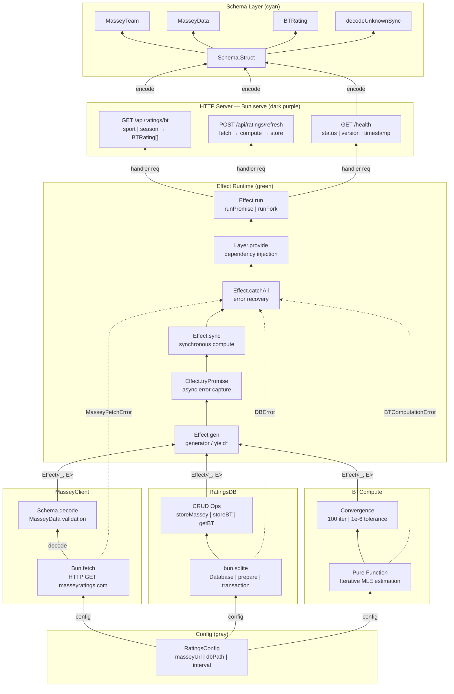

# Architecture Overview

**Bradley-Terry Ratings Service** — Effect TS + Bun runtime. ANSI-colored nodes, matrix-style layout, dark terminal aesthetic.

## Layer stack (bottom → top)

| Layer | Color | Nodes |
|-------|-------|-------|
| **Config** | Gray | `RatingsConfig` — masseyUrl \| dbPath \| interval |
| **Services** | Multi | `MasseyClient`, `RatingsDB`, `BTCompute` (dashed borders, red E badges) |
| **Effect Runtime** | Green | `Effect.gen`, `Effect.tryPromise`, `Effect.sync`, `Effect.catchAll`, `Layer.provide`, `Effect.run` |
| **HTTP Server** | Dark purple | `Bun.serve` — `GET /api/ratings/bt`, `POST /api/ratings/refresh`, `GET /health` |
| **Schema** | Cyan | `MasseyTeam`, `MasseyData`, `BTRating`, `Schema.Struct`, `decodeUnknownSync` |

## Service internals

### MasseyClient (pink dashed)

| Node | Role |
|------|------|
| `Bun.fetch` | HTTP GET masseyratings.com |
| `Schema.decode` | MasseyData validation |
| **E** `MasseyFetchError` | Tagged, typed, catchable |

Internal arrow: `Bun.fetch` —decode→ `Schema.decode`

### RatingsDB (purple dashed)

| Node | Role |
|------|------|
| `bun:sqlite` | Database \| prepare \| transaction |
| `CRUD Ops` | storeMassey \| storeBT \| getBT |
| **E** `DBError` | sqlite operation failures |

### BTCompute (yellow dashed)

| Node | Role |
|------|------|
| `Pure Function` | Iterative MLE estimation |
| `Convergence` | 100 iter \| 1e-6 tolerance |
| **E** `BTComputationError` | Convergence failures, team count context |

## Effect Runtime (green dashed)

| Primitive | Purpose |
|-----------|---------|
| `Effect.gen` | generator / yield* |
| `Effect.tryPromise` | async error capture |
| `Effect.sync` | synchronous compute |
| `Effect.catchAll` | error recovery |
| `Layer.provide` | dependency injection |
| `Effect.run` | runPromise \| runFork |

Composes into `handler(req)` for `Bun.serve`.

## HTTP routes

| Route | Behavior |
|-------|----------|
| `GET /api/ratings/bt` | sport \| season → BTRating[] |
| `POST /api/ratings/refresh` | fetch → compute → store |
| `GET /health` | status \| version \| timestamp |

Responses **encode** upward through the Schema layer.

## Data flow

1. **Config** fans out via gray `config` arrows to all three services
2. **Services** emit purple `Effect<_, E>` arrows into the runtime layer
3. **Runtime** composes green `handler(req)` for `Bun.serve`
4. **Server** routes send cyan `encode` arrows into Schema types

## ANSI legend

| Color | Category | Micro-text |
|-------|----------|------------|
| Green | Effect | Generator \| Sync \| Async \| Layer |
| Brown | Bun | serve \| fetch \| sqlite \| file |
| Cyan | Schema | Struct \| decode \| validation |
| Purple | DB | sqlite \| prepare \| transaction |
| Yellow | Compute | Pure \| MLE \| iterative |
| Pink | Fetch | HTTP \| GET \| JSON |
| Dark purple | Server | Routes \| handlers \| port |
| Red | Error | Typed \| tagged \| catchAll |

## Mermaid source



## Library modules (package consumers)

For embedded use without the HTTP server:

```
BT Core → Loader (SQLite + Massey) → Repository → Cascade Integration
```

| Module | Role |
|--------|------|
| `schema.ts` | Branded `EntityId`, `Match`, `FitResult` |
| `massey-loader.ts` | Streaming Massey CSV ingestion |
| `match-adapter.ts` | SQLite `MatchRow` → validated `Match` |
| `src/bradley-terry/` | `fit()` core algorithm |
| `src/repository/` | Snapshot persistence |
| `src/integrations/cascade-mover.ts` | Win prob + delta consumer |
